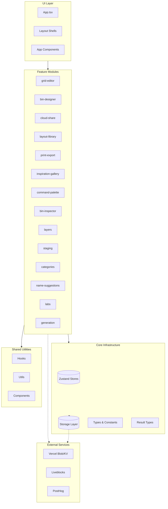

# Gridfinity Layout Tool

Web app for designing storage layouts for 3D-printed Gridfinity drawer organizers.

**Live:** [gridfinitylayouttool.com](https://gridfinitylayouttool.com)

## Features

- **Layout Planner** - Drag-and-drop bin placement with multi-layer support
- **3D Preview** - Isometric visualization of your drawer layout
- **Bin Designer** - Parametric 3D bin generator with STL/3MF export
- **Print List** - Optimized print list with filament estimation
- **Cloud Sharing** - Share layouts via link with optional collaboration
- **Multi-Layout Library** - Manage multiple drawer layouts
- **Responsive Design** - Desktop, tablet, and mobile support
- **PWA** - Installable, works offline

## Quick Start

```bash
npm install
npm run dev      # Development server at localhost:5173
npm run build    # Production build
npm run test     # Unit tests (watch mode)
npm run test:e2e # Playwright e2e tests
```

## Deployment

Deployed via **Vercel** with automatic deployments on push to `main`. Preview deployments for pull requests.

## Architecture



## Project Structure

```
src/
├── core/           # Infrastructure (stores, storage, types, constants, Result types)
├── features/       # Vertical slices (each with README.md):
│   ├── bin-designer/       # Parametric 3D bin generator
│   ├── bin-inspector/      # Selected bin details panel
│   ├── categories/         # Color-coding system
│   ├── cloud-share/        # Cloud sharing via Vercel Blob
│   ├── command-palette/    # Keyboard command interface
│   ├── generation/         # WASM geometry engine
│   ├── grid-editor/        # Main layout editor
│   ├── inspiration-gallery/# Example layouts
│   ├── labs/               # Experimental feature flags
│   ├── layers/             # Vertical stacking system
│   ├── layout-library/     # Multi-layout management
│   ├── name-suggestions/   # Intelligent naming
│   ├── print-export/       # Print list generation
│   └── staging/            # Off-grid bin stash
├── shared/         # Cross-cutting (components, hooks, utils)
├── components/     # App-level components (Mobile/, Tablet/, Modals/)
├── hooks/          # App-level hooks
├── i18n/           # Localization (en, de, es, fr, nl, pt-BR)
└── layouts/        # Responsive layout shells
e2e/                # Playwright e2e tests
api/                # Vercel serverless functions
```

## Documentation

See **[CLAUDE.md](./CLAUDE.md)** for technical documentation:

- Architecture and state management
- Data model and coordinate system
- Code style requirements
- Testing approach
