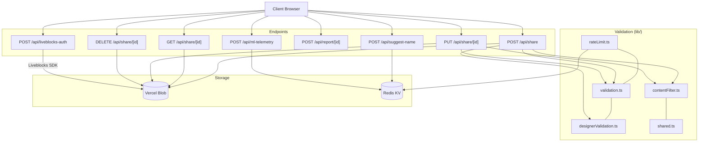

# API

Vercel serverless endpoints for cloud sharing, collaborative editing auth, LLM name suggestions, and ML telemetry.



## Endpoints

| Endpoint               | Method | Rate Limit | Purpose                                  |
| ---------------------- | ------ | ---------- | ---------------------------------------- |
| `/api/share`           | POST   | 100/min    | Create layout or designer share          |
| `/api/share/[id]`      | GET    | 100/min    | Fetch share with metadata                |
| `/api/share/[id]`      | PUT    | 100/min    | Update share (requires delete token)     |
| `/api/share/[id]`      | DELETE | 100/min    | Delete share (requires delete token)     |
| `/api/report/[id]`     | POST   | 10/hr      | Report inappropriate share               |
| `/api/suggest-name`    | POST   | 20/hr      | LLM-generated layout names (GPT-4o-mini) |
| `/api/liveblocks-auth` | POST   | 100/min    | Collaborative editing session auth       |
| `/api/ml-telemetry`    | POST   | 100/min    | Aggregated ML training data              |

## Validation Library (`lib/`)

| File                    | Purpose                                                                        |
| ----------------------- | ------------------------------------------------------------------------------ |
| `validation.ts`         | Layout schema: 500KB max, 2500 bins, sanitize strings, validate hex colors     |
| `designerValidation.ts` | BinParams schema: 100KB max, enum checking, dimension constraints              |
| `contentFilter.ts`      | Blocklist (~30 terms), XSS pattern detection, spam filtering                   |
| `rateLimit.ts`          | Sliding window counters via Redis; fail-closed if Redis unavailable            |
| `shared.ts`             | Share ID validation, `hashToken()` (SHA-256), error codes                      |
| `llm.ts`                | Name generation via AI Gateway, 7-day Redis cache, prompt injection prevention |

## Share System

**Two share types:**

- **Layout shares** — full Layout data (bins, layers, categories, drawer); 500KB max
- **Designer shares** — BinParams only; 100KB max; `type: 'designer'` in request

**Authentication (no user accounts):**

```
1. Client generates 32-char hex token (128-bit entropy)
2. Server hashes: SHA-256(TOKEN_SALT + token)
3. Hash stored in Blob metadata (deleteTokenHash)
4. Client presents original token for PUT/DELETE
5. Constant-time comparison prevents timing attacks
```

**Share ID formats (backwards compatible):**

- Base36 timestamp: `{timestamp}-{7-char-random}` (current)
- UUID: `xxxxxxxx-xxxx-...` (legacy)
- 12-char alphanumeric (legacy)

## Key Constraints

| Resource         | Limit                 |
| ---------------- | --------------------- |
| Layout payload   | 500KB                 |
| Designer payload | 100KB                 |
| Bins per layout  | 2,500                 |
| Grid dimensions  | 1–50                  |
| Layers           | 1–10                  |
| Categories       | 20                    |
| Label length     | 24 chars              |
| Notes length     | 256 chars             |
| Report threshold | 5 reports → escalated |

## Gotchas

1. **No user accounts** — shares secured by random delete tokens, not authentication
2. **Redis fail-closed** — if Redis unavailable, rate limiting denies all requests for safety
3. **TOKEN_SALT required** — `TOKEN_SALT` env var must be set; token hashing breaks without it
4. **Designer type field** — layout shares omit `type`; designer shares require `type: 'designer'`
5. **Metadata in same Blob** — timestamps, token hash, report count all stored in the Blob file metadata
6. **Permission coupling** — `edit` permission auto-grants Liveblocks `FULL_ACCESS`
7. **Liveblocks optional** — fails gracefully if `LIVEBLOCKS_SECRET_KEY` not set
8. **Content filter minimal** — ~30 term blocklist; production should supplement with external service
9. **LLM cache degrades gracefully** — name suggestions continue without cache if Redis fails
10. **IP hashing for privacy** — rate limiter hashes IP with SHA-256 before using as Redis key
