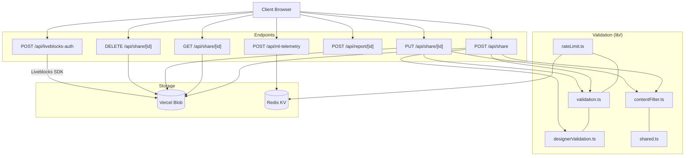

# API

Vercel serverless endpoints for cloud sharing, collaborative editing auth, and ML telemetry.



## Endpoints

| Endpoint                        | Method         | Rate Limit | Purpose                                |
| ------------------------------- | -------------- | ---------- | -------------------------------------- |
| `/api/share`                    | POST           | 100/min    | Create layout or designer share        |
| `/api/share/[id]`               | GET            | 100/min    | Fetch share with metadata              |
| `/api/share/[id]`               | PUT            | 100/min    | Update share (requires delete token)   |
| `/api/share/[id]`               | DELETE         | 100/min    | Delete share (requires delete token)   |
| `/api/report/[id]`              | POST           | 10/hr      | Report inappropriate share             |
| `/api/liveblocks-auth`          | POST           | 100/min    | Collaborative editing session auth     |
| `/api/ml-telemetry`             | POST           | 100/min    | Aggregated ML training data            |
| `/api/auth/login/[provider]`    | GET            | 30/min     | Begin OAuth flow (Google / GitHub)     |
| `/api/auth/callback/[provider]` | GET            | 30/min     | OAuth code exchange + session mint     |
| `/api/auth/logout`              | POST           | 100/min    | Clear session cookie + KV row          |
| `/api/auth/me`                  | GET            | 100/min    | Return signed-in user profile          |
| `/api/sync/layouts/[id]`        | GET/PUT/DELETE | 60–240/min | Per-user layout sync (LWW + tombstone) |
| `/api/sync/designs/[id]`        | GET/PUT/DELETE | 60–240/min | Per-user Bin Designer design sync      |
| `/api/sync/manifest`            | GET            | 240/min    | Per-user index + If-Modified-Since 304 |
| `/api/sync/export`              | GET            | 240/min    | ZIP of all live items + manifest       |
| `/api/sync/account`             | DELETE         | 60/min     | Cascade-delete account + KV + blobs    |
| `/api/kofi-webhook`             | POST           | 60/min     | Ko-fi payment ingest → supporters      |
| `/api/supporters`               | GET            | 120/min    | Public supporter list for /supporters  |

See [`auth/README.md`](./auth/README.md) for the OAuth setup and [`sync/README.md`](./sync/README.md) for sync semantics, quotas, and the LWW + tombstone state machine.

## Ko-fi supporter ingest

`/api/kofi-webhook` is the **only** way a supporter reaches `/supporters`. Ko-fi
has no read API and no webhook replay, so this is a one-shot feed: anything not
recorded on delivery is gone. That drives three rules.

- **Fail loudly, never silently 200.** Missing `KOFI_VERIFICATION_TOKEN` → 503;
  Redis down → 503. Ko-fi retries on a failure response, so a 503 is
  recoverable while a cheerful 200 loses the supporter permanently.
- **Verify before touching Redis.** The token is compared (constant-time) before
  any I/O, so forged requests cost nothing. Rate limiting sits _behind_ that as a
  backstop for a leaked token — it is not the front door.
- **Dedupe twice.** `message_id` guards Ko-fi's retries (`SET NX`), and the
  donor id guards repeat donations from the same person — otherwise a monthly
  subscriber earns a fresh bin every renewal.

**Privacy.** Stored: a salted donor-id hash and a display name. Never stored:
the email, the amount, or the supporter's message. `deriveDonorId` salts with
`TOKEN_SALT` and refuses to derive an id without it — an _unsalted_ SHA-256 of
an email is brute-forcible against a wordlist, so it would effectively still be
an email.

**Untrusted input.** `from_name` is arbitrary text typed by a stranger that
renders on a public page. `normalizeDisplayName` honours Ko-fi's `is_public`,
strips characters that must never render (C0/C1 controls, zero-width, and bidi
overrides — U+202E can make a name display as something else; `contentFilter`
folds these for _matching_ but returns the original string), then caps to
`MAX_DISPLAY_NAME_LENGTH` and runs `contentFilter` on exactly the text that will
be shown. A rejected name makes the supporter _anonymous_ rather than dropping
them — the name is untrusted, the person isn't.

**Order is load-bearing** in that function: bound → strip → cap → filter.
Filtering last keeps the filter's backtracking regexes on a short string (they
go quadratic on long input — see the ReDoS note below) and means we judge what
actually renders rather than characters past the cut. Stripping before the cap
stops invisible padding from pushing a real name off the end.

**`contentFilter` quantifiers stay bounded.** `/on\w+\s*=/` backtracked
quadratically on `"ononon…"` (120KB took 4.7s). Any new pattern there must not
use an unbounded quantifier followed by a required literal.

Seed the pre-webhook backfill once with `pnpm seed-supporters` (`--dry-run` to
preview); see `src/features/supporters/README.md`.

## Validation Library (`lib/`)

| File                    | Purpose                                                                         |
| ----------------------- | ------------------------------------------------------------------------------- |
| `validation.ts`         | Layout schema: 500KB max, 2500 bins, sanitize strings, validate hex colors      |
| `designerValidation.ts` | BinParams schema: 100KB max, enum checking, dimension constraints               |
| `contentFilter.ts`      | Blocklist (~30 terms) with NFKD + confusable normalization, XSS / spam patterns |
| `rateLimit.ts`          | Sliding window counters via Redis; fail-closed if Redis unavailable             |
| `shared.ts`             | Share ID validation, `hashToken()` (SHA-256), error codes                       |

## Share System

**Two share types:**

- **Layout shares** — full Layout data (bins, layers, categories, drawer); 500KB max
- **Designer shares** — BinParams only; 100KB max; `type: 'designer'` in request

**Authentication (no user accounts):**

```
1. Client generates 32-char hex token (128-bit entropy)
2. Server hashes: SHA-256(TOKEN_SALT + token)
3. Hash stored in Redis (`share:hash:{id}`); legacy shares may have it in blob metadata
4. Client presents original token for PUT/DELETE
5. Constant-time comparison prevents timing attacks
```

**Redis key namespaces (see `lib/redisKeys.ts`):**

| Key                       | Purpose                                              |
| ------------------------- | ---------------------------------------------------- |
| `share:hash:{id}`         | Delete-token hash (acquired AFTER blob put succeeds) |
| `share:reports:{id}`      | Abuse-report counter (1-year TTL)                    |
| `share:lastAccessed:{id}` | ISO timestamp of last GET (1-year TTL)               |
| `ratelimit:{action}:{ip}` | Sliding-window rate-limit counter                    |

Share creation uses `put({ allowOverwrite: false })` as an atomic CAS lock — concurrent POSTs racing on the same shareId produce exactly one winner.

**Share ID formats (backwards compatible):**

- Base36 timestamp: `{timestamp}-{7-char-random}` (current)
- UUID: `xxxxxxxx-xxxx-...` (legacy)
- 12-char alphanumeric (legacy)

## Key Constraints

| Resource         | Limit                 |
| ---------------- | --------------------- |
| Layout payload   | 500KB                 |
| Designer payload | 100KB                 |
| Bins per layout  | 2,500                 |
| Grid dimensions  | 1–50                  |
| Layers           | 1–10                  |
| Categories       | 20                    |
| Label length     | 24 chars              |
| Notes length     | 256 chars             |
| Report threshold | 5 reports → escalated |

## Gotchas

1. **No user accounts** — shares secured by random delete tokens, not authentication
2. **Redis fail-closed** — if Redis unavailable, rate limiting denies all requests for safety
3. **TOKEN_SALT required** — `TOKEN_SALT` env var must be set; token hashing breaks without it
4. **Designer type field** — layout shares omit `type`; designer shares require `type: 'designer'`
5. **Metadata in same Blob** — timestamps, token hash, report count all stored in the Blob file metadata
6. **Permission coupling** — `edit` permission auto-grants Liveblocks `FULL_ACCESS`
7. **Liveblocks optional** — fails gracefully if `LIVEBLOCKS_SECRET_KEY` not set
8. **Content filter minimal** — ~30 term blocklist; production should supplement with external service
9. **IP hashing for privacy** — rate limiter hashes IP with SHA-256 before using as Redis key
