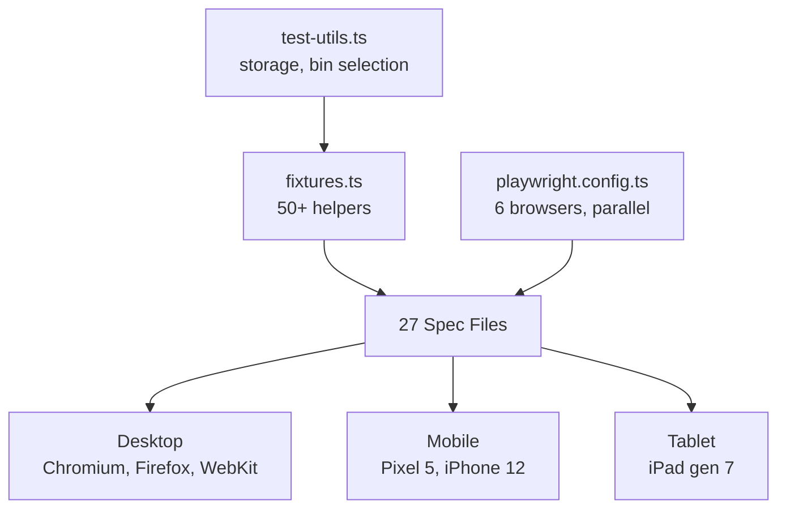

# E2E Testing

Playwright browser tests covering all major features across 6 browser/device configurations.



## Key Files

| File                   | Purpose                                                                               |
| ---------------------- | ------------------------------------------------------------------------------------- |
| `fixtures.ts`          | Custom wait helpers, grid interaction, UI panel selectors, viewport constants         |
| `test-utils.ts`        | Storage isolation (`clearAllStorage`), auto-save polling, deterministic bin selection |
| `playwright.config.ts` | 6 browser projects, parallel execution, 0 retries                                     |

## Browser Matrix

| Project       | Device          | Viewport |
| ------------- | --------------- | -------- |
| chromium      | Desktop Chrome  | 1280×720 |
| firefox       | Desktop Firefox | 1280×720 |
| webkit        | Desktop Safari  | 1280×720 |
| mobile-chrome | Pixel 5         | 393×851  |
| mobile-safari | iPhone 12       | 390×844  |
| tablet        | iPad (gen 7)    | 810×1080 |

## Test Scaffold

```typescript
test.describe('Feature', () => {
  test.beforeEach(async ({ page }) => {
    await page.goto('/');
    await clearAllStorage(page);
    await page.reload();
    await waitForAppReady(page);
  });

  test.afterEach(async ({ page }) => {
    await clearAllStorage(page);
    await resetViewport(page); // CRITICAL: prevents mobile pollution
  });
});
```

## Core Selectors

| Element      | Selector                                                         | Helper                     |
| ------------ | ---------------------------------------------------------------- | -------------------------- |
| Grid         | `[role="application"]`                                           | `getGrid()`                |
| Bins         | `[data-bin-id]`                                                  | `waitForBinCount()`        |
| Staging bins | `[data-staging-bin-id]`                                          | `waitForStagingBinCount()` |
| Inspector    | `[data-inspector]`                                               | `getInspector()`           |
| Sidebar      | `[data-sidebar]`                                                 | `getSidebar()`             |
| Dialogs      | `[role="dialog"]:not([aria-label="Labs experimental features"])` | `getActiveDialog()`        |
| Mobile nav   | `[data-bottom-nav]`                                              | `getBottomNav()`           |

## Grid Coordinates

```typescript
const bounds = await getGridBounds(page);
const screenX = bounds.x + gridX;
const screenY = bounds.y + gridY;
// Grid (0,0) = bottom-left, but mouse uses screen coords (top-left)

// Draw a bin via helper
const bin = await drawBinOnGrid(page, 50, 50, 100, 100);
```

## Gotchas

1. **Viewport pollution** — mobile tests set 375×667; must call `resetViewport()` in `afterEach` or cascading failures occur
2. **Labs drawer always in DOM** — has `[role="dialog"]`; use `getActiveDialog()` helper to exclude it
3. **Bin DOM order non-deterministic** — use `getBinByIndex(page, i)` instead of `.first()` / `.last()` for parallel safety
4. **Swap detection skipped** — Shift+drag requires precise bin centering; unreliable in E2E due to auto-zoom. Verified in unit tests
5. **Paint mode must exit** — call `waitForPaintModeExited()` before next grid interaction
6. **Auto-save polling** — use `waitForAutoSave()` not `page.waitForTimeout(2000)`; app debounces at 1000ms
7. **Multi-select Alt+drag flaky** — race condition between selection state and drag start; marked `test.skip()`
8. **3D canvas slow** — takes ~10s to load; use `waitForCanvas(page, 10000)` timeout
9. **0 retries policy** — flakes are root-caused, not masked; `retries: 0` in config
10. **Mouse steps matter** — use `{ steps: 5 }` for drag operations; too few = unreliable movement
