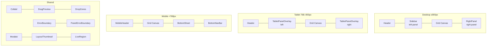

# Components

App-level layout shells, modals, and responsive UI containers. Business logic lives in `src/features/`; these components orchestrate layout and navigation.

## Subdirectories

| Directory             | Purpose                                                                                     |
| --------------------- | ------------------------------------------------------------------------------------------- |
| `Collab/`             | Liveblocks integration: CollabProvider, cursors, ghosts, presence avatars, selection rings  |
| `Mobile/`             | Mobile-specific UI: MobileHeader, BottomNavBar, BottomSheet, MobileInspector, context menus |
| `Modals/`             | Full-screen overlays: SettingsModal (5 tabs), HelpModal, ImportModal                        |
| `Tablet/`             | TabletPanelOverlay (slide-in 85vw panels), TabletPanelTriggers (FABs)                       |
| `Header/`             | App header with layout name, undo/redo, tool buttons, presence                              |
| `Sidebar/`            | Desktop left panel: layers, categories, drawer settings, inspiration gallery                |
| `RightPanel/`         | Desktop right panel: bin inspector, print list, split preview                               |
| `Print/`              | Print preview split view                                                                    |
| `DragPreview/`        | Floating ghost following cursor during drag/stagingDrag                                     |
| `DropZones/`          | Trash drop target (shows after first pointermove)                                           |
| `ErrorBoundary/`      | Root error boundary with full-page recovery                                                 |
| `PanelErrorBoundary/` | Panel-level error boundary with inline retry                                                |
| `LayoutThumbnail/`    | SVG mini preview of layout bins                                                             |
| `LiveRegion/`         | ARIA live announcements for screen readers                                                  |
| `STLSearchDropdown/`  | STL search site selection menu                                                              |

## Responsive Strategy

| Breakpoint           | Layout                                    | Panels                      | Navigation            |
| -------------------- | ----------------------------------------- | --------------------------- | --------------------- |
| `< 768px` (mobile)   | MobileHeader + BottomSheet + BottomNavBar | Slide-up sheets             | 4-tab bottom nav      |
| `768–900px` (tablet) | Header + TabletPanelOverlay × 2           | Slide-in overlays (85vw)    | Header toggle buttons |
| `≥ 900px` (desktop)  | Header + Sidebar + RightPanel             | Always visible, collapsible | Header toolbar        |

## Key Files

| File                         | Size | Purpose                                                 |
| ---------------------------- | ---- | ------------------------------------------------------- |
| `Sidebar.tsx`                | 25KB | Desktop left panel: layers, categories, drawer settings |
| `RightPanel.tsx`             | 23KB | Desktop right panel: inspector, print list              |
| `Header.tsx`                 | 18KB | Full toolbar with modals, presence, layout manager      |
| `Mobile/BottomSheet.tsx`     | —    | Modal container with swipe-to-dismiss, ESC close        |
| `Mobile/BottomNavBar.tsx`    | —    | Fixed 4-tab bar: layers, inspector, categories, print   |
| `Collab/CollabProvider.tsx`  | —    | Liveblocks RoomProvider wrapper, user setup             |
| `Collab/PresenceAvatars.tsx` | —    | Smart wrapper: bar (desktop) or button (mobile)         |

## Gotchas

1. **PrintModal always mounted** — rendered even when closed because `@media print` CSS needs the portal in DOM
2. **Labs drawer always in DOM** — has `[role="dialog"]`; exclude with `:not([aria-label="Labs..."])` when querying dialogs
3. **No single mobile/tablet component** — responsive layout is composition of conditional renders, not a master component
4. **DropZones appear after pointermove** — prevents flicker on simple clicks; only shows trash zone during actual drag
5. **Two-tier error boundaries** — root `ErrorBoundary` for crashes; `PanelErrorBoundary` wraps each major panel for inline recovery
6. **Lazy loading with retry** — use `lazyWithRetry()` for PWA resilience; wrap in `<Suspense fallback={<LoadingFallback />}>`
7. **Feature content reused, not duplicated** — Mobile panels wrap the same feature components (ActiveLayerPanel, SingleBinInspector) in mobile-specific containers
8. **BottomSheet activeMobilePanel** — panels conditionally mount based on string ID; `toggleMobilePanel(id)` opens or closes
