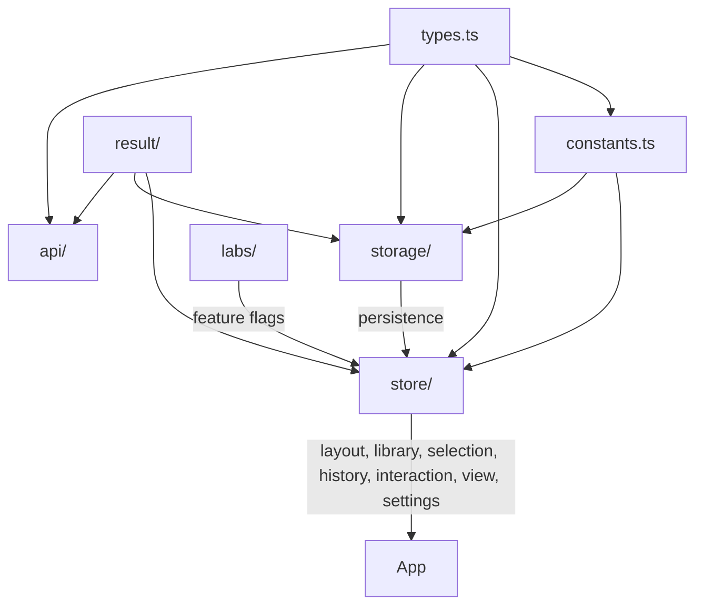

# Core

Application infrastructure: data model, state management, storage, error handling, and API clients.



## Subdirectories

| Directory  | Purpose                                                                                                 |
| ---------- | ------------------------------------------------------------------------------------------------------- |
| `api/`     | Cloud sharing API client (`share.ts`, `suggestName.ts`)                                                 |
| `labs/`    | Feature flag definitions and types (experimental/preview/graduated)                                     |
| `result/`  | `Result<T, E>` type system — constructors, error catalog, combinators                                   |
| `storage/` | Layout persistence — LayoutManager, LayoutService, ShareService, backends                               |
| `store/`   | Zustand + Immer stores — layout, library, history, selection, interaction, view, settings               |
| `sync/`    | Multi-device sync foundation: session, `outbox` (IDB queue), `status` store, `adapters/` (engine in 4b) |

## Key Files

- `types.ts` — core data model: `Layout`, `Bin`, `Layer`, `Category`, `Drawer`, branded IDs
- `constants.ts` — constraints, defaults, half-bin helpers, keyboard shortcuts, breakpoints

## Stores (`store/`)

| Store            | Purpose                                                         |
| ---------------- | --------------------------------------------------------------- |
| `layout.ts`      | Current layout data, bin/layer/category CRUD (returns `Result`) |
| `library.ts`     | Multi-layout library index, active layout, cloud share metadata |
| `history.ts`     | Undo/redo stack (max 100 states)                                |
| `selection.ts`   | Selected bins, active layer/category, keyboard focus            |
| `interaction.ts` | Current mode (draw/drag/resize/paint), drop targets, 3D preview |
| `view.ts`        | Zoom, panel collapse, context menu, layer visibility            |
| `settings.ts`    | User preferences (persisted to `gridfinity-settings-v1`)        |
| `toast.ts`       | Ephemeral notifications (max 3, auto-dismiss)                   |

## Storage Architecture (`storage/`)

```
LayoutManager.ts    — atomic ops: save+metadata, create, delete, switch, duplicate
LayoutService.ts    — CRUD (async/sync/Result APIs), schema migration
ShareService.ts     — JSON import/export, URL encoding, cloud share
SharedWithMeService — track layouts shared by others
backend.ts          — dual-write coordinator (IndexedDB primary + localStorage backup)
backends/
  indexedDB.ts      — primary backend (50MB+ capacity, compressed)
  localStorage.ts   — fallback backend, cross-tab sync for library index
migration.ts        — one-time localStorage → IndexedDB migration
```

## Result Type (`result/`)

```typescript
import { ok, err, isOk, isErr, map, flatMap, match } from '@/core/result';
import type { Result, StorageError, ValidationError, LayoutError, ApiError } from '@/core/result';
```

- `types.ts` — `Ok<T>`, `Err<E>`, `Result<T, E>`, type guards
- `errors.ts` — domain error types (Storage, Validation, Layout, Api)
- `constructors.ts` — factory functions per error type
- `catalog.ts` — error metadata, user messages, recovery hints, severity
- `utils.ts` — `map`, `flatMap`, `match`, `tryCatch`, `unwrapOr`
- `resultAsync.ts` — `ResultAsync<T, E>` chainable wrapper for async pipelines (`fromPromise`, `map`, `andThen`, etc.); awaits to a plain `Result<T, E>`

## Gotchas

1. **Branded IDs** — `BinId`, `LayerId`, `CategoryId`, `LayoutId` are nominal types; use factory functions at boundaries
2. **Coordinate system** — grid (0,0) is bottom-left, `layers[0]` is bottom; UI reverses via `getDisplayLayers()`
3. **Staging layer** — `layerId === '__staging__'` is the off-grid stash, not a real layer
4. **Half-bin mode** — 0.5 increments via `HALF_BIN_SCALE = 2`; use `snapToHalf()`, `isFractional()`
5. **Atomic storage** — prefer `saveLayoutWithMetadata()` over separate save + library update
6. **Dual-write** — async ops write to IndexedDB + localStorage backup; library index stays in localStorage for cross-tab sync
7. **Result everywhere** — layout store mutations return `Result<T, E>`; never throw for expected failures
