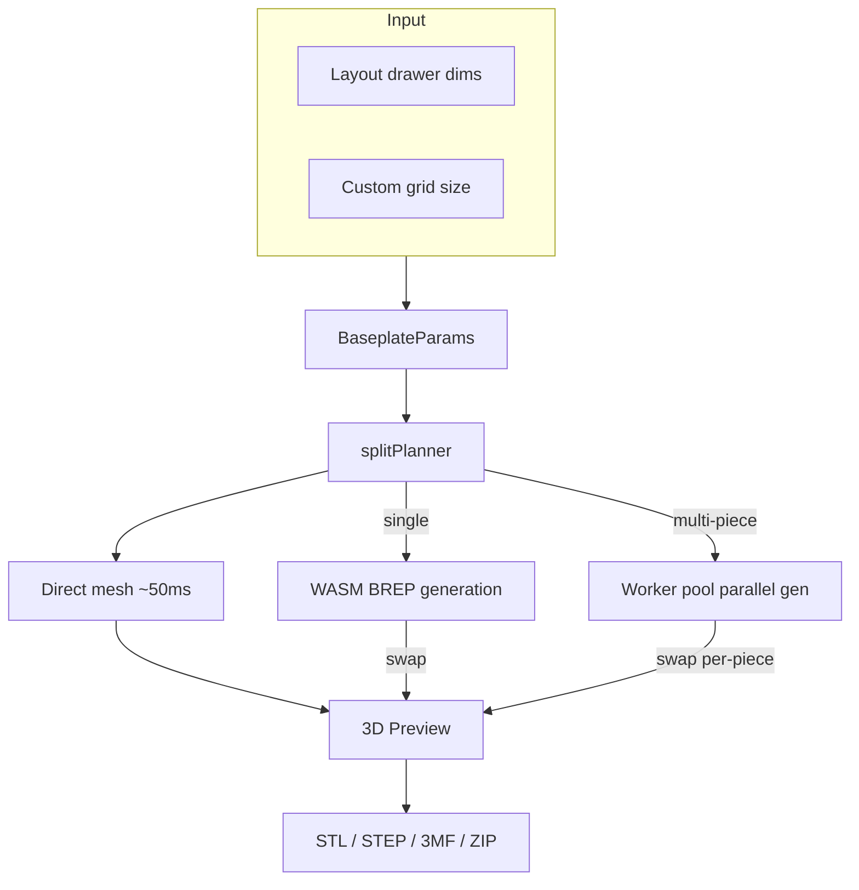

# Baseplate

Standalone page (`/baseplate`) for generating 3D-printable Gridfinity baseplates with automatic splitting for large layouts.

## Key Files

- `components/BaseplatePage.tsx` — responsive layout shell (desktop side-by-side, mobile stacked)
- `components/BaseplatePanel.tsx` — parameter controls: grid size, padding, magnets, split mini-map
- `components/BaseplatePreview.tsx` — Three.js 3D preview with assembled/exploded split views
- `hooks/useBaseplateGeneration.ts` — two-phase lifecycle: synchronous direct-mesh preview (sub-100ms) + async BREP swap once WASM bridge ready, epoch-based stale detection
- `hooks/useBaseplateExport.ts` — export pipeline: single-piece or parallel split with ZIP packaging; 3MF format optionally stacks N copies of each part via 3MF instancing
- `store/baseplatePageStore.ts` — ephemeral UI state (generation status, tiling, piece selection)
- `utils/splitPlanner.ts` — 2D optimal tiling: partitions grid into print-bed-sized pieces
- `utils/buildFullParams.ts` — resolves sync mode: drawer dims vs custom width/depth
- `utils/fileNaming.ts` — descriptive/compact/custom filename generation
- `constants.ts` — MAX_BASEPLATE_DIMENSION (16), EXPLODE_GAP_MM (10), piece color palette

## Key Concepts

- **Sync mode**: `syncWithLayout: true` reads drawer dims from layout store; `false` uses custom grid size
- **Split tiling**: baseplates exceeding print bed are partitioned into labeled pieces (A1, B2, etc.)
- **Two-phase preview**: direct-mesh (procedural, no WASM) renders immediately on every params change; BREP (high-fidelity) silently swaps in once ready. `MeshResult.source` records which path produced the visible mesh
- **Graceful BREP failure**: if BREP errors after a direct-mesh preview is on screen, the preview stays visible and a non-blocking toast surfaces the failure — avoids the red error overlay swallowing a still-usable canvas
- **Epoch detection**: rapid param changes bump an epoch counter; stale in-flight results (direct or BREP) are discarded
- **Ephemeral store**: `baseplatePageStore` resets on unmount; persistent params live in layout store

## Gotchas

1. **Padding is position-aware** — only edge pieces carry padding; join edges always have 0mm
2. **Fractional edges** — 0.5-unit edges are absorbed into the outermost piece
3. **Worker pool is optional** — parallel generation falls back to sequential if pool unavailable
4. **Grid units vs mm** — stored params use grid units; multiply by `gridUnitMm` (42mm) for generation
5. **Default camera is top-down** — `BaseplatePreview` opens in top view (`CAMERA_PRESETS.top`); the reset button also returns to top view (not isometric)
