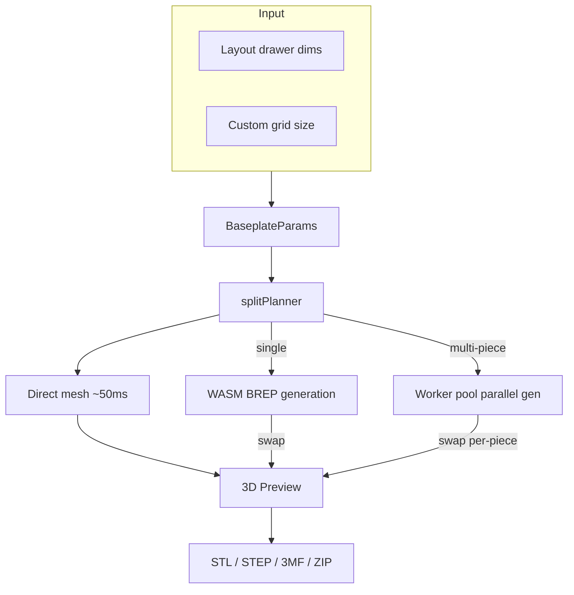

# Baseplate

Standalone page (`/baseplate`) for generating 3D-printable Gridfinity baseplates with automatic splitting for large layouts.

## Key Files

- `components/BaseplatePage.tsx` — responsive layout shell (desktop side-by-side, mobile stacked)
- `components/BaseplatePanel.tsx` — parameter controls: grid size, padding, magnets, split mini-map
- `components/BaseplatePreview.tsx` — Three.js 3D preview with assembled/exploded split views
- `hooks/useBaseplateGeneration.ts` — two-phase lifecycle: synchronous direct-mesh preview (sub-100ms) + async BREP swap once WASM bridge ready, epoch-based stale detection
- `hooks/useBaseplateExport.ts` — export pipeline: single-piece or parallel split with ZIP packaging; 3MF format optionally stacks N copies of each part via 3MF instancing
- `store/baseplatePageStore.ts` — ephemeral UI state (generation status, tiling, piece selection)
- `utils/splitPlanner.ts` — 2D optimal tiling: partitions grid into print-bed-sized pieces
- `utils/buildFullParams.ts` — resolves sync mode: drawer dims vs custom width/depth
- `utils/fileNaming.ts` — descriptive/compact/custom filename generation
- `constants.ts` — MAX_BASEPLATE_DIMENSION (16), EXPLODE_GAP_MM (10), piece color palette

## Key Concepts

- **Sync mode**: `syncWithLayout: true` reads drawer dims from layout store; `false` uses custom grid size
- **Split tiling**: baseplates exceeding print bed are partitioned into labeled pieces (A1, B2, etc.)
- **Two-phase preview**: direct-mesh (procedural, no WASM) renders immediately on every params change; BREP (high-fidelity) silently swaps in once ready. `MeshResult.source` records which path produced the visible mesh. With the graduated `manifold_preview` path (always on), the draft phase instead runs the real `generateBaseplate` on the Manifold kernel at draft quality (`runManifoldDraftPreview`) — more faithful than the procedural approximation — falling back to direct-mesh if the preview bridge is unavailable. A `finalizedEpochRef` guards the now-async draft so a late draft can't overwrite a fresher BREP result
- **Graceful BREP failure**: if BREP errors after a direct-mesh preview is on screen, the preview stays visible and a non-blocking toast surfaces the failure — avoids the red error overlay swallowing a still-usable canvas
- **Epoch detection**: rapid param changes bump an epoch counter; stale in-flight results (direct or BREP) are discarded
- **Ephemeral store**: `baseplatePageStore` resets on unmount; persistent params live in layout store
- **Connector fit offset (`connectorFitOffset`, issue #2024)**: a signed mm value (±0.3, 0.05 step, default 0) the user dials in the panel's connector section to compensate for printer/filament variation. It only shifts the female groove clearance — the tongue/key stay nominal — and is clamped so effective clearance never goes negative (`effectiveClearance` in `@/shared/constants/connectors`, the single source of truth shared by the worker, cache keys, and print guide). Positive = looser, negative = tighter
- **`preferIdenticalPieces` (opt-in, gated behind `connectorNubs`)**: palindromic chunk sizes + doubled (M+F) dovetail connectors + canonical-edge fingerprinting let opposite-corner pieces share one generated mesh. Each placement gets a `placementRotationDeg` (0 or 180); the 3D preview rotates the canonical mesh around the piece center and the print guide annotates rotated positions with "(rotate 180°)"
- **Padding anchor pad**: `PaddingSchematic` frames four mm steppers around a central `PaddingAnchor` 3×3 pad. Each outer cell is a directional arrow (a single `ArrowLeftIcon` rotated in 45° steps via `ARROW_ROTATION`) pointing at the drawer corner/edge it anchors to; the center cell is a target glyph. Picking a cell redistributes total padding through `computeAnchoredPaddings`; editing any stepper flips the anchor to `custom`, surfaced as a caption

## Gotchas

1. **Padding is position-aware** — only edge pieces carry padding; join edges always have 0mm
2. **Fractional edges** — 0.5-unit edges are absorbed into the outermost piece
3. **Worker pool is optional** — parallel generation falls back to sequential if pool unavailable
4. **Grid units vs mm** — stored params use grid units; multiply by `gridUnitMm` (42mm) for generation
5. **Default camera is top-down** — `BaseplatePreview` opens in top view (`CAMERA_PRESETS.top`); the reset button also returns to top view (not isometric)
6. **`preferIdenticalPieces` degrades silently with asymmetric padding/radii** — opposite-corner pieces only share a fingerprint when `paddingLeft == paddingRight`, `paddingFront == paddingBack`, and `cornerRadii` are 180°-symmetric. Otherwise the canonical mesh diverges and each piece gets its own file (still correct, just not deduplicated)
7. **WebGL context failure is terminal for the session, by design** — `BaseplatePreview`'s `<Canvas>` is wrapped in `WebGLErrorBoundary` (inside `PanelErrorBoundary`). When three.js can't acquire a GL context (slot exhaustion, GPU-process loss), the boundary renders `WebGLFallback` with **no Retry** and flips `detectWebGL()` to unavailable so subsequent renders skip the canvas — re-mounting would just re-throw. Recovery requires a page reload
8. **Snap-clip connector geometry has one source of truth** — `snapClipLevels(totalHeight, fitOffset)` in `@/shared/constants/connectors` resolves every Z-level and X-position for the `'snapClip'` style. The worker (pocket cut + `buildSnapClip`), the seated-clip preview (`ConnectorKeyMeshes`), and the bed/print math all call it, so they can't drift. The clip is a single X-Z cross-section extruded along the seam; the barb is a fixed-size feature near the leg tip, so only the leg LENGTH scales with slab height (taller bases get a longer flex beam). On a slab too thin to flex (`!viable`) the generator skips the pockets rather than ship a clip that snaps off. Geometry proven standalone with `brepjs-verify` (valid clip, watertight pockets, zero-interference seated fit). Because the socket mouth opens to the full cell at the slab top (`INSET_TOP = 0`), the clip's flush top bridge would poke into the open corners of the edge sockets flanking the seam, so `buildSnapClip` relieves those top-bridge corners against the neighbouring bin feet (above the barb zone only — the snap is untouched); see `snapClipSocketInterference.test.ts`. The seated-clip preview (`ConnectorKeyMeshes`) draws the un-relieved profile, a known cosmetic gap
