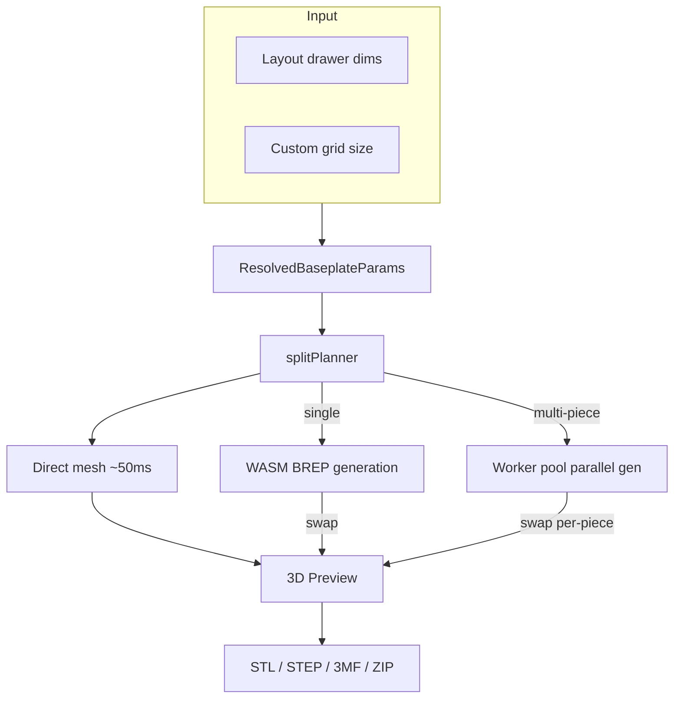

# Baseplate

Standalone page (`/baseplate`) for generating 3D-printable Gridfinity baseplates with automatic splitting for large layouts.



## Key Files

- `components/BaseplatePage.tsx` — responsive layout shell (desktop side-by-side, mobile stacked)
- `components/BaseplatePanel.tsx` — parameter controls: grid size, padding, magnets, split mini-map
- `components/BaseplatePreview.tsx` — Three.js 3D preview with assembled/exploded split views
- `hooks/useBaseplateGeneration.ts` — two-phase lifecycle: synchronous direct-mesh preview (sub-100ms) + async BREP swap once WASM bridge ready, epoch-based stale detection
- `hooks/useBaseplateExport.ts` — export pipeline: single-piece or parallel split with ZIP packaging. The unstacked split ZIP holds **one file per physical drawer slot**, named by grid label (`baseplate_A1.stl`, …), so importing the whole ZIP into a slicer drops in every piece with nothing to duplicate by hand. Identical shapes are still generated once (`groupPiecesByFingerprint`) and the single mesh buffer is reused for each slot — dedup is a generation optimization, not a user-visible artifact. When stack printing is on, bakes real stacked geometry per physical stack instead (see Stack printing)
- `store/baseplatePageStore.ts` — ephemeral UI state (generation status, tiling, piece selection)
- `components/BaseplateSelector.tsx` — header identity: the active design's name (click to rename) + a button opening the library. **No Save / Save As / New** — see "Design management" below
- `hooks/useBaseplateInit.ts` — guarantees an active design exists
- `hooks/useBaseplateAutoSave.ts` — debounced write-back to the active library design; also the source of the header's save status. After the mesh settles it captures a preview thumbnail (`utils/thumbnail.ts`) into the library entry — on every edit, plus a one-time backfill when an opened design has none yet
- `utils/thumbnail.ts` — captures the live `BaseplatePreview` canvas at a canonical steep-isometric angle and downscales to a WebP data URL for the library cards. `BaseplatePreview` registers its renderer/scene/camera here (`setPreviewContext`) and needs `preserveDrawingBuffer` on its `<Canvas>` so the framebuffer stays readable
- `components/BaseplatePanel/StackPrintSection.tsx` — "Stack for printing" panel section
- `components/BaseplatePreview/StackedBaseplateMeshes.tsx` + `StackSeparationSlider.tsx` — flipped-tower preview + explode slider
- `utils/splitPlanner.ts` — 2D optimal tiling: partitions grid into print-bed-sized pieces, minimizing **build-plate loads** (see Key Concepts)
- `utils/bedPacking.ts` — `estimateBedLoads`: shelf First-Fit-Decreasing bin-packer (90° rotation) estimating how many bed loads a set of pieces needs
- `utils/splitReorder.ts` — display reordering of chunk sizes (largest-first, fractional pinning, palindromic layout) — split out of the planner to keep it focused on the search
- `utils/buildFullParams.ts` — resolves sync mode (drawer dims vs custom width/depth); strips connectors, magnet holes, and corner rounding when stack printing is on
- `utils/stackPrint.ts` — stack planning (groups → capped physical stacks) + `buildTowerLayers` (bottom plate upright, the rest flipped, all XY-aligned)
- `utils/stackExport.ts` — bakes a stack into export triangle soup (single material)
- `utils/stackPreview.ts` — lays the towers out for the 3D preview. Two modes: when every tower carries its tiling `col`/`row` (the "no stacks" case — each split piece is its own single-plate tower, no fingerprint dedup), towers sit on their real tiling grid in the same orientation as the assembled split view (row 0 at the front) so the preview reads in baseplate order; otherwise (deduped or genuinely stacked towers, which no longer map 1:1 to positions) they fall back to a centered, roughly-square grid. `TOWER_GAP_UNITS` (1) is the whole-unit clearance between adjacent towers — one grid unit (~42mm) reads as "separate printed pieces" while keeping every cell on the scene's integer footprint grid
- `utils/fileNaming.ts` — descriptive/compact/custom filename generation
- `constants.ts` — MAX_BASEPLATE_DIMENSION (16), EXPLODE_GAP_MM (10), piece color palette

## Key Concepts

- **Sync mode**: `syncWithLayout: true` reads drawer dims from layout store; `false` uses custom grid size
- **Split tiling**: baseplates exceeding print bed are partitioned into labeled pieces (A1, B2, etc.). The planner optimizes for the **fewest build-plate loads** (print jobs), not the fewest pieces: it scores each candidate grid `MAX_EXTRA_PIECES_PER_BED_LOAD * bedLoads + pieceCount` (`bedLoads` from `estimateBedLoads`'s shelf packing), so it will choose a finer split that packs more pieces per bed when that removes a load — but the per-load piece budget (`MAX_EXTRA_PIECES_PER_BED_LOAD`, currently 4) caps the trade so it won't fragment into tiny tiles. The packing-aware refinement only runs for small splits (`coarse.pieceCount <= PACKING_SEARCH_MAX_PIECES`); larger plates keep the fast min-piece tiling (their big pieces already tile beds tightly). `tiling.bedLoads` is surfaced in the panel ("Prints in N build-plate loads")
- **Two-phase preview**: direct-mesh (procedural, no WASM) renders immediately on every params change; BREP (high-fidelity) silently swaps in once ready. `MeshResult.source` records which path produced the visible mesh. With the graduated `manifold_preview` path (always on), the draft phase instead runs the real `generateBaseplate` on the Manifold kernel at draft quality (`runManifoldDraftPreview`) — more faithful than the procedural approximation — falling back to direct-mesh if the preview bridge is unavailable. A `finalizedEpochRef` guards the now-async draft so a late draft can't overwrite a fresher BREP result
- **Graceful BREP failure**: if BREP errors after a direct-mesh preview is on screen, the preview stays visible and a non-blocking toast surfaces the failure — avoids the red error overlay swallowing a still-usable canvas
- **Epoch detection**: rapid param changes bump an epoch counter; stale in-flight results (direct or BREP) are discarded
- **Ephemeral store**: `baseplatePageStore` resets on unmount; persistent params live in layout store
- **Connector fit offset (`connectorFitOffset`, issue #2024)**: a signed mm value (±0.3, 0.05 step, default 0) the user dials in the panel's connector section to compensate for printer/filament variation. It only shifts the female groove clearance — the tongue/key stay nominal — and is clamped so effective clearance never goes negative (`effectiveClearance` in `@/shared/constants/connectors`, the single source of truth shared by the worker, cache keys, and print guide). Positive = looser, negative = tighter
- **`preferIdenticalPieces` (opt-in, gated behind `connectorNubs`)**: palindromic chunk sizes + doubled (M+F) dovetail connectors + canonical-edge fingerprinting let opposite-corner pieces share one generated mesh. Each placement gets a `placementRotationDeg` (0 or 180); the 3D preview rotates the canonical mesh around the piece center and the print guide annotates rotated piece files with "(rotate 180° to seat)"
- **Stack printing (`StackPrintParams`)**: `baseplateParams.stackPrint` (`{ enabled, gapMm, copies }`) prints a drawer's plates fast as vertical stacks. Each identical-piece group stacks to the quantity the drawer needs (`groupQuantity`), split into multiple physical stacks once a tower exceeds how many tiles fit the printer's build height (`stackHeightCap` from `settings.printSettings.maxPrintHeightMm`, applied in `planPhysicalStacks`). **`copies` (1–20, default 1)** multiplies the whole layout — `stackGroupsFromTiling(tiling, params, copies)` scales every group's quantity by it, so a single-plate layout (otherwise "nothing to stack") becomes a tower of N and a split layout yields N of every unique piece. It's pure replication (no geometry change), so it's deliberately **not** a `selectGenerationTriggers` input — the preview recomputes from `baseplateParams` without a BREP rebuild. `stackGroupsFromTiling` is the single choke point feeding the preview and `useStackPrintStatus`; the export hook, the export banner (`BaseplatePage`), and the print guide apply the same `copies` multiplier directly. The panel surfaces the resulting output as a success readout, and the `singlePlate` warning clears once `copies >= 2`. **Orientation** (community practice, see the model links below): the **bottom plate prints upright** (solid bed adhesion, no overhang) and **every plate above it is flipped upside down**, separated by a `gapMm` air gap so the tower snaps apart. `buildTowerLayers` builds this — the flip negates Y, so it re-aligns the mirrored footprint onto the upright one so all copies share one XY footprint. **Separation is single-material only** (an air gap). The PETG/"Support for PLA" technique people use is the **slicer's support interface** filling that gap — a slicer setting, not modeled geometry — so we don't model a separator sheet; the expanded print guide and the panel's "Clean separation (multi-material)" collapsible explain how to enable it (the Gap tooltip now only covers the air-gap layer-height rule). Replication is mesh-level (`utils/stackPrint`/`stackExport`/`stackPreview`): the BREP generator builds one plate, then flip/translate/replicate transforms produce the towers for both preview and export — the generator is untouched. The preview shows the towers in their printed orientation with a `StackSeparationSlider` to explode them. The panel section is a plain (non-collapsible) `FeatureToggle`, not a `StickyGroupHeader` group. Toggling stacking is a `selectGenerationTriggers` input so the preview mesh regenerates with connectors/magnets/rounding stripped (otherwise it keeps the pre-strip mesh). Reference models: [Stu142](https://printables.com/model/725407-gridfinity-stack-printing-baseplate), [Clough42](https://printables.com/model/995911-gridfinity-grids-stacked-for-printing), [gerolori generator](https://github.com/gerolori/gridfinity-baseplate-stack-generator).
- **Feature stripping under stacking**: stacking needs uniform, support-free tiles, so when `stackPrint.enabled` `buildFullParams` strips **connectors** (overhang barbs), **magnet holes** (their retaining floors become ~10% bridge area when flipped — see `baseplateGenerator.scenario.overhangAudit.test.ts`), and **corner rounding** (only the drawer's outer corners round, which would make the corner tiles differ). All done **functionally, without mutating stored params**, so settings return intact when stacking is off; the panel hides those controls and shows a notice. **Detached margins compose with stacking** (#2641): rails never enter the flipped towers — they export as flat files alongside, the body stacks padding-free on detached sides (via `bodyParamsForDetach`, which also lets edge tiles dedupe with interior ones), and the guide/panel readout carry the per-rail copy count. Only the margin seam connector is dropped when stacking strips a snapClip style (undefined would read as the dovetail default). **STEP never stacks** (it's a CAD interchange format with no slicer stacking notion), so the format-aware `stackEnabled` — derived as `stackPrint.enabled && format !== 'step'` in both `BaseplatePage` and `BaseplatePanel` (reading `exportFileNameConfig.format`) — keeps those controls live for STEP, and the STEP export path clears `stackPrint` before `buildFullParams` so the exported solid retains them end-to-end.
- **Stack tile dedup**: with connectors + rounding stripped, split pieces that differ only by edge classification (corner/edge/interior) are byte-identical, so `computePieceFingerprint` omits the `edges` key when neither connectors nor rounding are active. An evenly-tiled drawer (e.g. 16×16 on a 180mm bed → sixteen 4×4 tiles) then dedupes to **one group** and stacks into a couple of tall towers instead of printing 16 unique pieces. Padding is still keyed separately, so padded edge tiles stay distinct from interior ones.
- **Padding anchor pad**: `PaddingSchematic` frames four mm steppers around a central `PaddingAnchor` 3×3 pad. Each outer cell is a directional arrow (a single `ArrowLeftIcon` rotated in 45° steps via `ARROW_ROTATION`) pointing at the drawer corner/edge it anchors to; the center cell is a target glyph. Picking a cell redistributes total padding through `computeAnchoredPaddings`; editing any stepper flips the anchor to `custom`, surfaced as a caption
- **Over-tile padding fill (`overTile` / `overTileHalfGrid` / `overTileHalfGridSolidLeftover`)**: fill the drawer-fit padding margin with functional grid instead of solid plastic. `overTile` clips one grid tile per edge into the margin (a sub-threshold sliver stays solid). `overTileHalfGrid` instead packs true 21mm (0.5-unit) functional half-sockets from the grid edge outward, then a sub-21mm leftover. `overTileHalfGridSolidLeftover` (#2397) picks how that leftover renders: **Grid** (default) clips it as a partial tile; **Solid** leaves it flat so true half-grid cells read as distinct from unusable margin. Geometry is the `solidLeftover` flag on `frameCells`/`marginPocketDepthMm` (`cellDecomposition.ts`), which drops the remainder cell/depth; both the BREP body (`baseplateGenerator`) and the procedural draft (`baseplateDirectMesh`) pass it so preview and export agree, and `baseplateMargin` forwards it to detached rails. **Normalization contract**: a flag is meaningful only when its parent is on, so `buildFullParams`, `useBaseplateGeneration`, and `baseplateCacheKeys` drop `overTileHalfGrid` unless `overTile`, and `overTileHalfGridSolidLeftover` unless both `overTile` and `overTileHalfGrid` — an orphaned flag (stored but ignored when half-grid is off) can't fragment caches or trigger needless regeneration. The panel stores `undefined` (not `false`) for the default Grid so identical geometry keeps one stored/cache identity

## Design management

Mirrors the bin designer deliberately, so moving between the Bins and Baseplate
tabs doesn't mean relearning how designs are named, saved, and switched:

```
/designer   Untitled Bin   [Designs]     [Export]  ✓ Saved
/baseplate  Baseplate 1    [Baseplates]  [Export]  ✓ Saved
```

`useBaseplateInit` guarantees an active design and `useBaseplateAutoSave` keeps
it current, so there is nothing for a Save button to do. New and duplicate live
in `BaseplateLibraryModal`, matching where the designer keeps them
(`DesignListDialog`). There is **no unsaved-draft state** — if you find yourself
adding one back, you're re-introducing the Save / Save As / New cluster with it.

**`useBaseplateInit` deliberately diverges from `useDesignerInit`**: it creates a
design _from the layout's current params_ rather than adopting the most recently
used one. A `SavedDesign` is standalone, but `baseplateParams` live on the
`Layout` (`core/types.ts`) — adopting another design would silently overwrite
baseplate settings the layout already has. It only runs on `/baseplate`, so a
library entry appears when someone opens the tool, not for every layout they own.

## Gotchas

1. **Padding is position-aware** — only edge pieces carry padding; join edges always have 0mm
2. **Fractional edges** — 0.5-unit edges are absorbed into the outermost piece
3. **Worker pool is optional** — parallel generation falls back to sequential if pool unavailable
4. **Grid units vs mm** — stored params use grid units; multiply by `gridUnitMm` (42mm) for generation
5. **Default camera is top-down** — `BaseplatePreview` opens in top view (`CAMERA_PRESETS.top`); the reset button also returns to top view (not isometric)
6. **`preferIdenticalPieces` degrades silently with asymmetric padding/radii** — opposite-corner pieces only share a fingerprint when `paddingLeft == paddingRight`, `paddingFront == paddingBack`, and `cornerRadii` are 180°-symmetric. Otherwise the canonical mesh diverges and each piece is generated separately. This is invisible in the unstacked ZIP (which always emits one file per slot regardless), but it costs extra generation time and, under stack printing, produces more towers (each unique shape stacks on its own)
7. **WebGL context failure is terminal for the session, by design** — `BaseplatePreview`'s `<Canvas>` is wrapped in `WebGLErrorBoundary` (inside `PanelErrorBoundary`). When three.js can't acquire a GL context (slot exhaustion, GPU-process loss), the boundary renders `WebGLFallback` with **no Retry** and flips `detectWebGL()` to unavailable so subsequent renders skip the canvas — re-mounting would just re-throw. Recovery requires a page reload
8. **Snap-clip connector geometry has one source of truth** — `snapClipLevels(totalHeight, fitOffset)` in `@/shared/constants/connectors` resolves every Z-level and X-position for the `'snapClip'` style. The worker (pocket cut + `buildSnapClip`), the seated-clip preview (`ConnectorKeyMeshes`), and the bed/print math all call it, so they can't drift. The clip is a single X-Z cross-section extruded along the seam; the barb is a fixed-size feature near the leg tip, so only the leg LENGTH scales with slab height (taller bases get a longer flex beam). On a slab too thin to flex (`!viable`) the generator skips the pockets rather than ship a clip that snaps off. Geometry proven standalone with `brepjs-verify` (valid clip, watertight pockets, zero-interference seated fit). Because the socket mouth opens to the full cell at the slab top (`INSET_TOP = 0`), the clip's flush top bridge would poke into the open corners of the edge sockets flanking the seam, so `buildSnapClip` relieves those top-bridge corners against the neighbouring bin feet (above the barb zone only — the snap is untouched); see `snapClipSocketInterference.test.ts`. The seated-clip preview (`ConnectorKeyMeshes`) draws the un-relieved profile, a known cosmetic gap. The seam-side retaining wall the pockets leave (`BEAR_WALL`) is deliberately THINNER than the flex slot: `GAP_HALF − BEAR_WALL` is the pinch room the barbs need to pass the throat, and filling the slot to `GAP_HALF − clearance` made the clip impossible to insert (#2638) — `snapClipInsertion.test.ts` pins the deflection budget, so retune barb/wall/slot only against it
9. **`'puzzle'` connector** (issue #2241) — a jigsaw tab (narrow neck → wider rounded head, ~1.0mm undercut/side) that locks the seam, drawn by `puzzleOutline` in `baseplateConnectors.ts`. Two non-obvious constraints: its head half-width (`PUZZLE_HEAD_HALF`) stays narrower than the bottom inter-cell wall, so a full-depth groove doesn't sever cells (no partial-height groove needed); and `nP` is clamped at 0 so a wide nozzle + max fit offset can't push the neck→head transition behind the wall and invert the profile. Shares `TONGUE_PROTRUSION` reach, so bed/bbox math is unchanged
10. **Shaped plates & padding (issue #2612)** — the resolved `outline` on `ResolvedBaseplateParams` is PLATE-local mm, spanning the padded extent (`totalW × totalD`). Corner-cut drawer shapes compose with padding: `buildFullParams` re-inscribes the stored cuts on the padded rectangle, but only after `cornerCutsMatchVertices` proves the authoring echo still reproduces the stored vertices (the echo is a round-trip hint, never trusted for geometry blindly). Painted/pen/trace shapes have no parametric resize, so they still zero padding (plate-local == grid-local for them). Corner radii beyond `plainRoundingLimit` (half a grid unit + min padding) are converted to a radius-cut outline the same way, so the generator's cell classification trims/drops the sockets the arc consumes — the plain rounding path never sees a radius that could orphan a pocket
