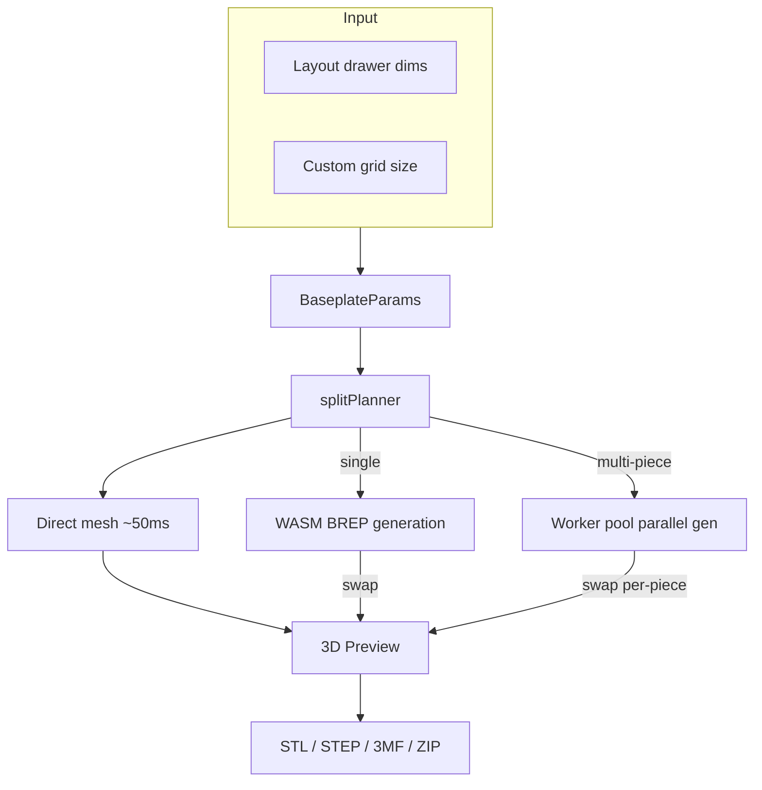

# Baseplate

Standalone page (`/baseplate`) for generating 3D-printable Gridfinity baseplates with automatic splitting for large layouts.

## Key Files

- `components/BaseplatePage.tsx` — responsive layout shell (desktop side-by-side, mobile stacked)
- `components/BaseplatePanel.tsx` — parameter controls: grid size, padding, magnets, split mini-map
- `components/BaseplatePreview.tsx` — Three.js 3D preview with assembled/exploded split views
- `hooks/useBaseplateGeneration.ts` — two-phase lifecycle: synchronous direct-mesh preview (sub-100ms) + async BREP swap once WASM bridge ready, epoch-based stale detection
- `hooks/useBaseplateExport.ts` — export pipeline: single-piece or parallel split with ZIP packaging; when stack printing is on, bakes real stacked geometry per physical stack (see Stack printing)
- `store/baseplatePageStore.ts` — ephemeral UI state (generation status, tiling, piece selection)
- `components/BaseplatePanel/StackPrintSection.tsx` — "Stack for printing" panel section
- `components/BaseplatePreview/StackedBaseplateMeshes.tsx` + `StackSeparationSlider.tsx` — flipped-tower preview + explode slider
- `utils/splitPlanner.ts` — 2D optimal tiling: partitions grid into print-bed-sized pieces
- `utils/buildFullParams.ts` — resolves sync mode (drawer dims vs custom width/depth); strips connectors, magnet holes, and corner rounding when stack printing is on
- `utils/stackPrint.ts` — stack planning (groups → capped physical stacks) + `buildTowerLayers` (bottom plate upright, the rest flipped, all XY-aligned)
- `utils/stackExport.ts` — bakes a stack into export triangle soup (single material)
- `utils/stackPreview.ts` — lays the towers out in a centered, roughly-square grid for the 3D preview. `TOWER_GAP_UNITS` (1) is the whole-unit clearance between adjacent towers — one grid unit (~42mm) reads as "separate printed pieces" while keeping every cell on the scene's integer footprint grid
- `utils/fileNaming.ts` — descriptive/compact/custom filename generation
- `constants.ts` — MAX_BASEPLATE_DIMENSION (16), EXPLODE_GAP_MM (10), piece color palette

## Key Concepts

- **Sync mode**: `syncWithLayout: true` reads drawer dims from layout store; `false` uses custom grid size
- **Split tiling**: baseplates exceeding print bed are partitioned into labeled pieces (A1, B2, etc.)
- **Two-phase preview**: direct-mesh (procedural, no WASM) renders immediately on every params change; BREP (high-fidelity) silently swaps in once ready. `MeshResult.source` records which path produced the visible mesh. With the graduated `manifold_preview` path (always on), the draft phase instead runs the real `generateBaseplate` on the Manifold kernel at draft quality (`runManifoldDraftPreview`) — more faithful than the procedural approximation — falling back to direct-mesh if the preview bridge is unavailable. A `finalizedEpochRef` guards the now-async draft so a late draft can't overwrite a fresher BREP result
- **Graceful BREP failure**: if BREP errors after a direct-mesh preview is on screen, the preview stays visible and a non-blocking toast surfaces the failure — avoids the red error overlay swallowing a still-usable canvas
- **Epoch detection**: rapid param changes bump an epoch counter; stale in-flight results (direct or BREP) are discarded
- **Ephemeral store**: `baseplatePageStore` resets on unmount; persistent params live in layout store
- **Connector fit offset (`connectorFitOffset`, issue #2024)**: a signed mm value (±0.3, 0.05 step, default 0) the user dials in the panel's connector section to compensate for printer/filament variation. It only shifts the female groove clearance — the tongue/key stay nominal — and is clamped so effective clearance never goes negative (`effectiveClearance` in `@/shared/constants/connectors`, the single source of truth shared by the worker, cache keys, and print guide). Positive = looser, negative = tighter
- **`preferIdenticalPieces` (opt-in, gated behind `connectorNubs`)**: palindromic chunk sizes + doubled (M+F) dovetail connectors + canonical-edge fingerprinting let opposite-corner pieces share one generated mesh. Each placement gets a `placementRotationDeg` (0 or 180); the 3D preview rotates the canonical mesh around the piece center and the print guide annotates rotated positions with "(rotate 180°)"
- **Stack printing (`StackPrintParams`)**: `baseplateParams.stackPrint` (`{ enabled, gapMm }`) prints a drawer's plates fast as vertical stacks. Each identical-piece group stacks to the quantity the drawer needs (`groupQuantity`), split into multiple physical stacks once a tower exceeds how many tiles fit the printer's build height (`stackHeightCap` from `settings.printSettings.maxPrintHeightMm`, applied in `planPhysicalStacks`). There's no "sets" multiplier — to print more, re-run the export. **Orientation** (community practice, see the model links below): the **bottom plate prints upright** (solid bed adhesion, no overhang) and **every plate above it is flipped upside down**, separated by a `gapMm` air gap so the tower snaps apart. `buildTowerLayers` builds this — the flip negates Y, so it re-aligns the mirrored footprint onto the upright one so all copies share one XY footprint. **Separation is single-material only** (an air gap). The PETG/"Support for PLA" technique people use is the **slicer's support interface** filling that gap — a slicer setting, not modeled geometry — so we don't model a separator sheet; the expanded print guide and the panel's "Clean separation (multi-material)" collapsible explain how to enable it (the Gap tooltip now only covers the air-gap layer-height rule). Replication is mesh-level (`utils/stackPrint`/`stackExport`/`stackPreview`): the BREP generator builds one plate, then flip/translate/replicate transforms produce the towers for both preview and export — the generator is untouched. The preview shows the towers in their printed orientation with a `StackSeparationSlider` to explode them. The panel section is a plain (non-collapsible) `FeatureToggle`, not a `StickyGroupHeader` group. Toggling stacking is a `selectGenerationTriggers` input so the preview mesh regenerates with connectors/magnets/rounding stripped (otherwise it keeps the pre-strip mesh). Reference models: [Stu142](https://printables.com/model/725407-gridfinity-stack-printing-baseplate), [Clough42](https://printables.com/model/995911-gridfinity-grids-stacked-for-printing), [gerolori generator](https://github.com/gerolori/gridfinity-baseplate-stack-generator).
- **Feature stripping under stacking**: stacking needs uniform, support-free tiles, so when `stackPrint.enabled` `buildFullParams` strips **connectors** (overhang barbs), **magnet holes** (their retaining floors become ~10% bridge area when flipped — see `baseplateGenerator.scenario.overhangAudit.test.ts`), and **corner rounding** (only the drawer's outer corners round, which would make the corner tiles differ). All done **functionally, without mutating stored params**, so settings return intact when stacking is off; the panel hides those controls and shows a notice. **STEP never stacks** (it's a CAD interchange format with no slicer stacking notion), so the format-aware `stackEnabled` — derived as `stackPrint.enabled && format !== 'step'` in both `BaseplatePage` and `BaseplatePanel` (reading `exportFileNameConfig.format`) — keeps those controls live for STEP, and the STEP export path clears `stackPrint` before `buildFullParams` so the exported solid retains them end-to-end.
- **Stack tile dedup**: with connectors + rounding stripped, split pieces that differ only by edge classification (corner/edge/interior) are byte-identical, so `computePieceFingerprint` omits the `edges` key when neither connectors nor rounding are active. An evenly-tiled drawer (e.g. 16×16 on a 180mm bed → sixteen 4×4 tiles) then dedupes to **one group** and stacks into a couple of tall towers instead of printing 16 unique pieces. Padding is still keyed separately, so padded edge tiles stay distinct from interior ones.
- **Padding anchor pad**: `PaddingSchematic` frames four mm steppers around a central `PaddingAnchor` 3×3 pad. Each outer cell is a directional arrow (a single `ArrowLeftIcon` rotated in 45° steps via `ARROW_ROTATION`) pointing at the drawer corner/edge it anchors to; the center cell is a target glyph. Picking a cell redistributes total padding through `computeAnchoredPaddings`; editing any stepper flips the anchor to `custom`, surfaced as a caption

## Gotchas

1. **Padding is position-aware** — only edge pieces carry padding; join edges always have 0mm
2. **Fractional edges** — 0.5-unit edges are absorbed into the outermost piece
3. **Worker pool is optional** — parallel generation falls back to sequential if pool unavailable
4. **Grid units vs mm** — stored params use grid units; multiply by `gridUnitMm` (42mm) for generation
5. **Default camera is top-down** — `BaseplatePreview` opens in top view (`CAMERA_PRESETS.top`); the reset button also returns to top view (not isometric)
6. **`preferIdenticalPieces` degrades silently with asymmetric padding/radii** — opposite-corner pieces only share a fingerprint when `paddingLeft == paddingRight`, `paddingFront == paddingBack`, and `cornerRadii` are 180°-symmetric. Otherwise the canonical mesh diverges and each piece gets its own file (still correct, just not deduplicated)
7. **WebGL context failure is terminal for the session, by design** — `BaseplatePreview`'s `<Canvas>` is wrapped in `WebGLErrorBoundary` (inside `PanelErrorBoundary`). When three.js can't acquire a GL context (slot exhaustion, GPU-process loss), the boundary renders `WebGLFallback` with **no Retry** and flips `detectWebGL()` to unavailable so subsequent renders skip the canvas — re-mounting would just re-throw. Recovery requires a page reload
8. **Snap-clip connector geometry has one source of truth** — `snapClipLevels(totalHeight, fitOffset)` in `@/shared/constants/connectors` resolves every Z-level and X-position for the `'snapClip'` style. The worker (pocket cut + `buildSnapClip`), the seated-clip preview (`ConnectorKeyMeshes`), and the bed/print math all call it, so they can't drift. The clip is a single X-Z cross-section extruded along the seam; the barb is a fixed-size feature near the leg tip, so only the leg LENGTH scales with slab height (taller bases get a longer flex beam). On a slab too thin to flex (`!viable`) the generator skips the pockets rather than ship a clip that snaps off. Geometry proven standalone with `brepjs-verify` (valid clip, watertight pockets, zero-interference seated fit). Because the socket mouth opens to the full cell at the slab top (`INSET_TOP = 0`), the clip's flush top bridge would poke into the open corners of the edge sockets flanking the seam, so `buildSnapClip` relieves those top-bridge corners against the neighbouring bin feet (above the barb zone only — the snap is untouched); see `snapClipSocketInterference.test.ts`. The seated-clip preview (`ConnectorKeyMeshes`) draws the un-relieved profile, a known cosmetic gap
9. **`'puzzle'` connector** (issue #2241) — a jigsaw tab (narrow neck → wider rounded head, ~1.0mm undercut/side) that locks the seam, drawn by `puzzleOutline` in `baseplateConnectors.ts`. Two non-obvious constraints: its head half-width (`PUZZLE_HEAD_HALF`) stays narrower than the bottom inter-cell wall, so a full-depth groove doesn't sever cells (no partial-height groove needed); and `nP` is clamped at 0 so a wide nozzle + max fit offset can't push the neck→head transition behind the wall and invert the profile. Shares `TONGUE_PROTRUSION` reach, so bed/bbox math is unchanged
