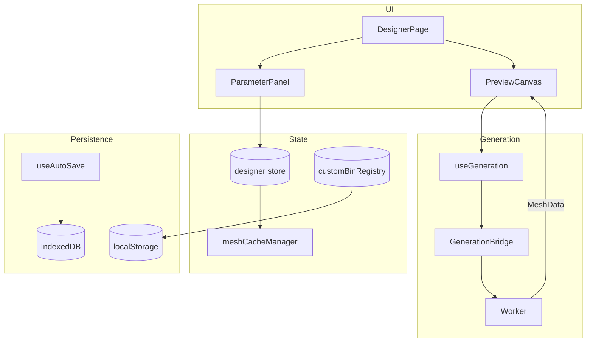

# Bin Designer

Parametric 3D Gridfinity bin generator with brepjs geometry engine.

## Key Files

- `components/DesignerPage.tsx` — main UI entry point
- `components/ParameterPanel.tsx` — parameter editing sidebar with collapsible sections
- `components/PreviewCanvas.tsx` — 3D preview with Three.js (renders bin + optional lid + explode slider)
- `components/CutoutWorkspace` — dedicated 3D editor for floor/wall cutouts
- `components/panel/ShapeSection/` — "Custom shape" toggle + paint-style half-bin grid editor
  (L/T/U presets, reset-to-rectangle link, O-shape-capable cellMask painting)
- `components/panel/LidSection/` — click-lock lid toggle, fit pills, magnet/grid toggles, thickness sliders
- `components/panel/ColorsSection/` — multi-color zone editor: per-zone rows, picker, palette CRUD, eyedropper + swap entry points
- `components/PreviewCanvas/ColorToolOverlay.tsx` — banner + click-anchored ColorPicker for the eyedropper tool, ESC-to-exit
- `utils/zoneResolver.ts` — pure raycast triangle → ColorZone mapping (reused across hit-test, preview, and 3MF export gating)
- `utils/zoneLabels.ts` — ColorZone → i18n key + flat `updateFeatureColors` patch helpers
- `hooks/useSwapZoneWithToast.ts` — wraps `pickSwapZone` with a localized success toast
- `components/preview/LidMesh/` — renders the lid mesh in the preview, with explode-aware
  positioning, opacity interpolation, and mutual hover highlight pairing with `BinMesh`
- `components/preview/LidGuideLine/` — visual cue connecting bin and lid in exploded views
- `components/preview/LidExplodeSlider/` — slider that lifts the lid off the bin (replaces view-mode pills)
- `store/designer.ts` — design state and parameter mutations (composed from slices)
- `store/customBinRegistry.ts` — syncs saved designs to layout planner palette
- `store/cutoutSelection.ts` — cutout editor selection state
- `hooks/useGeneration.ts` — triggers geometry regeneration via bridge (bin + optional companion lid)
- `storage/DesignerStorage.ts` — IndexedDB persistence for saved designs
- `constants/` — Gridfinity geometry constants, default params, designer constraints
- `types/` — TypeScript types for designer state, cutouts, compartments, lid config
- `utils/` — validation, print estimates, file naming, design JSON serialization

## Critical Concepts

- **Epoch pattern**: `store.setParam()` increments epoch → triggers regeneration. Cosmetic cutout mutations (lock/hide/z-reorder/showAllCutouts) call `pushHistoryEntry(state, { affectsGeometry: false })` so undo still works but the worker doesn't re-run — only properties the worker reads (everything except `locked`/`hidden`/`zIndex`) bump the epoch
- **Mesh cache**: 100MB budget, attached to history for instant undo
- **Custom bin registry**: Syncs to localStorage for Layout Planner palette
- **Ghost overlays**: Lightweight Three.js primitives render during `generationStatus === 'generating'` for instant visual feedback before BREP mesh completes. Components: `GhostDividers`, `GhostWireframe`, `GhostCompartmentPreview`, `GhostLabelTabs`, `GhostScoops`, `GhostCutouts`, `GhostWallCutouts`, `GhostSlotLines`, `GhostDividerPieces`
- **cellMask**: Non-rectangular footprint carried in `params.cellMask`. Always
  stored at **half-bin resolution** (`MASK_CELLS_PER_UNIT = 2`, so a `W × D`
  bin has a `2W × 2D` mask), row-major with **row 0 = bottom** (matches the
  generator's coordinate system; the UI inverts via `flex-col-reverse`).
  A fully-filled mask is normalised to `undefined` by `setCellMask` so the
  rectangle **fast-path** (shared by `isAllFilled` / `isPartialMask` /
  `drawRoundedRectangle` in the generator) stays active — custom shapes only
  pay the polygon cost when they actually differ from a rectangle.
  `validateMask` accepts enclosed empty cells (O-shape / ring topology); the
  generator builds those via `buildMaskHoleDrawings` and a 3D boolean cut,
  and the stacking-lip loft wraps each hole as well.
- **Shape editor state** (`ui.shapeEditorOpen` + `ui.halfGridMode`): normalised
  from the loaded params by `loadDesign` and `restoreHistoryEntry` via
  `paramsNeedHalfGridMode` (fractional dimensions OR `hasHalfBinDetail(mask)`),
  so reopening a design or undoing past a dimension change never leaves the
  UI toggles out of sync with the underlying shape.
- **Click-lock lid**: optional companion piece generated alongside the bin
  when `params.lid.enabled && params.base.stackingLip`. Source of truth lives
  in the worker (`generation/worker/generators/lidBuilder.ts` +
  `lidConstants.ts` + `lidOrchestrator.ts`); the result rides back as
  `lidMesh` on the same `MESH_RESULT` payload. The lid is rendered in
  preview with explode-aware Z and opacity (`LidMesh.tsx`); when exporting,
  STL/3MF emit it as a separate piece in the ZIP and STEP folds it into a
  compound assembly translated to its mated position. `LidSection` exposes
  fit (`tight`/`standard`/`loose` → fit-clearance table in `types/lid.ts`),
  toggles for stack grid + magnets, and floor/wall thickness.

## Gotchas

1. **Compartment cells must form rectangles** - `isRectangularSelection()` validates
2. **Min compartment size is 5mm** - smaller cells skip wall generation
3. **Auto-save only for saved designs** - "Untitled" bins don't persist
4. **Half-cells get no magnet holes** - only full 1×1 unit cells
5. **Solid style skips shell** - `keepFull` bypasses `.shell()`, so wallThickness is irrelevant
6. **Label tabs skip solid bins** - both generation and ghost overlay guard against `style === 'solid'`
7. **cellMask dimensions must track width × depth** - `cols` must equal
   `Math.round(width × MASK_CELLS_PER_UNIT)` and `rows` the depth equivalent.
   `paramSlice.setCellMask` rejects mismatched masks outright. When the bin
   is resized, `reshapeOrClearMask` (in `paramSlice`) grows/crops the stored
   mask to the new dimensions — if the result would be empty or invalid it
   falls back to `undefined` (rectangle fast-path).
8. **Custom shapes disable most features** - `FeatureGate` (`inert`
   - visual de-emphasis) blocks pattern/cutouts/handle/compartments/label
     tabs/scoop on `isPartialMask(cellMask)`. Wall thickness and stacking
     lip still work for any footprint.
9. **Lid requires a stacking lip** — `params.lid.enabled` is gated on
   `params.base.stackingLip` at every layer (orchestrator, export handler,
   `useLidSection`). The mating cavity wraps the lip; without a lip there is
   nothing for the lid to clip onto, so the lid is silently skipped.
10. **Two-piece export** — when `hasLid`, the `EXPORT_COMBINED` flow emits the
    lid as its own labeled piece for STL/3MF (main thread ZIPs them) and
    folds it into the STEP compound. The STEP path must `translate()` the
    lid solid by `totalHeight - lidAnchorZ(...)`; the lid is built in
    lid-local coordinates (Z=0 = lid floor top).
11. **`lidAnchorZ` is duplicated across the worker boundary** — the canonical
    formula lives in `generation/worker/generators/lidConstants.ts`; the
    main-thread copy in `LidMesh.tsx` mirrors it because the worker module
    isn't importable here. **Update both in lockstep** — silent drift causes
    the preview to misalign vs. the exported geometry.
12. **SVG import unit contract** — `svgImport/svgParser.ts` treats user units
    as mm 1:1 unless the SVG declares a physical `width`/`height`
    (mm/cm/in/pt/pc/Q) **and** carries an explicit `viewBox`. Without a real
    viewBox the fallback parses width/height with `parseFloat` (drops unit
    suffixes), so scaling is skipped to avoid producing wildly wrong sizes.
    Genuinely non-square aspect ratios (sx/sy diverge > 0.5%) also fall back
    to identity — a single uniform scalar would distort circles and rotated
    shapes. Path bounds use `getPathBounds` (flattened bezier) so curves that
    bow outward beyond their anchors aren't clipped.
13. **`BinMesh` multi↔single material switch needs distinct keys** — the
    multi-color branch passes `material` as a `<mesh>` **prop** (array of
    `MeshStandardMaterial`), the single-color branch declares the material as
    a `<meshStandardMaterial>` **child**. Without keys, R3F (9.x) reuses the
    same `THREE.Mesh` across the toggle and the post-order commit clobbers
    the freshly attached child material: child-attach runs first, then the
    parent's prop-diff resets the removed `material` prop to a memoized
    `new Mesh()` default (`MeshBasicMaterial`) via `diffProps`. The
    user-visible symptom is a mesh with no emissive glow whose color picker
    no longer takes. Don't remove the `key="multi-color"` /
    `key="single-color"` props — and if you add a third branch (e.g. a new
    material strategy) give it its own key too.

## Thumbnail Pipeline

Two paths produce design thumbnails, written to IndexedDB and surfaced in the design-list modal:

1. **Live-canvas capture** (`utils/thumbnail.ts` → `captureThumbnailAtPreset`) — used by `useAutoSave` and `useThumbnailCapture`. Reuses the main `PreviewCanvas`'s WebGL context: saves camera state, moves to the isometric preset, renders one frame, captures via `drawImage`, restores. Requires the designer to be mounted.
2. **Offscreen regenerator** (`utils/thumbnailRegenerator.ts`) — used by `useThumbnailRegeneration` (modal-open fallback) and `useBackgroundThumbnailRegen` (boot scan). Creates its own `THREE.WebGLRenderer`, acquires the shared bridge, generates mesh, renders one frame, disposes everything. Works without the designer being mounted.

**Boot-time scan** (`hooks/useBackgroundThumbnailRegen.ts`, mounted in `App.tsx`) runs once per page load to regenerate stale thumbnails before the user opens the modal. It schedules itself on `requestIdleCallback`, waits for sync to settle for authenticated sessions, pauses while the designer's `generationStatus === 'generating'` or the tab is hidden, and acquires the bridge once for the whole batch. Emits a single `bin_designer_bg_thumbnail_regen` PostHog event on completion. The modal-open hook stays as an in-session safety net for designs that appear after the boot scan (imports, freshly created bins).

Both paths feed the same `THUMBNAIL_VERSION` invariant: any thumbnail saved is stamped with the current version. The modal hook re-flags any design whose stored version trails the current constant, so bumping `THUMBNAIL_VERSION` (in `types/index.ts`) forces an organic regeneration on next modal open.

**Bump policy:** increment `THUMBNAIL_VERSION` whenever the _rendered output_ changes meaningfully — bug fixes that produce a different image, lighting changes, camera framing changes, lid/edge handling changes. Don't bump for code-internal refactors that produce byte-identical output.

**Indexed-mesh contract:** the worker emits an indexed mesh (deduplicated vertices + `Uint32Array` indices). Both render paths MUST call `geometry.setIndex(new THREE.BufferAttribute(indices, 1))` — without it Three.js draws random triangles between consecutive vertices and produces visually-corrupted "spaghetti" thumbnails. The shared `useMeshGeometry` hook handles this for the live canvas; the offscreen regenerator handles it inline.

## Integration

- `?placeBin=WxDxH` URL param places bin at (0,0) in Layout Planner
- Uses `generation` feature for WASM tessellation
