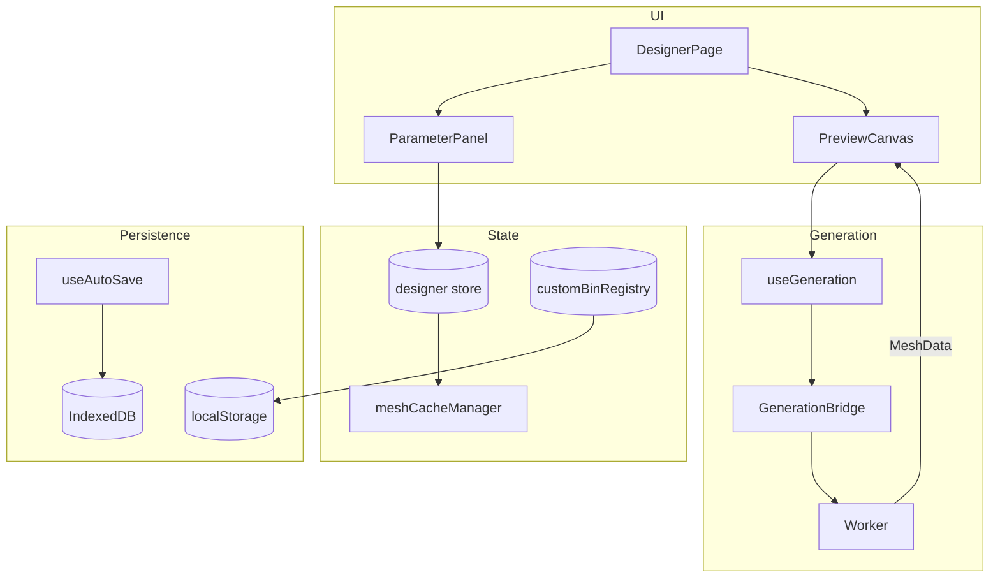

# Bin Designer

Parametric 3D Gridfinity bin generator with brepjs geometry engine.

## Key Files

- `components/DesignerPage.tsx` — main UI entry point
- `components/ParameterPanel.tsx` — parameter editing sidebar with collapsible sections
- `components/PreviewCanvas.tsx` — 3D preview with Three.js
- `components/CutoutWorkspace` — dedicated 3D editor for floor/wall cutouts
- `store/designer.ts` — design state and parameter mutations (composed from slices)
- `store/customBinRegistry.ts` — syncs saved designs to layout planner palette
- `store/cutoutSelection.ts` — cutout editor selection state
- `hooks/useGeneration.ts` — triggers geometry regeneration via bridge
- `storage/DesignerStorage.ts` — IndexedDB persistence for saved designs
- `constants/` — Gridfinity geometry constants, default params, designer constraints
- `types/` — TypeScript types for designer state, cutouts, compartments
- `utils/` — validation, print estimates, file naming, design JSON serialization

## Critical Concepts

- **Epoch pattern**: `store.setParam()` increments epoch → triggers regeneration
- **Mesh cache**: 100MB budget, attached to history for instant undo
- **Custom bin registry**: Syncs to localStorage for Layout Planner palette
- **Ghost overlays**: Lightweight Three.js primitives render during `generationStatus === 'generating'` for instant visual feedback before BREP mesh completes. Components: `GhostDividers`, `GhostWireframe`, `GhostCompartmentPreview`, `GhostLabelTabs`, `GhostScoops`, `GhostCutouts`, `GhostWallCutouts`, `GhostSlotLines`, `GhostDividerPieces`

## Gotchas

1. **Compartment cells must form rectangles** - `isRectangularSelection()` validates
2. **Min compartment size is 5mm** - smaller cells skip wall generation
3. **Auto-save only for saved designs** - "Untitled" bins don't persist
4. **Half-cells get no magnet holes** - only full 1×1 unit cells
5. **Solid style skips shell** - `keepFull` bypasses `.shell()`, so wallThickness is irrelevant
6. **Label tabs skip solid bins** - both generation and ghost overlay guard against `style === 'solid'`

## Integration

- `?placeBin=WxDxH` URL param places bin at (0,0) in Layout Planner
- Uses `generation` feature for WASM tessellation
