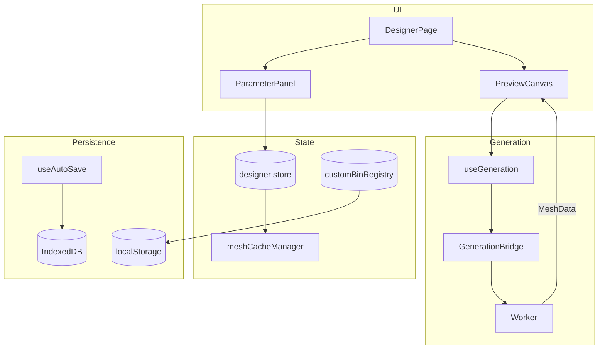

# Bin Designer

Parametric 3D Gridfinity bin generator with brepjs geometry engine.

## Key Files

- `components/DesignerPage.tsx` — main UI entry point
- `components/ParameterPanel.tsx` — parameter editing sidebar with collapsible sections
- `components/PreviewCanvas.tsx` — 3D preview with Three.js (renders bin + optional lid + explode slider)
- `components/CutoutWorkspace` — dedicated 3D editor for floor/wall cutouts. Properties live in
  a docked, resizable/collapsible `InspectorDock` (width + collapsed state persisted via
  `inspectorDockStorage`), not a floating overlay. `InspectorContent` switches between
  single-select sections, multi-select shared fields (mixed values show a "—" placeholder),
  and an empty board-settings state; number-first `CompactNumberInput` (drag-scrub + type)
  replaces sliders, and hardware-size presets surface as quick-pick chips.
- `components/panel/ShapeSection/` — "Custom shape" toggle + paint-style half-bin grid editor
  (L/T/U presets, reset-to-rectangle link, O-shape-capable cellMask painting)
- `components/panel/LidSection/` — click-lock lid toggle, fit pills, magnet/grid toggles, thickness sliders
- `components/panel/ColorsSection/` — multi-color zone editor: per-zone rows, picker, palette CRUD, eyedropper + swap entry points
- `components/PreviewCanvas/ColorToolOverlay.tsx` — banner + click-anchored ColorPicker for the eyedropper tool, ESC-to-exit
- `utils/zoneResolver.ts` — pure raycast triangle → ColorZone mapping (reused across hit-test, preview, and 3MF export gating)
- `utils/zoneLabels.ts` — ColorZone → i18n key + flat `updateFeatureColors` patch helpers
- `hooks/useSwapZoneWithToast.ts` — wraps `pickSwapZone` with a localized success toast
- `components/preview/LidMesh/` — renders the lid mesh in the preview, with explode-aware
  positioning, opacity interpolation, and mutual hover highlight pairing with `BinMesh`. In
  multi-color mode it paints the lid with its zone color (`featureColors.lid`) to match the
  exporter, rather than the body color
- `components/preview/LidGuideLine/` — visual cue connecting bin and lid in exploded views
- `components/preview/LidExplodeSlider/` — slider that lifts the lid off the bin (replaces view-mode pills)
- `store/designer.ts` — design state and parameter mutations (composed from slices)
- `store/customBinRegistry.ts` — syncs saved designs to layout planner palette
- `store/cutoutSelection.ts` — cutout editor selection state
- `store/tagAppearance.ts` — device-local per-tag icon/color (localStorage `gridfinity-tag-appearance-v1`), keyed by lowercased tag; rendered by `TagGlyph` in every tag chip and edited via `TagManagerDialog` (Saved Designs ⋯ menu → "Manage tags…")
- `hooks/useGeneration.ts` — triggers geometry regeneration via bridge (bin + optional companion lid)
- `storage/DesignerStorage.ts` — IndexedDB persistence for saved designs (incl. optional `tags`; `updateDesignTags` replaces a design's tag set)
- `storage/defaultParamsStorage.ts` — user's custom "default for new bins" (localStorage). Stores a style-only `Partial<BinParams>` (per-design geometry stripped via `extractStyleDefaults`/`STYLE_DEFAULT_OMIT_KEYS`); `loadDefaultParams` re-completes it via `migrateParams`. Read at the single `defaultsForNewDesign()` chokepoint so `newDesign`/`resetToDefaults` both honor it
- `store/binDefaults.ts` — tiny reactive mirror of "is a custom default stored?" so every surface stays in sync (localStorage isn't reactive)
- `hooks/useBinDefaults.ts` — single source of behavior (`setCurrentAsDefault` / `resetToFactory` / `hasCustomDefault` + toasts) shared by all four discoverability surfaces: the Saved Designs ⋯ menu, the `SetDefaultFooter` (parameter-panel footer), the Settings → Defaults tab, and the command palette. The palette can't import this feature (cross-feature boundary), so `set-bin-default`/`reset-bin-default` commands dispatch window events that `useBinDefaultCommandBridge` (mounted by `DesignerPage`) translates into hook calls
- `constants/` — Gridfinity geometry constants, default params, designer constraints
- `types/` — TypeScript types for designer state, cutouts, compartments, lid config
- `utils/` — validation, print estimates, file naming, design JSON serialization
- `utils/tags.ts` — `normalizeTags` (trim/strip-control-chars/dedupe/cap: 12 tags × 32 chars)

## Critical Concepts

- **Epoch pattern**: `store.setParam()` increments epoch → triggers regeneration. Cosmetic cutout mutations (lock/hide/z-reorder/showAllCutouts) call `pushHistoryEntry(state, { affectsGeometry: false })` so undo still works but the worker doesn't re-run — only properties the worker reads (everything except `locked`/`hidden`/`zIndex`) bump the epoch
- **Mesh cache**: 100MB budget, attached to history for instant undo
- **Custom bin registry**: Syncs to localStorage for Layout Planner palette
- **Ghost overlays**: Lightweight Three.js primitives render during `generationStatus === 'generating'` for instant visual feedback before BREP mesh completes. Components: `GhostDividers`, `GhostWireframe`, `GhostCompartmentPreview`, `GhostLabelTabs`, `GhostScoops`, `GhostCutouts`, `GhostWallCutouts`, `GhostSlotLines`, `GhostDividerPieces`
- **cellMask**: Non-rectangular footprint carried in `params.cellMask`. Always
  stored at **half-bin resolution** (`MASK_CELLS_PER_UNIT = 2`, so a `W × D`
  bin has a `2W × 2D` mask), row-major with **row 0 = bottom** (matches the
  generator's coordinate system; the UI inverts via `flex-col-reverse`).
  A fully-filled mask is normalised to `undefined` by `setCellMask` so the
  rectangle **fast-path** (shared by `isAllFilled` / `isPartialMask` /
  `drawRoundedRectangle` in the generator) stays active — custom shapes only
  pay the polygon cost when they actually differ from a rectangle.
  `validateMask` accepts enclosed empty cells (O-shape / ring topology); the
  generator builds those via `buildMaskHoleDrawings` and a 3D boolean cut,
  and the stacking-lip loft wraps each hole as well.
- **Shape editor state** (`ui.shapeEditorOpen` + `ui.halfGridMode`): normalised
  from the loaded params by `loadDesign` and `restoreHistoryEntry` via
  `paramsNeedHalfGridMode` (fractional dimensions OR `hasHalfBinDetail(mask)`),
  so reopening a design or undoing past a dimension change never leaves the
  UI toggles out of sync with the underlying shape.
- **Fractional foot edge** (`params.fractionalEdgeX` / `fractionalEdgeY`): for a
  bin with a fractional dimension (e.g. 2.5u), which side the half-unit foot
  column/row sits on — `'end'` (default) = right/back, `'start'` = left/front.
  Mirrors the baseplate's drawer-level option and lets a 2.5×2 bin place its
  half foot on either side **without** rotating the print (rotation would move
  the front-facing finger scoop to the back). Default `'end'` keeps existing
  geometry byte-identical (the socket cache key appends `frac:x:y` only when
  non-default). The setting is threaded through every cell iterator that must
  agree on foot placement — base sockets + their magnet/screw holes, the
  lightweight base, and lid magnets — so they never drift apart. **No effect with
  `base.halfSockets`** (every foot is already a uniform 0.5u cell, so there's no
  single half foot to move) — the `DimensionsSection` toggle hides in that mode.
  Overhang gap-fill feet keep the default decomposition since they don't mate
  with baseplate sockets. `migrateParams` backfills `'end'` for legacy designs;
  `handleSwapDimensions` swaps the two edges along with width/depth.
- **Click-lock lid**: optional companion piece generated alongside the bin
  when `params.lid.enabled && params.base.stackingLip`. Source of truth lives
  in the worker (`generation/worker/generators/lidBuilder.ts` +
  `lidConstants.ts` + `lidOrchestrator.ts`); the result rides back as
  `lidMesh` on the same `MESH_RESULT` payload. The lid is rendered in
  preview with explode-aware Z and opacity (`LidMesh.tsx`); when exporting,
  STL/3MF emit it as a separate piece in the ZIP and STEP folds it into a
  compound assembly translated to its mated position. `LidSection` exposes
  the extra-height cavity boost (`extraHeightMm`, 0–100mm — a taller lid
  encloses items that poke up out of a short bin, e.g. toothpicks; 0 = the
  standard one-grid-unit lid), the stack-grid / magnet / separate-baseplate
  toggles, and per-side click-rail snaps with a coverage slider. Wall/top
  thickness and fit clearance are intentionally locked-down constants in
  `lidConstants.ts` (a single validated set — exposing them invited mis-prints).
- **Cutout Pathfinder / `GroupOp`**: cutouts in the same `groupId` share an
  optional `groupOp` ∈ `'union' | 'subtract' | 'intersect' | 'exclude'`
  (missing = `'union'` so pre-Pathfinder designs are unchanged). The worker's
  `cutoutGroupOps.combineGroupSolids` fuses, carves, or XORs the group's
  member solids into a single cut tool; **Subtract uses the highest-zIndex
  member as the cutter** against the union of the rest (Illustrator "Minus
  Front"). The 2D editor preview mirrors the same semantics via
  `polygon-clipping` in `panel/CutoutsSection/booleanGeometry.ts`, so the
  live editor matches the exported mesh. **Exclude is computed as `union −
intersection`, not XOR** — they coincide for 2 members but diverge for
  3+ (a region in 2 of 3 members survives `union − intersection` but is
  stripped by symmetric-difference). Scoop fillets are restricted to union
  groups; the other ops can produce holes or disjoint topologies the
  adaptive fillet can't reason about. Empty results (e.g. Intersect of
  disjoint shapes) raise a toast so silent no-ops are debuggable.

- **Cutout shapes**: beyond `rectangle` / `circle` / `path` (pen), the editor
  has two parametric primitives for bit/socket organizers — `polygon`
  (regular N-gon, `sides` 3–12, flat-top hex default) and `slot`
  (stadium/capsule = rounded-rect at half-short-side radius). A polygon's
  vertices are **derived to fill the `width × depth` box** (shared math in
  `@/shared/utils/cutoutPolygon`, used by both the worker and the 2D editor),
  so every bounds/resize/rotation/align helper is reused unchanged — only the
  outline generation, `booleanGeometry`, and the renderer branch on shape
  (polygon → `PolygonShapeMesh`; slot → SDF rounded box). Insert shapes
  (circle/polygon/slot) carry an optional `clearance` (mm) added to the cut at
  generation time so spec-sized parts fit; the 2D editor shows the nominal
  size. Polygons are sized **across-flats** (matches hex/Allen specs);
  per-shape sizing + hardware presets live in `CutoutShapeControls`.

- **Entry chamfer**: `chamferWidth` (mm) lofts a ~45° flare at the cut's top rim
  so parts self-center on insertion. The generator builds it via `loftWith`
  between the nominal profile and a `chamferWidth`-expanded top profile; it
  composes with scoop fillets and is clamped to `maxEntryChamfer(cutDepth)` (a
  `MIN_STRAIGHT_WALL` straight section must remain below the bevel). New
  insert-style holes seed a size-scaled default via `defaultEntryChamfer`
  (~10% of the tightest dimension, clamped to a tasteful 0.4–0.8mm). Available
  on `rectangle` / `circle` / `polygon` / `slot`. The editor exposes tolerance +
  chamfer as 0.2mm steppers that still accept off-grid fractional typing.

- **Parametric arrays**: a cutout can carry a `CutoutArrayConfig` (`array`) that
  replicates it across a `grid`, `staggered`, or `radial` pattern from a single
  **master**. Placement math lives in `@/shared/utils/cutoutArray`
  (`arrayInstances` → offsets, `expandCutoutArray` → concrete `Cutout[]`), shared
  by the worker (cut tools) and the 2D editor (instance meshes) so both derive
  identical positions. Instance 0 is always the master (a real cut, keeps its
  id/placement); derived instances get ids `${master.id}::a${i}`. Total instances
  are capped at `MAX_ARRAY_INSTANCES`, and the editor clamps counts, pitch, and
  radius to feasible bounds (`arrayFieldBounds`) so an array can't be grown past
  the bin footprint. Arrays are restricted to **ungrouped, non-path** cutouts;
  `flattenCutoutArray` / `applyFlattenArray` bake instances into independent
  cutouts. Array controls (now `+/-` steppers) appear in both the full-screen
  workspace and the sidebar editor (`CutoutArrayControls`).

### Mesh imprint cutouts (STL import)

`shape: 'mesh'` cutouts carve a contoured pocket from an uploaded STL. The compressed mesh lives in `BinParams.meshAssets` (content shared across duplicates/arrays; store GCs an asset when its last referencing cutout is deleted — see `cutoutSlice`). Import flow: `panel/CutoutsSection/stlImport/` (`useStlImport` → worker `IMPORT_MESH` → orientation dialog → `addMeshCutout`). The 2D editor renders the stored silhouette (`renderer/MeshFootprintMesh`) shape-locked: move/rotate/array yes; resize, point-edit, scoops, pathfinder groups no. Fit controls (clearance/chamfer) apply. Payload cap is 2MB only when `meshAssets` is non-empty (server mirror in `api/lib/designerValidation.ts`).

### Imported bin designs (STL → design, `stl_bin_import` labs flag)

Distinct from mesh imprints: here the uploaded STL **is** the design — a whole
Gridfinity bin (e.g. downloaded from Printables) saved as an `importedMesh`
item kind (`kind` + `envelope` + `structure`, no `params`). The structure
(`ImportedMeshStructure` in `@/shared/types/item`) holds the GMA1-compressed
`MeshAsset`, the claimed `heightUnits`, the measured `volumeMm3` (filament
estimates), and the source file name.

- **Import flow**: `DesignImportView` accepts `.stl` when the flag is on and
  routes to `components/ImportBinDialog/` (`useImportBinDesign` →
  `bridge.importMesh` → orientation preview → `detectGridFromSize` →
  eager `saveDesign` + `customBinRegistry` upsert + `loadDesign`).
- **Grid detection** (`utils/meshGridDetection.ts`): W/D snap to 0.5-unit
  steps against `W·gridUnit − TOLERANCE`; height tests both lipless (`H·7`)
  and lipped (`H·7 + 4.4`) reads so a lipped 3U bin (25.4mm) reads as 3U.
  Deviation > 2mm/axis flags the off-grid warning. The claimed footprint only
  affects layout planning — **the mesh is never rescaled**.
- **Panel**: `panel/ImportedMeshSection/ImportedMeshPanel.tsx` (read-mostly:
  stats, footprint steppers, STL/3MF export — STEP is impossible, no BREP).
- **Persistence**: `useAutoSave` is bin-params-only, so
  `hooks/useImportedDesignAutoSave.ts` covers footprint edits (load → merge →
  save, preserving the captured thumbnail) and the one-time thumbnail capture
  after first generation.
- **Registry**: `CustomBinRef.kind?: ItemKind` (absent = bin) lets the
  planner/link dialog identify imported entries; `designFootprint()` in
  `utils/designKind.ts` reads dimensions for any kind.
- **Scope (v1)**: local-only — cloud sync deliberately skips non-bin kinds
  (`sync/designAdapter.ts` filters with `isBinDesign`); the layout grid/3D
  view renders the standard box + link badge, not the real mesh.

## Gotchas

1. **Compartment cells must form rectangles** - `isRectangularSelection()` validates
2. **Min compartment size is 5mm** - smaller cells skip wall generation
3. **Auto-save only for saved designs** - "Untitled" bins don't persist
4. **Half-cells get no magnet holes** - only full 1×1 unit cells
5. **Solid style skips shell** - `keepFull` bypasses `.shell()`, so wallThickness is irrelevant
6. **Label tabs skip solid bins** - both generation and ghost overlay guard against `style === 'solid'`. Tabs default to `edges: 'back'` (legacy); `'front'` and `'both'` enable tuck-under ledges (#1898). `inset` (mm) slides the tab inward from its anchor wall for shorter coverage. In `'both'` mode the front tab silently drops when `2·depth + 2·inset > compartmentDepth` and the panel surfaces an inline warning.
   - **Per-compartment label text is edited in two places, one source of truth.** `compartments.compartmentTexts` (keyed by compartment id) feeds both the engraving (`labelTabBuilder`) and two editors: the `CompartmentEditor` "Add labels" mode (primary — `useCompartmentLabeling` + `CompartmentLabelField`, transient view state, **standard style + >1 compartment only**) and the collapsed bulk list in `LabelTabsSection` (keyboard/a11y fallback). Both call `setCompartmentText`. Labels render **always-visible** on grid cells (truncated, full text via `title`) so they're legible without hover (which doesn't exist on touch); typing a label when label tabs are off shows an inline "Enable label tabs" prompt. The text persists regardless of whether tabs are enabled or actually generate.
7. **cellMask dimensions must track width × depth** - `cols` must equal
   `Math.round(width × MASK_CELLS_PER_UNIT)` and `rows` the depth equivalent.
   `paramSlice.setCellMask` rejects mismatched masks outright. When the bin
   is resized, `reshapeOrClearMask` (in `paramSlice`) grows/crops the stored
   mask to the new dimensions — if the result would be empty or invalid it
   falls back to `undefined` (rectangle fast-path).
8. **Custom shapes disable most features** - `FeatureGate` (`inert`
   - visual de-emphasis) blocks pattern/cutouts/handle/compartments/label
     tabs/scoop on `isPartialMask(cellMask)`. Wall thickness and stacking
     lip still work for any footprint.
9. **Lid requires a stacking lip** — `params.lid.enabled` is gated on
   `params.base.stackingLip` at every layer (orchestrator, export handler,
   `useLidSection`). The mating cavity wraps the lip; without a lip there is
   nothing for the lid to clip onto, so the lid is silently skipped.
10. **Two-piece export** — when `hasLid`, the `EXPORT_COMBINED` flow emits the
    lid as its own labeled piece for STL/3MF (main thread ZIPs them) and
    folds it into the STEP compound. The STEP path must `translate()` the
    lid solid by `totalHeight - lidAnchorZ(...)`; the lid is built in
    lid-local coordinates (Z=0 = lid floor top).
11. **`lidAnchorZ` is duplicated across the worker boundary** — the canonical
    formula lives in `generation/worker/generators/lidConstants.ts`; the
    main-thread copy in `LidMesh.tsx` mirrors it because the worker module
    isn't importable here. **Update both in lockstep** — silent drift causes
    the preview to misalign vs. the exported geometry.
12. **SVG import unit contract** — `svgImport/svgParser.ts` treats user units
    as mm 1:1 unless the SVG declares a physical `width`/`height`
    (mm/cm/in/pt/pc/Q) **and** carries an explicit `viewBox`. Without a real
    viewBox the fallback parses width/height with `parseFloat` (drops unit
    suffixes), so scaling is skipped to avoid producing wildly wrong sizes.
    Genuinely non-square aspect ratios (sx/sy diverge > 0.5%) also fall back
    to identity — a single uniform scalar would distort circles and rotated
    shapes. Path bounds use `getPathBounds` (flattened bezier) so curves that
    bow outward beyond their anchors aren't clipped.
13. **Physical-units print bed is dual-axis** — the section uses the shared
    `PrintBedInput`, so width and depth round-trip independently when the
    link toggle is off. The linked state is encoded by
    `settings.defaultPrintBedDepth === undefined` (`undefined` = "follow
    width", not "0" or "missing"). `usePhysicalUnitsSection.handlePrintBedChange`
    must call the setter with `depth: undefined` when relinking — otherwise
    a stale depth lingers in localStorage and the bed silently stays
    non-square on the next load.
14. **`BinMesh` multi↔single material switch needs distinct keys** — the
    multi-color branch passes `material` as a `<mesh>` **prop** (array of
    `MeshStandardMaterial`), the single-color branch declares the material as
    a `<meshStandardMaterial>` **child**. Without keys, R3F (9.x) reuses the
    same `THREE.Mesh` across the toggle and the post-order commit clobbers
    the freshly attached child material: child-attach runs first, then the
    parent's prop-diff resets the removed `material` prop to a memoized
    `new Mesh()` default (`MeshBasicMaterial`) via `diffProps`. The
    user-visible symptom is a mesh with no emissive glow whose color picker
    no longer takes. Don't remove the `key="multi-color"` /
    `key="single-color"` props — and if you add a third branch (e.g. a new
    material strategy) give it its own key too.
15. **Split connectors have two independent joints** — two sibling toggles in
    `SplitOptionsSection`, gated separately (neither is a child of the other):
    - **Alignment connectors** (`splitConnectors.enabled`) — a 45° floor scarf lap.
    - **Wall connectors** (`splitConnectors.wallConnector`, a `WallConnectorStyle`:
      `'none'` | `'key'`, **default `'none'`**, #1869) — a connector on the
      **exterior perimeter walls only**. The `'key'` style is a straight
      (non-undercut) tongue/groove so the halves **press together horizontally**
      — an undercut dovetail would force a vertical drop-in, impossible past the
      partial-height groove and the stacking lip. The protruding tongue has a 45°
      chamfered underside (self-supporting), and the key is **anchored a fixed skin
      behind the outer face** so the groove can't breach the exterior wall (see
      `wallKeyGeometry`). Stops below the rim so the lip is untouched.

    Either toggle works with the other off — the call site in `splitBinBuilder.ts`
    runs the connector pass when _either_ is on, and `addConnectors` self-gates each
    feature. **Thicker walls add no extra material:** the key is reinforced by an
    inward pilaster _only when the wall is too thin to host it_. Because `perpInset`
    is anchored to a fixed outer skin (not the wall thickness), a thicker wall
    envelops the key and `addKeyConnectors` drops the pilaster entirely.
    **Adding a connector type:** extend `WallConnectorStyle`, add a `case` to the
    exhaustive `addWallConnectors` switch in
    `generation/worker/generators/splitConnectorBuilder.ts` (the compiler flags it
    until handled), reuse `perimeterWalls()` for placement, and add it to the UI.

16. **Design tags sync as a `name`-sibling, not inside `params`** — `tags` rides
    alongside `name` in the design envelope (`{ name, params, tags }`), so it
    never passes through the BinParams share validator. `saveDesign` normalizes
    and persists it; an omitted `tags` on update **preserves** the stored set,
    while an explicit `[]` **clears** it. The sync adapter applies LWW (a remote
    array — even empty — wins; a legacy payload with no `tags` key falls back to
    local). `normalizeTags` (client) and `sanitizeTags` (server) **must** stay
    identical — same 12×32 caps **and** the same control-char stripping — or a
    tag the client keeps but the server rewrites would flicker on the next pull.
17. **Draft preview is best-effort and supersedable** — the `manifold_preview`
    path (graduated, always on) has `useGeneration` render a fast Manifold draft (`setDraftResult`,
    `generation.isDraft = true`) on each edit, then the exact occt-wasm result
    supersedes it. A monotonic token drops a draft once a newer edit starts or the
    exact for its edit has landed (covers the exact-resolves-before-draft race).
    Drafts skip the undo/redo mesh cache — history holds exact geometry only.
18. **Angled dividers are an advanced opt-in, gating UI only** — the editing
    surfaces (the `DividerTiltSubsection` tilt list/inspector and the on-grid
    `DividerHitTargets` overlay in `CompartmentEditor`) are hidden unless
    `settings.angledDividersEnabled` is on (default `false`, persisted; toggled
    inline from the compact header in the Grid Dividers panel). The gate is
    **UI-only**: `compartments.dividerOverrides` and the worker geometry path are
    untouched, so a saved design with tilts still renders and exports them while
    the toggle is off — only editing is hidden (#2044). Toggling off clears the
    in-flight selection/hover/preview so the canvas overlay drops cleanly.
19. **WebGL context failure is terminal for the session, by design** — the
    `PreviewCanvas` `<Canvas>` is wrapped in `WebGLErrorBoundary` (inside
    `PanelErrorBoundary`). When three.js can't acquire a GL context (slot
    exhaustion, GPU-process loss), the boundary renders `WebGLFallback` with
    **no Retry** and flips `detectWebGL()` to unavailable so subsequent renders
    skip the canvas — re-mounting would just re-throw, which previously produced
    rapid error bursts. Recovery requires a page reload. Non-WebGL render errors
    still bubble to `PanelErrorBoundary`'s generic retry UI.
20. **Resizing can strand cutouts off-board** — the cutout workspace inspector
    now hosts the bin Width/Depth/Height controls (`BinSizeSection` wrapping the
    shared `DimensionsSection`), so the bin can be resized mid-edit. Cutouts are
    stored in **absolute interior-mm and are never auto-rescaled**, so shrinking
    the footprint can leave a cutout past the new edge; the mesh builder then
    silently clips the overhang (`cutoutBuilder.clipToInterior`). `offBoardCutouts`
    treats a cutout as its set of **expanded array instances** (`expandCutoutArray`,
    just the cutout itself when there's no array) and flags it if **any** instance
    falls outside, measuring each footprint with `getCutoutBounds` from `maskFit`
    (true vertex bounds, rotation-aware for paths — the same primitive placement
    validation uses). A **masked** (custom-shape) bin defers to `cutoutFitsInMask`
    so an instance over an unfilled cell is caught, not just rectangle overhang.
    `OffBoardFrames3D` frames each off-board _instance_ in red; the inspector's
    one-click "Bring back in" translates the **master** (instances move with it):
    for a plain bin it pulls the instances' union inside the rectangle (oversized
    pins the min corner to the origin); for a masked bin it searches the nearest
    cell-aligned placement where every instance fits the polygon, and leaves the
    cutout flagged when none exists (translation can't fit an arbitrary concave
    region — honest rather than a silent false-fix).

## Thumbnail Pipeline

Two paths produce design thumbnails, written to IndexedDB and surfaced in the design-list modal:

1. **Live-canvas capture** (`utils/thumbnail.ts` → `captureThumbnailAtPreset`) — used by `useAutoSave` and `useThumbnailCapture`. Reuses the main `PreviewCanvas`'s WebGL context: saves camera state, moves to the isometric preset, renders one frame, captures via `drawImage`, restores. Requires the designer to be mounted.
2. **Offscreen regenerator** (`utils/thumbnailRegenerator.ts`) — used by `useThumbnailRegeneration` (modal-open fallback) and `useBackgroundThumbnailRegen` (boot scan). Creates its own `THREE.WebGLRenderer`, acquires the shared bridge, generates mesh, renders one frame, disposes everything. Works without the designer being mounted.

**Boot-time scan** (`hooks/useBackgroundThumbnailRegen.ts`, mounted in `App.tsx`) runs once per page load to regenerate stale thumbnails before the user opens the modal. It schedules itself on `requestIdleCallback`, waits for sync to settle for authenticated sessions, pauses while the designer's `generationStatus === 'generating'` or the tab is hidden, and acquires the bridge once for the whole batch. Emits a single `bin_designer_bg_thumbnail_regen` PostHog event on completion. The modal-open hook stays as an in-session safety net for designs that appear after the boot scan (imports, freshly created bins).

Both paths feed the same `THUMBNAIL_VERSION` invariant: any thumbnail saved is stamped with the current version. The modal hook re-flags any design whose stored version trails the current constant, so bumping `THUMBNAIL_VERSION` (in `types/index.ts`) forces an organic regeneration on next modal open.

**Bump policy:** increment `THUMBNAIL_VERSION` whenever the _rendered output_ changes meaningfully — bug fixes that produce a different image, lighting changes, camera framing changes, lid/edge handling changes. Don't bump for code-internal refactors that produce byte-identical output.

**Indexed-mesh contract:** the worker emits an indexed mesh (deduplicated vertices + `Uint32Array` indices). Both render paths MUST call `geometry.setIndex(new THREE.BufferAttribute(indices, 1))` — without it Three.js draws random triangles between consecutive vertices and produces visually-corrupted "spaghetti" thumbnails. The shared `useMeshGeometry` hook handles this for the live canvas; the offscreen regenerator handles it inline.

## Example Gallery (inspiration)

A curated, browsable catalog of example bin designs users import as a **new** saved design (copy semantics — never mutates current work). It lives inside this feature (not a separate slice) because it needs designer internals (`saveDesign`, `setActiveDesignId`, thumbnail capture) that cross-feature import rules forbid reaching from another feature.

Cards show a static thumbnail; the detail view loads a live, rotatable 3D preview from a pre-generated mesh — no in-browser geometry kernel call needed to inspect an example.

### Key files

- `components/ExampleGallery/` — modal (`ExampleGallery.tsx`), `ExampleCard`, `ExamplePreviewOverlay`, `TechniqueFilterPills`, the live `Example3DViewer.tsx` (loads the bundled Draco GLB into a Three.js canvas), and the pure `useExampleGalleryFilters.ts` (`filterExamples` — search + technique only).
- `data/examples/` — one file per technique group + `showcase.ts`, `heroes.ts`, and `palette.ts`, aggregated in `index.ts` (`EXAMPLE_DESIGNS`). Each preset spreads `DEFAULT_BIN_PARAMS` and overrides only the technique fields.
- `data/examples/palette.ts` — the cohesive gallery color system: `PALETTE` (named swatches) + `coloredFeatures()`, which builds a `FeatureColorConfig` so showcase/hero presets carry consistent per-zone colors (`colored: true`).
- `data/examples/thumbnails/*.png` — committed static thumbnails (one per example).
- `data/examples/meshes/*.glb` — committed Draco-compressed GLB previews (one per example), resolved via `meshUrl(id)`. The decoder is self-hosted in `public/draco/` so the viewer needs no CDN.
- `data/examples/catalog.test.ts` — integrity guard (unique ids, `validateBinParams` per preset, metrics==params, thumbnail-bundled, mesh-bundled, i18n keys resolve).
- `utils/exampleToDesign.ts` — `saveDesign` (fresh id) + `setActiveDesignId`; relies on `saveDesign`'s `put` event to sync the custom-bin registry.
- `types/exampleGallery.ts` — `ExampleDesign`, `ExampleTechnique`, `TECHNIQUE_CONFIG` (techniques include `wallPattern` for honeycomb/ventilated walls).
- `components/DevThumbnailRoute/` + `scripts/gen-example-thumbnails.ts` — dev-only render route (gated on `import.meta.env.DEV`) + Playwright generator (`pnpm gen:example-thumbnails`).

### Concepts & gotchas

1. **Open-state in a core store** — `@/core/store/binExampleGallery` (open/close/toggle). The modal is mounted once in `App.tsx` (always-present shell, so it works on every route), opened from two entry points: the "Browse examples" card in the bin designer's `ParameterPanel` sidebar (below Physical Units) and the `open-bin-examples` command-palette command (which can't import this feature, so it flips the core flag).
2. **Thumbnails and meshes need a browser** — thumbnails use `THREE.WebGLRenderer` and meshes come from the brepjs worker, so neither can be generated in node. Regenerate via the dev route + Playwright script after changing presets. The dev route renders with `PreviewCanvas`'s `hideChrome` prop (no grid/labels) for clean output. GLB previews are Draco-compressed; the preview meshes must be merged per-material before Draco encoding to keep file sizes small.
3. **Inspirational, not practical** — the catalog is a tight, hand-picked set that showcases the designer's full range (wall patterns, lids, handles, engraving, custom shapes), not a library of starting points. The `heroes.ts` group shows the richest multi-technique builds tinted via `palette.ts`.
4. **i18n** — example name/description and technique labels are keys under `binExamples.*` in `en.ts` (en.json is generated; the other locales are translated and key-parity-enforced).

## Integration

- `?placeBin=WxDxH` URL param places bin at (0,0) in Layout Planner
- Uses `generation` feature for WASM tessellation
