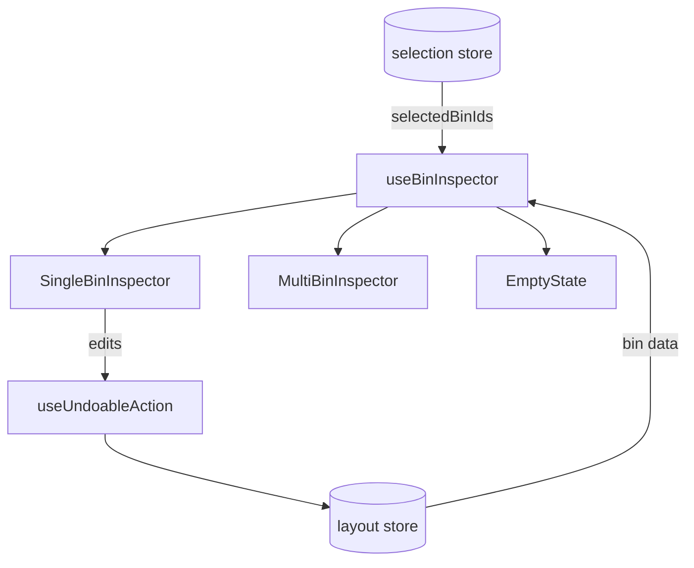

# Bin Inspector

Selected bin details panel with edit capabilities.

## Key Files

- `components/Inspector/SingleBinInspector.tsx` — single bin edit panel
- `components/Inspector/MultiBinInspector.tsx` — multi-select summary
- `components/Inspector/CustomPropertiesEditor.tsx` — custom key-value property editor
- `components/Inspector/SplitWarning.tsx` — print bed size warning indicator
- `components/Inspector/EmptyState.tsx` — no selection state
- `hooks/useBinInspector.ts` — selection resolution and bin data

## Constraints

| Field        | Limit                                   |
| ------------ | --------------------------------------- |
| Label        | 24 chars                                |
| Notes        | 256 chars                               |
| Custom props | 50 max, key: 32 chars, value: 256 chars |

## Gotchas

1. **Multi-select shows summary only** - can't edit dimensions of multiple bins
2. **Reserved property keys** - bin field names (`id`, `layerId`, `x`, `y`, `width`, `depth`, `height`, `clearanceHeight`, `category`, `label`, etc.) blocked from custom props
3. **Height validation** - must fit in layer + drawer height
4. **Rotation with relocation** - bins can be rotated in place or auto-repositioned to nearest valid spot if blocked
