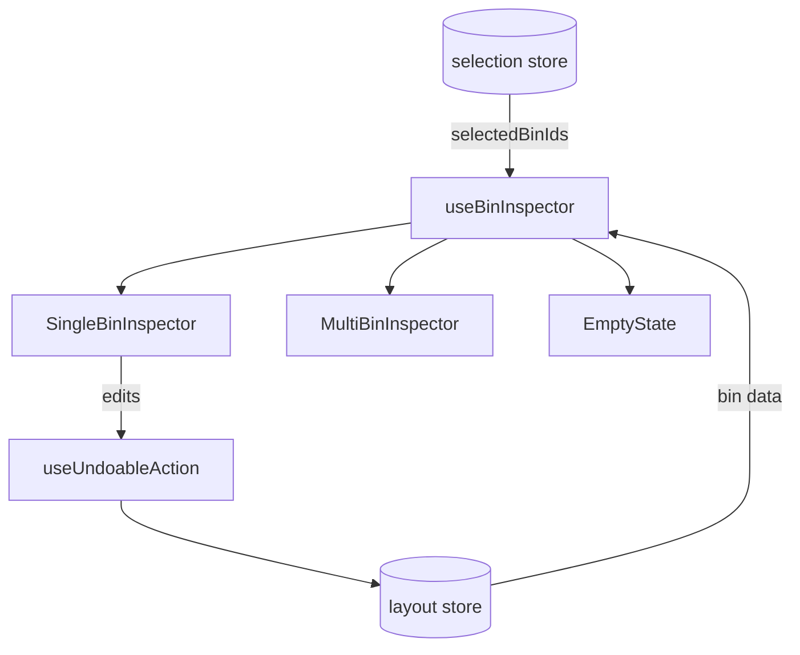

# Bin Inspector

Selected bin details panel with edit capabilities.

## Constraints

| Field        | Limit                                   |
| ------------ | --------------------------------------- |
| Label        | 64 chars                                |
| Notes        | 256 chars                               |
| Custom props | 50 max, key: 32 chars, value: 256 chars |

## Gotchas

1. **Multi-select shows summary only** - can't edit dimensions of multiple bins
2. **Reserved property keys** - `id`, `layerId`, `category` blocked from custom props
3. **Height validation** - must fit in layer + drawer height
