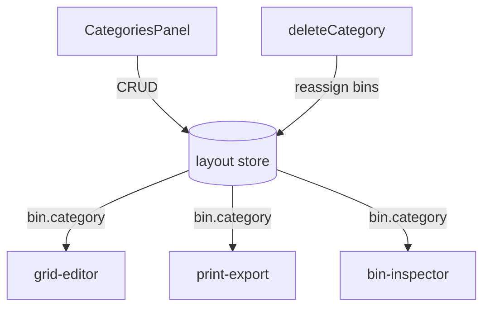

# Categories

Bin color-coding system for visual organization.

## Key Files

- `components/CategoriesPanel.tsx` — category CRUD UI

## Features

- **CRUD operations** - add, rename, recolor, delete categories
- **Quick color picker** - inline palette for fast color changes
- **Apply to selected bins** - clicking category updates all selected bins
- **Save as defaults** - persist current categories for new layouts
- **Hover highlighting** - preview category bins in 3D view

## Constraints

- **Min 1 category** - can't delete the last one
- **Max 20 categories**
- **Color format** - hex string (`#3B82F6`)

## Gotchas

1. **Deletion blocked if category in use** - bins must be reassigned first (prevented at store level)
2. **Category ID used in bin.category** - not name
3. **Print list groups by category** - affects export organization

## Help Modal Integration

`helpEntries` is exported from the barrel and aggregated by the global Help modal. Add new entries to `helpEntries.ts` when authoring user-facing affordances that should be discoverable via natural-language search. Each entry's `target` references a `data-help-target` marker in the rendered DOM.
