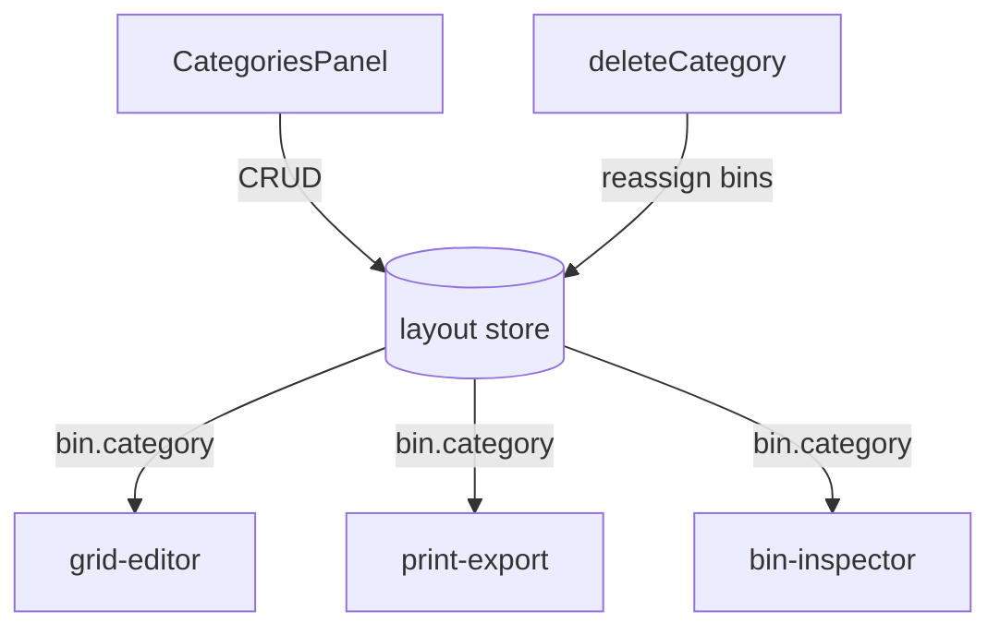

# Categories

Bin color-coding system for visual organization.

## Constraints

- **Min 1 category** - can't delete the last one
- **Max 20 categories**
- **Color format** - hex string (`#3B82F6`)

## Gotchas

1. **Deleting category reassigns bins** to first remaining category
2. **Category ID used in bin.category** - not name
3. **Print list groups by category** - affects export organization
