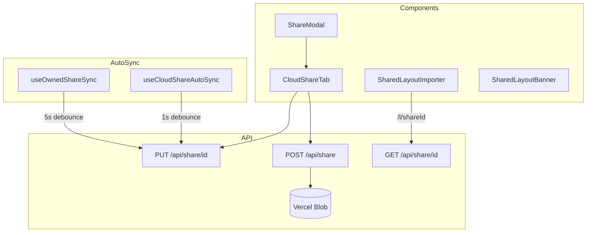

# Cloud Share

Persistent cloud sharing via Vercel Blob with permission control.

## Permission Model

| Permission | Access                                    |
| ---------- | ----------------------------------------- |
| `view`     | Read-only, anyone with link               |
| `edit`     | Collaborative editing (requires Labs flag)|

Delete token: random secret, hashed server-side, required for mutations.

## Gotchas

1. **Share ID = Layout UUID** - URL uses layout's own ID
2. **Shares are permanent** - no expiration, only explicit delete
3. **Staging bins never sync** - filtered from fingerprint
4. **Owner can't see own share in "Shared with me"**

## Limits

- Size: 500KB max
- Bins: 2500 max
- Rate: 10 shares/hr, 100 reads/hr
