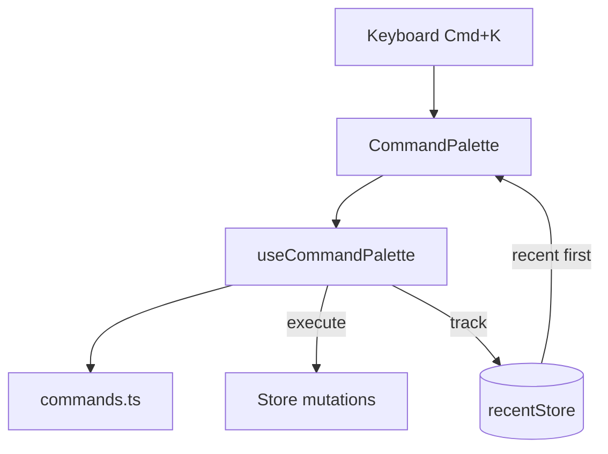

# Command Palette

Keyboard-driven command interface (`Cmd/Ctrl + K`).



## Categories

`navigation` | `edit` | `layers` | `view` | `preview` | `bins` | `tools` | `export`

## Adding Commands

```typescript
// commands.ts - wired to actions at runtime
{
  id: 'undo',
  labelKey: 'commandPalette.undo',  // i18n key
  category: 'edit',
  shortcut: { keys: 'Z', modifier: true },
  action: () => undo(),
}
```

## Integration

- Labels use i18n translation keys
- Shortcuts from `@/core/constants.SHORTCUTS`
- Recent commands persisted to localStorage
