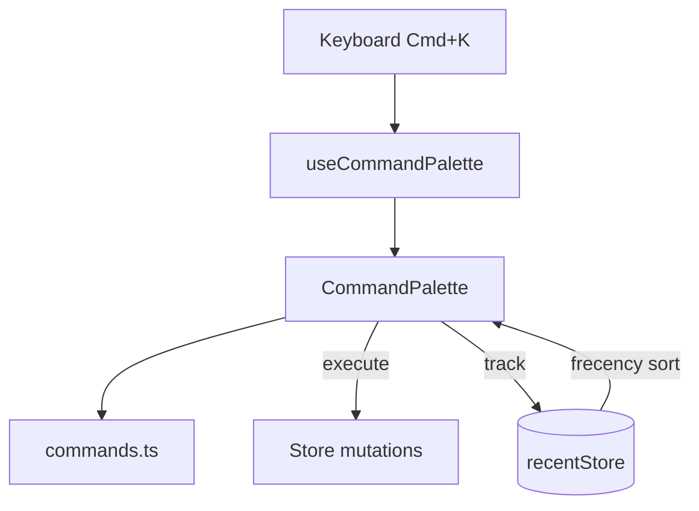

# Command Palette

Keyboard-driven command interface (`Cmd/Ctrl + K`).



## Key Files

- `commands.ts` — command definitions (COMMAND_DEFINITIONS, CATEGORY_LABELS, CATEGORY_ORDER)
- `types.ts` — CommandCategory type
- `components/CommandPalette/` — main search UI, command execution, and frecency tracking
- `components/CommandPaletteFooter/` — keyboard hints footer
- `components/ShortcutBadge/` — keyboard shortcut display component
- `hooks/useCommandPalette.ts` — open/close state and Cmd+K trigger
- `store/recentStore.ts` — frecency scoring (frequency + recency) with localStorage persistence

## Categories

`navigation` | `edit` | `layers` | `view` | `preview` | `bins` | `tools` | `export`

## Adding Commands

```typescript
// commands.ts - wired to actions at runtime
{
  id: 'undo',
  labelKey: 'commandPalette.undo',  // i18n key
  category: 'edit',
  shortcut: { keys: 'Z', modifier: true },
  action: () => undo(),
}
```

## Integration

- Labels use i18n translation keys
- Shortcuts from `@/core/constants.SHORTCUTS`
- Frecency tracking persisted to localStorage (`gridfinity-command-palette-frecency-v2`)
- Actions wired at runtime in CommandPalette component (access to stores/mutations)

## Frecency Algorithm

Commands sorted by **frecency** (frequency + recency):

- Frequency: logarithmic scale with 50-use cap (40% weight)
- Recency: exponential decay with 24-hour half-life (60% weight)
- Top 5 frecent commands displayed first
