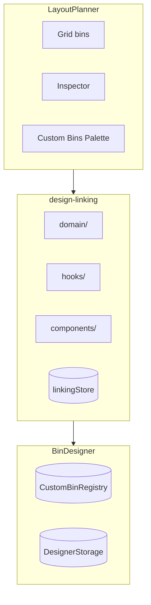

# Design Linking

Bidirectional integration between the Bin Designer and Layout Planner, enabling bins in layouts to be linked to saved designs.

## Key Files

- `domain/linkingRules.ts` — validation and eligibility checks
- `domain/syncOperations.ts` — dimension extraction and update creation
- `domain/linkageQueries.ts` — query bins/designs by link status
- `hooks/useBinLinking.ts` — link/unlink/create actions
- `hooks/useLinkedDesign.ts` — resolve linked design for a bin
- `hooks/useLinkedBins.ts` — find all bins linked to a design
- `hooks/useQuickExport.ts` — STL export for linked designs (internal)
- `hooks/useBinResizedListener.ts` — listens for bin resize events, triggers sync logic
- `hooks/useDesignSavedListener.ts` — listens for design save events, auto-syncs linked bins
- `components/LinkedDesignSection.tsx` — inspector UI for link status
- `components/DesignLinkingDialogs/` — dialog orchestrator
- `components/Dialogs/` — CreateDesignDialog, SyncDimensionsDialog, DeleteDesignWarningDialog, LinkDesignDialog
- `store/linkingStore.ts` — transient UI state

## Data Model

- **One-to-many**: Multiple bins can link to one design via `bin.linkedDesignId`
- **Sync scope**: Only dimensions (width, depth, height)
- **Ownership**: Layout owns the bin, Designer owns the design

## Key Flows

| Flow               | Steps                                                                        |
| ------------------ | ---------------------------------------------------------------------------- |
| Edit linked design | Select bin → "Edit Design" → Designer opens → auto-save → return             |
| Create from bin    | Select unlinked bin → "Create Design" → name dialog → Designer → save + link |
| Link existing      | Select unlinked bin → "Link Existing" → pick compatible design → linked      |
| Sync dimensions    | Design changed → "Sync" → eligible bins update, ineligible bins unlink       |

## Gotchas

1. **Sync checks fit** — bins that no longer fit after dimension change are unlinked with notification
2. **Registry is lightweight** — `CustomBinRegistry` in localStorage holds refs, full designs in IndexedDB
3. **Linkable kinds** — `LinkDesignDialog` admits parametric bins AND `importedMesh` designs (footprint read via `designFootprint()` from the bin-designer barrel, since non-bin kinds have no `params`); tool racks stay excluded. Never filter candidates with `params !== undefined` — that silently drops imported bins. Imported entries render with a kind badge; they are resize-inert (`useBinResizedListener` early-returns on paramsless designs — the mesh is immutable).
