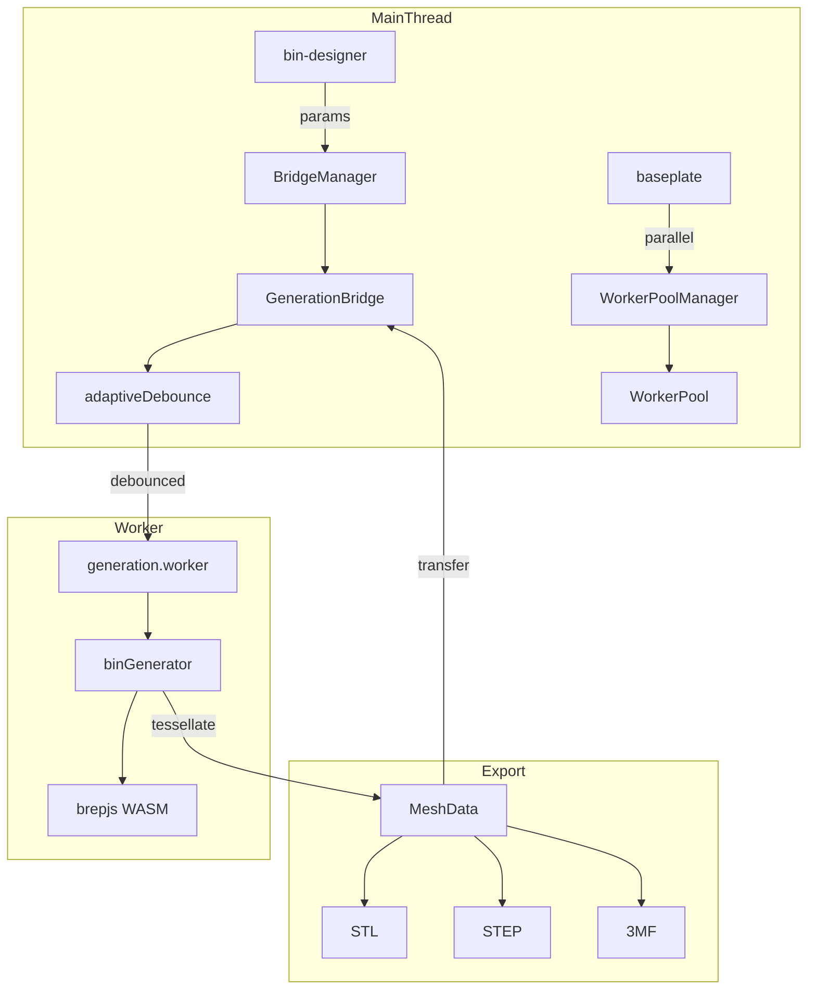

# Generation

brepjs-based 3D geometry engine running in Web Worker.

## Key Files

- `bridge/GenerationBridge.ts` — main thread API, manages worker lifecycle
- `bridge/BridgeManager.ts` — multi-bridge lifecycle management with reference counting
- `bridge/WorkerPool.ts` — parallel worker pool for concurrent generation (split baseplates)
- `bridge/WorkerPoolManager.ts` — shared pool acquisition with reference counting
- `bridge/adaptiveDebounce.ts` — dynamic debounce based on generation speed
- `bridge/bridgeRef.ts` — singleton bridge reference management
- `bridge/types.ts` — worker message protocol types
- `worker/generation.worker.ts` — Web Worker entry point
- `worker/generators/binGenerator.ts` — pipeline orchestrator + split/export functions
- `worker/generators/pipeline/` — composable generation stages (see Pipeline Stages below)
- `worker/generators/socketBuilder.ts` — gridfinity socket generation
- `worker/generators/boxBuilder.ts` — shell box generation
- `worker/generators/compartmentBuilder.ts` — compartment divider walls
- `worker/generators/insertBuilder.ts` — insert cavity cuts
- `worker/generators/cutoutBuilder.ts` — solid-mode cutout cuts
- `worker/generators/labelTabBuilder.ts` — label tab shelves + gussets
- `worker/generators/textBuilder.ts` — engraved/embossed/through-cut text solids; auto-fits font size to the host (see Gotchas re: linear sizing) and resolves the stencil-font swap for through-cut
- `worker/generators/scoopRampBuilder.ts` — scoop ramp geometry
- `worker/generators/wallCutoutBuilder.ts` — wall U-notch cutouts
- `worker/generators/handleBuilder.ts` — handle hole through-cuts in bin walls
- `worker/generators/wallPatternBuilder.ts` — per-wall hex pattern compounds with two-layer caching (uncut base + clipped result) and optional cutout/handle/ramp clipping. Polygon bins consume per-edge descriptors from `wallPatterns.collectPolygonWallSegments`: one descriptor per axis-aligned outer edge, with an `allowClip` flag that binds cutout/handle clipping only to the outermost edge per cardinal (matching `findPolygonEdgeForSide`). Divider ramp/junction zones are unconditionally empty on polygon bins — dividers are filtered out at `featuresStage`.
- `bridge/generationTimeout.ts` — complexity-aware per-request timeout (30-90 s based on pattern, cutouts, height)
- `worker/generators/featureBuilder.ts` — barrel re-export of all builder modules
- `worker/generators/dividerBuilder.ts` — divider piece generation
- `worker/generators/dividerExport.ts` — standalone divider STL export
- `worker/generators/utils/stlMeshFallback.ts` — `exportSolidToStl`: OCCT-primary STL writer with a mesh-based fallback for topologies OCCT's `StlAPI.Write` rejects but `mesh()` triangulates (the `STL_EXPORT_FAILED` class, #1760/#1850). Used by bin/divider/lid exporters; OCCT stays primary so success is byte-identical and 3MF faceGroups stay aligned
- `worker/generators/wallPatterns.ts` — hexgrid/slot patterns
- `worker/generators/slotBuilder.ts` — wall slot cutout geometry
- `worker/generators/splitConnectorBuilder.ts` — split-piece joints: floor scarf lap + optional press-together wall-locking keys (#1869)
- `worker/generators/baseplateGenerator.ts` — baseplate BREP generation
- `worker/generators/baseplateDirectMesh.ts` — direct mesh generation orchestrator for baseplate preview (procedural, no BREP)
- `worker/generators/directMeshBuilder.ts` — `MeshBuilder` class + `faceNormal`, `tangentVectors`, segment-count constants
- `worker/generators/directMeshShapes.ts` — 2D primitives shared across emitters: rounded rectangles, circles, point-in-polygon
- `worker/generators/directMeshWalls.ts` — pocket walls (with optional floor) and outer perimeter walls
- `worker/generators/directMeshFaces.ts` — top/bottom slab face = padding ring + per-cell corner gussets; closed bottom for magnet variants
- `worker/generators/directMeshMagnets.ts` — magnet hole emitter (cancel + cylinder + floor pattern)
- `worker/generators/directMeshConnectors.ts` — connector nub (male) and connector hole (female) emitters
- `worker/generators/featureTags.ts` — feature tagging system for BREP objects
- `worker/generators/generatorConstants.ts` — Gridfinity spec constants
- `worker/generators/cellDecomposition.ts` — grid cell decomposition utilities
- `worker/generators/meshUtils.ts` — mesh conversion, progress, cancellation helpers
- `worker/generators/connectorUtils.ts` — legacy connector position computation
- `worker/generators/generatorTypes.ts` — barrel re-export of constants/utilities
- `worker/generators/hexGrid.ts` — hex grid layout calculations
- `worker/generators/shapeCache.ts` — LRU cache for BREP solids
- `worker/generators/socketMeshCache.ts` — LRU cache for the deferred socket's tessellated mesh (triangles + edge lines), keyed by socket geometry identity + tolerance; reused across edits that don't change the base
- `worker/generators/patterns/` — pattern system (honeycomb, registry)
- `worker/generators/scenarios/` — test scenario data by category
- `export/stlExporter.ts` — STL file export
- `export/threemfExporter.ts` — 3MF file export (see [3MF multi-color compatibility](#3mf-multi-color-compatibility) for the slicer interop notes)
- `export/validation.ts` — shared mesh data validation

## Pipeline Stages

Composable stages in `pipeline/stages/`, orchestrated by `pipeline/runner.ts`:

1. **Shell** (`shellStage`) — box body + lip (cached by shellKey) is `ctx.solid`; the base socket is built separately. **Preview** keeps the socket in `ctx.deferredSolid` (skips the socket↔body fuse — ~80% of cold-shell time); **export** fuses it into `ctx.solid` for a watertight model.
2. **Features** (`featuresStage`) — compartments, inserts, slots, labels, scoops, wall cutouts, patterns (cut the body only; the socket is never feature-cut)
3. **Boolean** (`booleanStage`) — batch fuse additive + cut subtractive via `fuseAllBisect` / `cutAllBisect` (n-way batch first, recursive bisect on failure)
4. **Translate** (`translateStage`) — Z-offset for socket-based bins (applied to `solid` **and** `deferredSolid` so they stay aligned)
5. **Tessellate** (`tessellateStage`) — dynamic quality mesh + edge extraction; meshes `deferredSolid` separately and concatenates via `mergeShapeMeshes` (visually identical to the fused shell — socket meets the body only at a hidden interface). The socket mesh is cached by geometry identity (`socketMeshCache`, keyed via `deferredSolidKey`) so non-dimension edits skip re-tessellating the base.

## Worker Protocol

| Message         | Purpose                                           |
| --------------- | ------------------------------------------------- |
| INIT            | Load WASM (~11MB, 2-4s)                           |
| GENERATE        | Tessellation + progress → MESH_RESULT             |
| EXPORT          | STL/STEP export (uses cached solid or regenerate) |
| EXPORT_DIVIDERS | Export unique divider pieces as STL               |
| EXPORT_SPLIT    | Cut bin into pieces for multi-material printing   |
| CANCEL          | Abort current request                             |

Requests tagged with `requestId`; cancelled requests ignored.

**Responses:** INIT_READY, PROGRESS, MESH_RESULT, EXPORT_RESULT, DIVIDERS_EXPORT_RESULT, SPLIT_EXPORT_RESULT, ERROR

## Manifold Draft Preview (`manifold_preview`, graduated)

A second `GenerationBridge('manifold')` runs the Manifold mesh-CSG kernel at pinned draft quality in its own worker, acquired via `BridgeManager.acquirePreview()` / `releasePreview()` (ref-counted, idle-kept, independent of the exact bridge; init failure is non-fatal). Consumers render a fast coarse draft on the leading edge of an edit, then the exact occt-wasm result supersedes it. `worker/wasmInstantiator.ts:loadManifold()` dynamically imports `manifold-3d` + its WASM (`?url` for the Vite worker) and registers the kernel via brepjs `initFromManifold`. `KernelName` gains `'manifold'`. Graduated out of Labs (always on) — the flag id remains as the runtime gate (`isFeatureEnabled('manifold_preview')`, now always true) and a draft init failure degrades gracefully to the exact-only path; exports always use the exact kernel.

## Patterns System

Pattern calculators in `worker/generators/patterns/` use a registry-based architecture:

- **Honeycomb** — hexagonal grid for wall cutouts (configurable radius, web thickness)
- **Registry** — `PATTERN_REGISTRY` maps pattern names to calculators
- **Grid Utils** — staggered grid layout calculations

Add new patterns by implementing `PatternCalculator` interface and registering in `registry.ts`.

## Gotchas

1. **Half-cells decompose separately** — 1.5 width = [1.0, 0.5] cells
2. **Magnet holes only in full cells** — half cells remain solid
3. **Features fail silently** — tiny cells → feature skipped
4. **WASM objects are ephemeral** — brepjs GC invalidates refs unpredictably
5. **Wall pattern border rule** — any feature that cuts through a wall (cutouts, handles, future features) MUST have corresponding border clipping in `wallPatternBuilder.ts`. Without it, hex prisms overlap the cut region, producing jagged edges. Use `CUTOUT_BORDER_WIDTH` (1.5mm) for the expansion. See `wallPatternBuilder.ts` for the cutout and handle clipping implementations as reference.
6. **Text auto-fit assumes linear metrics** — `textBuilder.ts` `fitFontSize` computes the font size from a single reference measurement because `textMetrics` scales _exactly_ linearly with `fontSize` in the pinned brepjs build (advance width + vertical metrics scale by `fontSize / unitsPerEm`; no hinting in this path). A `fitFontSizeBisect` fallback covers any non-linearity, but **re-verify this assumption on brepjs bumps** — if a future build introduces hinting, the one-shot estimate could mis-size before the fallback catches it.

## Adaptive Debounce

Fast generations → 50ms delay, slow generations → 300ms delay

## Generation Timeout

`computeGenerationTimeoutMs(params)` scales the per-request watchdog: 30s base, +15s for hex pattern, +15s when paired with active wall cutouts, +15s per 2u of height over 4u, capped at 90s. Baseplates keep the flat 30s fallback.

## 3MF Multi-color Compatibility

Multi-color exports target three slicers — BambuStudio, OrcaSlicer, PrusaSlicer — with overlapping but conflicting expectations. The exporter (`export/threemfExporter.ts`) handles them via three coordinated mechanisms; touching any one of them risks tripping a different slicer's validator. Verify with the slicer CLIs before merging (see the `feedback_slicer_cli_testing.md` memory).

- **`paint_color` triangle attribute** — the actual per-triangle multi-material encoding. Both OrcaSlicer (`bbs_3mf.cpp` `MMU_SEGMENTATION_ATTR`) and PrusaSlicer (`3mf.cpp:2158`, as a fallback for its own `slic3rpe:mmu_segmentation`) read this. All three slicers explicitly ignore the spec's `pid`/`p1` triangle-color mechanism (`bbs_3mf.cpp:3805-3810`), so the spec-correct `<basematerials>`/`<m:colorgroup>` paths don't work. Slot N maps to `FILAMENT_PAINT_CODES[N+1]` (the slicer's serialized TriangleSelector bit-tree, from OrcaSlicer's `CONST_FILAMENTS` table); slot 0 → `"4"` (filament 1), slot 1 → `"8"`, slot 2 → `"0C"`, etc. Every triangle gets an explicit code so zone-to-AMS-slot mapping doesn't depend on the object's default-extruder setting.
- **`Metadata/project_settings.config` sidecar** — minimal JSON with `filament_colour` populating the slicer's AMS palette automatically so the user opens the file with the bin's zone colors pre-loaded into slots. Also carries `use_relative_e_distances=1` and a `G92 E0` `layer_change_gcode` to satisfy OrcaSlicer's multi-material slice validation (`Print.cpp:1683-1689`). Bambu users will see these as project overrides applied on import.
- **`Application=BambuStudio-02.00.00.00` metadata claim** — BambuStudio gates `project_settings.config` loading on this prefix (`bbs_3mf.cpp:1898-1908`); without it the sidecar is silently skipped and Bambu shows a "not from Bambu Lab" dialog. The exact version `02.00.00.00` was empirically chosen as the only value both BambuStudio 2.6.0 and OrcaSlicer 2.3.1 CLIs accept — `01.x.x.x` hits a hidden Orca rejection threshold; `02.06.x.x+` trips its "file newer than CLI" branch. See the `BAMBU_COMPAT_APPLICATION` JSDoc for the full failure-mode table. Only emitted for multi-color exports — single-color exports have no sidecar to gate on.
