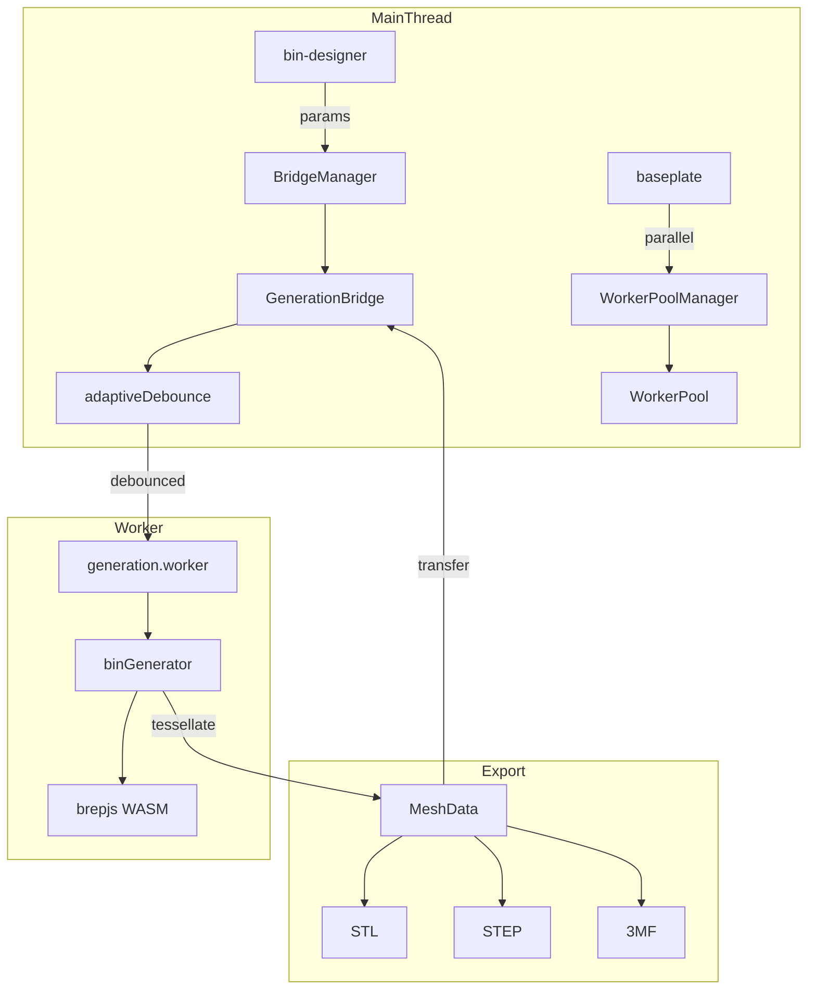

# Generation

brepjs-based 3D geometry engine running in Web Worker.

## Key Files

- `bridge/GenerationBridge.ts` — main thread API, manages worker lifecycle
- `bridge/BridgeManager.ts` — multi-bridge lifecycle management with reference counting
- `bridge/WorkerPool.ts` — parallel worker pool for concurrent generation (split baseplates)
- `bridge/WorkerPoolManager.ts` — shared pool acquisition with reference counting
- `bridge/adaptiveDebounce.ts` — dynamic debounce based on generation speed
- `bridge/bridgeRef.ts` — singleton bridge reference management
- `bridge/types.ts` — worker message protocol types
- `worker/generation.worker.ts` — Web Worker entry point
- `worker/generators/binGenerator.ts` — pipeline orchestrator + split/export functions
- `worker/generators/pipeline/` — composable generation stages (see Pipeline Stages below)
- `worker/generators/socketBuilder.ts` — gridfinity socket generation
- `worker/generators/boxBuilder.ts` — shell box generation
- `worker/generators/compartmentBuilder.ts` — compartment divider walls
- `worker/generators/insertBuilder.ts` — insert cavity cuts
- `worker/generators/cutoutBuilder.ts` — solid-mode cutout cuts
- `worker/generators/labelTabBuilder.ts` — label tab shelves + gussets
- `worker/generators/scoopRampBuilder.ts` — scoop ramp geometry
- `worker/generators/wallCutoutBuilder.ts` — wall U-notch cutouts
- `worker/generators/handleBuilder.ts` — handle hole through-cuts in bin walls
- `worker/generators/wallPatternBuilder.ts` — per-wall hex pattern compounds with two-layer caching (uncut base + clipped result) and optional cutout/handle/ramp clipping
- `bridge/generationTimeout.ts` — complexity-aware per-request timeout (30-90 s based on pattern, cutouts, height)
- `worker/generators/featureBuilder.ts` — barrel re-export of all builder modules
- `worker/generators/dividerBuilder.ts` — divider piece generation
- `worker/generators/dividerExport.ts` — standalone divider STL export
- `worker/generators/wallPatterns.ts` — hexgrid/slot patterns
- `worker/generators/slotBuilder.ts` — wall slot cutout geometry
- `worker/generators/splitConnectorBuilder.ts` — connector nubs for split bin assembly
- `worker/generators/baseplateGenerator.ts` — baseplate BREP generation
- `worker/generators/baseplateDirectMesh.ts` — direct mesh generation for baseplate preview
- `worker/generators/featureTags.ts` — feature tagging system for BREP objects
- `worker/generators/generatorConstants.ts` — Gridfinity spec constants
- `worker/generators/cellDecomposition.ts` — grid cell decomposition utilities
- `worker/generators/meshUtils.ts` — mesh conversion, progress, cancellation helpers
- `worker/generators/connectorUtils.ts` — legacy connector position computation
- `worker/generators/generatorTypes.ts` — barrel re-export of constants/utilities
- `worker/generators/hexGrid.ts` — hex grid layout calculations
- `worker/generators/shapeCache.ts` — LRU cache for BREP solids
- `worker/generators/patterns/` — pattern system (honeycomb, registry)
- `worker/generators/scenarios/` — test scenario data by category
- `export/stlExporter.ts` — STL file export
- `export/threemfExporter.ts` — 3MF file export
- `export/validation.ts` — shared mesh data validation

## Pipeline Stages

Composable stages in `pipeline/stages/`, orchestrated by `pipeline/runner.ts`:

1. **Shell** (`shellStage`) — socket + box body + lip assembly, cached by shellKey
2. **Features** (`featuresStage`) — compartments, inserts, slots, labels, scoops, wall cutouts, patterns
3. **Boolean** (`booleanStage`) — batch fuse additive + cut subtractive with sequential fallback
4. **Translate** (`translateStage`) — Z-offset for socket-based bins
5. **Tessellate** (`tessellateStage`) — dynamic quality mesh + edge extraction

## Worker Protocol

| Message         | Purpose                                           |
| --------------- | ------------------------------------------------- |
| INIT            | Load WASM (~11MB, 2-4s)                           |
| GENERATE        | Tessellation + progress → MESH_RESULT             |
| EXPORT          | STL/STEP export (uses cached solid or regenerate) |
| EXPORT_DIVIDERS | Export unique divider pieces as STL               |
| EXPORT_SPLIT    | Cut bin into pieces for multi-material printing   |
| CANCEL          | Abort current request                             |

Requests tagged with `requestId`; cancelled requests ignored.

**Responses:** INIT_READY, PROGRESS, MESH_RESULT, EXPORT_RESULT, DIVIDERS_EXPORT_RESULT, SPLIT_EXPORT_RESULT, ERROR

## Patterns System

Pattern calculators in `worker/generators/patterns/` use a registry-based architecture:

- **Honeycomb** — hexagonal grid for wall cutouts (configurable radius, web thickness)
- **Registry** — `PATTERN_REGISTRY` maps pattern names to calculators
- **Grid Utils** — staggered grid layout calculations

Add new patterns by implementing `PatternCalculator` interface and registering in `registry.ts`.

## Gotchas

1. **Half-cells decompose separately** — 1.5 width = [1.0, 0.5] cells
2. **Magnet holes only in full cells** — half cells remain solid
3. **Features fail silently** — tiny cells → feature skipped
4. **WASM objects are ephemeral** — brepjs GC invalidates refs unpredictably
5. **Wall pattern border rule** — any feature that cuts through a wall (cutouts, handles, future features) MUST have corresponding border clipping in `wallPatternBuilder.ts`. Without it, hex prisms overlap the cut region, producing jagged edges. Use `CUTOUT_BORDER_WIDTH` (1.5mm) for the expansion. See `wallPatternBuilder.ts` for the cutout and handle clipping implementations as reference.

## Adaptive Debounce

Fast generations → 50ms delay, slow generations → 300ms delay

## Generation Timeout

`computeGenerationTimeoutMs(params)` scales the per-request watchdog: 30s base, +15s for hex pattern, +15s when paired with active wall cutouts, +15s per 2u of height over 4u, capped at 90s. Baseplates keep the flat 30s fallback.
