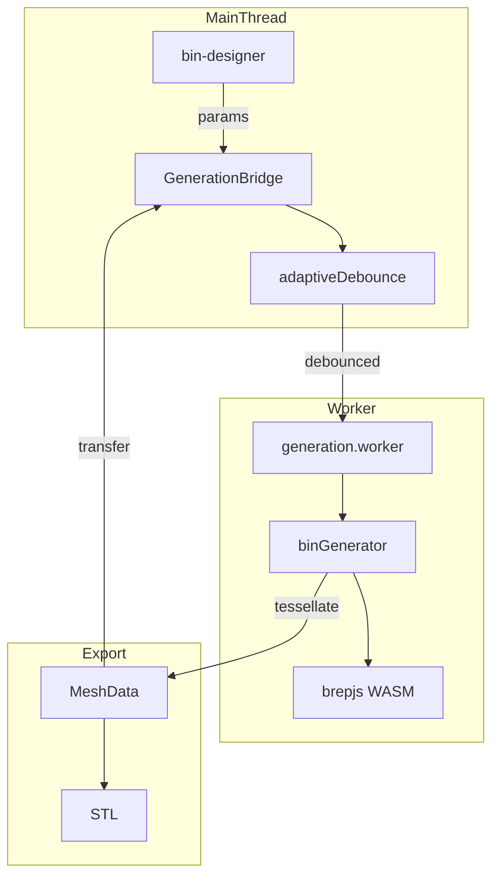

# Generation

brepjs-based 3D geometry engine running in Web Worker.

## Key Files

- `bridge/GenerationBridge.ts` — main thread API, manages worker lifecycle
- `bridge/adaptiveDebounce.ts` — dynamic debounce based on generation speed
- `bridge/bridgeRef.ts` — singleton bridge reference management
- `bridge/types.ts` — worker message protocol types
- `worker/generation.worker.ts` — Web Worker entry point
- `worker/generators/binGenerator.ts` — main brepjs geometry pipeline
- `worker/generators/socketBuilder.ts` — gridfinity socket generation
- `worker/generators/boxBuilder.ts` — shell box generation
- `worker/generators/featureBuilder.ts` — scoop/inserts/magnets/labels
- `worker/generators/dividerBuilder.ts` — divider piece generation
- `worker/generators/dividerExport.ts` — standalone divider STL export
- `worker/generators/wallPatterns.ts` — hexgrid/slot patterns
- `worker/generators/slotBuilder.ts` — wall slot cutout geometry
- `worker/generators/shapeCache.ts` — LRU cache for BREP solids
- `worker/generators/patterns/` — pattern system (honeycomb, registry)
- `export/stlExporter.ts` — STL file export
- `export/threemfExporter.ts` — 3MF file export
- `../../shared/generation/wasmCapabilities.ts` — multi-threading detection (moved to shared)

## Pipeline Stages

1. **Base Socket** → built fresh
2. **Shell Box** → built fresh
3. **Assembly** → built fresh
4. **Features** (dividers, inserts) → built fresh
5. **Tessellate** → MeshData {vertices, normals}

## Worker Protocol

| Message         | Purpose                                           |
| --------------- | ------------------------------------------------- |
| INIT            | Load WASM (~11MB, 2-4s)                           |
| GENERATE        | Tessellation + progress → MESH_RESULT             |
| EXPORT          | STL/STEP export (uses cached solid or regenerate) |
| EXPORT_DIVIDERS | Export unique divider pieces as STL               |
| EXPORT_SPLIT    | Cut bin into pieces for multi-material printing   |
| CANCEL          | Abort current request                             |

Requests tagged with `requestId`; cancelled requests ignored.

**Responses:** INIT_READY, PROGRESS, MESH_RESULT, EXPORT_RESULT, DIVIDERS_EXPORT_RESULT, SPLIT_EXPORT_RESULT, ERROR

## Patterns System

Pattern calculators in `worker/generators/patterns/` use a registry-based architecture:

- **Honeycomb** — hexagonal grid for wall cutouts (configurable radius, web thickness)
- **Registry** — `PATTERN_REGISTRY` maps pattern names to calculators
- **Grid Utils** — staggered grid layout calculations

Add new patterns by implementing `PatternCalculator` interface and registering in `registry.ts`.

## Gotchas

1. **Half-cells decompose separately** — 1.5 width = [1.0, 0.5] cells
2. **Magnet holes only in full cells** — half cells remain solid
3. **Features fail silently** — tiny cells → feature skipped
4. **WASM objects are ephemeral** — brepjs GC invalidates refs unpredictably
5. **Multi-threading requires cross-origin isolation** — SharedArrayBuffer needs COOP/COEP headers

## Adaptive Debounce

Fast generations → 50ms delay, slow generations → 300ms delay
