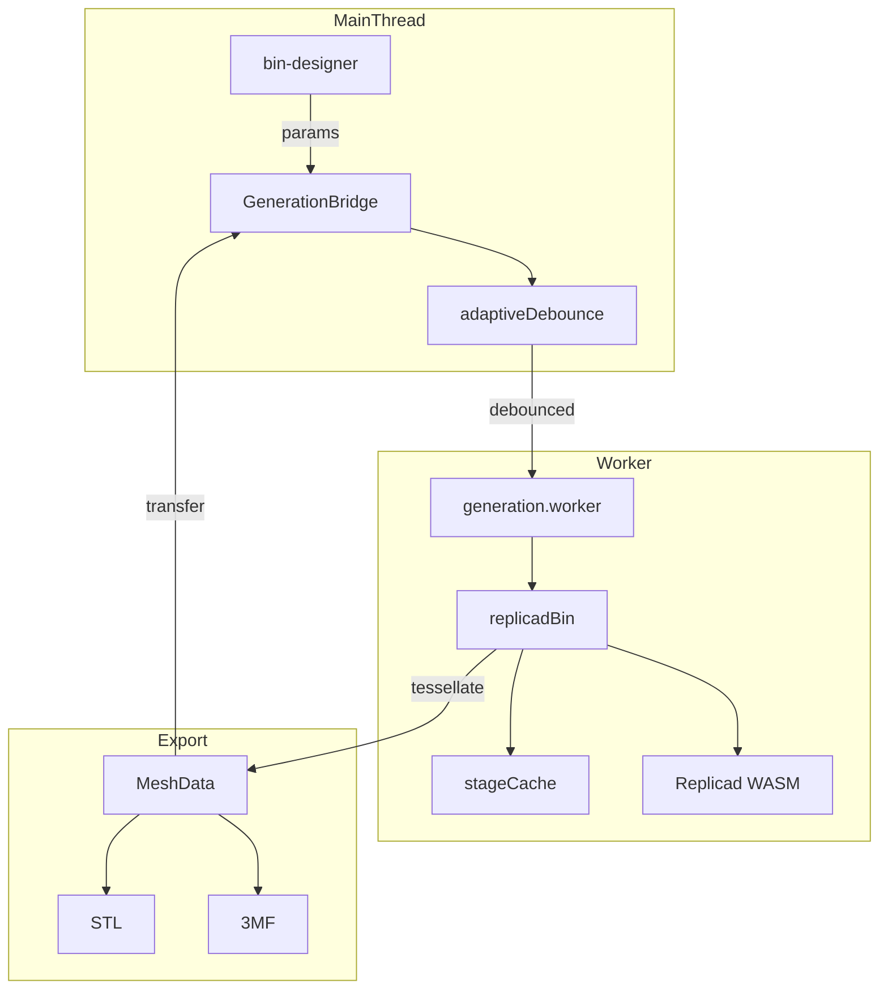

# Generation

Replicad-based 3D geometry engine running in Web Worker.

## Pipeline Stages

1. **Base Socket** → cached
2. **Shell Box** → cached
3. **Assembly** → cached
4. **Features** (dividers, scoops, cutouts) → always rebuilt
5. **Tessellate** → MeshData {vertices, normals}

## Worker Protocol

| Message  | Purpose                          |
| -------- | -------------------------------- |
| INIT     | Load WASM (~11MB, 2-4s)          |
| GENERATE | Tessellation + progress          |
| CANCEL   | Abort current request            |

Requests tagged with `requestId`; cancelled requests ignored.

## Gotchas

1. **Half-cells decompose separately** - 1.5 width = [1.0, 0.5] cells
2. **Magnet holes only in full cells** - half cells remain solid
3. **Features fail silently** - tiny cells → scoop skipped
4. **WASM heap refs can't transfer threads** - cache only valid in worker

## Adaptive Debounce

Fast generations → 50ms delay, slow generations → 300ms delay
