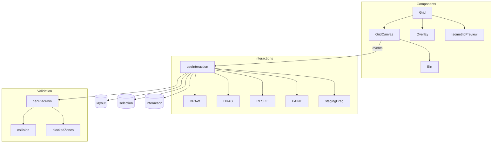

# Grid Editor

Core interactive layout editor using CSS Grid rendering.



## Coordinate System (CRITICAL)

```
Grid origin (0,0) is BOTTOM-LEFT
Screen Y is inverted: gridY = drawer.depth - screenY - 1
layers[0] is BOTTOM layer (UI displays reversed via getDisplayLayers())
```

## Interaction Modes

| Mode          | Trigger          | Purpose                    |
| ------------- | ---------------- | -------------------------- |
| `draw`        | Drag empty space | Create bin                 |
| `drag`        | Drag bin(s)      | Move selected (RAF)        |
| `resize`      | Drag handle      | Resize bin (RAF)           |
| `paint`       | Paint mode + drag| Fill area with uniform bins|
| `stagingDrag` | Drag from stash  | Place from staging         |

## Validation (`canPlaceBin`)

1. **Bounds** - within drawer dimensions
2. **Height** - fits remaining drawer height
3. **Blocked zones** - no overlap with lower-layer protrusions
4. **Collisions** - 3D overlap (footprint + vertical range)

## Gotchas

1. **Y-axis inversion** - forget this and bins appear upside down
2. **Half-bin mode** - doubles visual grid (`HALF_BIN_SCALE = 2`)
3. **Multi-select drag** - entire group stops if one bin blocked
4. **Ghost bins** - lower-layer bins shown semi-transparent
