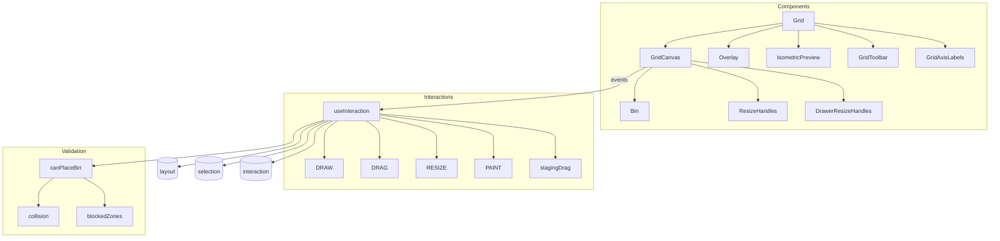

# Grid Editor

Core interactive layout editor using CSS Grid rendering.



## Key Files

### Components

- `components/Grid/Grid.tsx` — main grid container with zoom, axis labels, collab
- `components/Grid/GridCanvas.tsx` — CSS Grid canvas with bin rendering
- `components/Grid/Bin.tsx` — individual bin component
- `components/Grid/IsometricPreview/` — 3D preview panel (lazy loaded, ~800KB)
- `components/Grid/GridToolbar.tsx` — editor toolbar
- `components/Grid/Overlay.tsx` — interaction overlays (draw rect, ghosts, drop zones)
- `components/Grid/DrawerResizeHandles.tsx` — drawer dimension resize handles
- `components/Grid/GridAxisLabels/` — row/column numbering
- `components/Grid/QuickLabelPopover.tsx` — quick label editing popover
- `components/Grid/ResizeHandles.tsx` + `ResizeHandle.tsx` — bin resize handles

### Hooks

- `hooks/useInteraction.ts` — draw/drag/resize/paint/stagingDrag handler (orchestrates mode-specific hooks)
- `hooks/useGridZoom.ts` — zoom and pan controls
- `hooks/useGridResize.ts` — drawer dimension resizing
- `hooks/useGridCoords.ts` — mouse position → grid coordinates (Y-axis inversion)
- `hooks/useGridNavigation.ts` — keyboard navigation between bins
- `hooks/useGridAxisLabels.ts` — row/column label generation
- `hooks/useGridRowColumnSelection.ts` — row/column selection highlight
- `hooks/useGridFirstUseHints.ts` — first-time-use tutorials

### Utils

- `utils/fractionalPixels.ts` — half-bin pixel snapping (`calcFractionalPixelSize`, `toPixels`)
- `utils/handlePositioning.ts` — resize handle placement logic
- `utils/navigation.ts` — directional bin navigation (`findNearestBinInDirection`)

## Coordinate System (CRITICAL)

```
Grid origin (0,0) is BOTTOM-LEFT
Screen Y is inverted: gridY = drawer.depth - screenY - 1
layers[0] is BOTTOM layer (UI displays reversed via getDisplayLayers())
```

## Interaction Modes

| Mode          | Trigger           | Purpose                     |
| ------------- | ----------------- | --------------------------- |
| `draw`        | Drag empty space  | Create bin                  |
| `drag`        | Drag bin(s)       | Move selected (RAF)         |
| `resize`      | Drag handle       | Resize bin (RAF)            |
| `paint`       | Paint mode + drag | Fill area with uniform bins |
| `stagingDrag` | Drag from stash   | Place from staging          |

## Validation

Uses `canPlaceBin` from `@/shared/utils/validation`:

1. **Bounds** - within drawer dimensions
2. **Height** - fits remaining drawer height
3. **Blocked zones** - no overlap with lower-layer protrusions
4. **Collisions** - 3D overlap (footprint + vertical range)

## Gotchas

1. **Y-axis inversion** - forget this and bins appear upside down
2. **Half-bin mode** - doubles visual grid (`HALF_BIN_SCALE = 2`)
3. **Multi-select drag** - entire group stops if one bin blocked
4. **Ghost bins** - lower-layer bins shown semi-transparent
