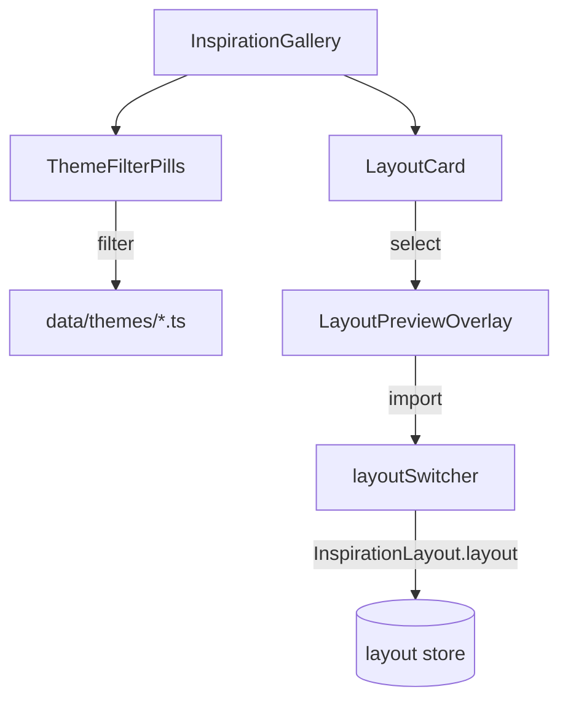

# Inspiration Gallery

Curated example layouts for user onboarding.



## Key Files

- `components/InspirationGallery.tsx` — gallery modal UI with filtering and grid
- `components/LayoutCard.tsx` — layout preview card
- `components/LayoutPreviewOverlay.tsx` — full-screen preview with metrics and related layouts
- `components/LayoutThumbnailWithLabels.tsx` — 3D preview with bin labels
- `components/ThemeFilterPills.tsx` — theme filter UI
- `data/themes/*.ts` — preset layout definitions per theme
- `utils/layoutBuilder.ts` — helpers to create bins/layers/categories, build InspirationLayout

## Themes

`workshop` | `office` | `kitchen` | `hobby` | `personal`

## Data Structure

```typescript
interface InspirationLayout {
  id: string;
  name: string;
  theme: InspirationTheme;
  description: string; // Full description (preview overlay)
  shortDescription: string; // Card description (max 80 chars)
  metrics: {
    binCount: number;
    layerCount: number;
    categoryCount: number;
    labeledBinCount: number;
    drawerSize: { width; depth; height };
  };
  preview: LayoutPreview; // Pre-computed thumbnail
  layout: Layout; // Full layout with bins, categories, layers
  tags: string[]; // Search tags
}
```

## Gotchas

1. **Layouts are templates** - importing creates copy, not reference
2. **Full Layout objects** - theme files use `buildInspirationLayout()` with complete Layout (not simplified)
3. **Pre-computed metrics** - stats calculated once at build time, not runtime
4. **Lazy-loaded modal** - chunk split for bundle size
5. **Fresh state pattern** - gallery unmounts when closed to reset state
