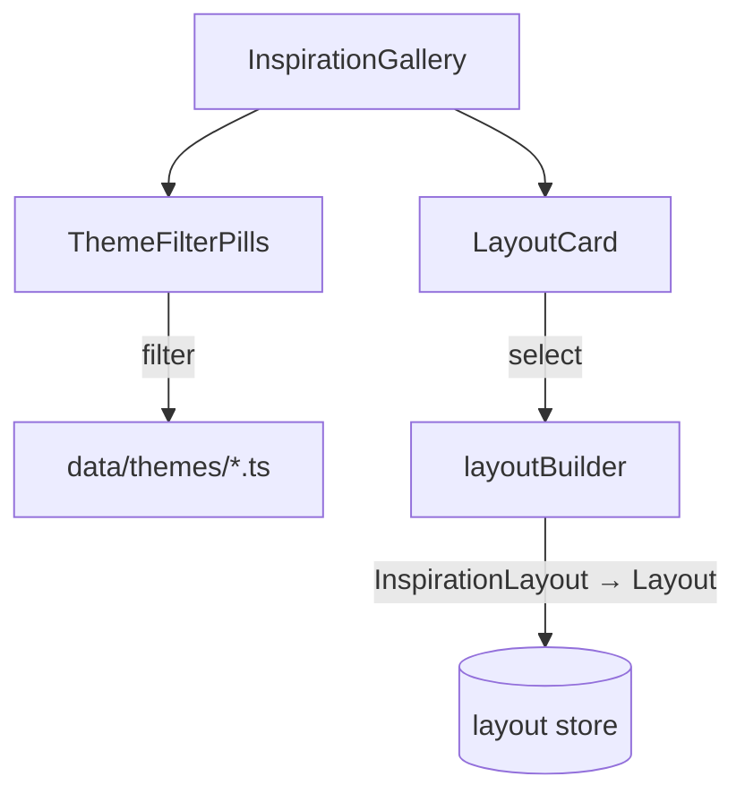

# Inspiration Gallery

Curated example layouts for user onboarding.



## Themes

`workshop` | `office` | `kitchen` | `hobby` | `personal`

## Data Structure

```typescript
interface InspirationLayout {
  id: string;
  name: string;
  theme: Theme;
  drawer: { width; depth; height };
  bins: InspirationBin[];  // Simplified: no layerId
}
```

## Gotchas

1. **Layouts are templates** - importing creates copy, not reference
2. **Simplified bin format** - no layerId (defaults to first layer)
3. **Categories auto-generated** - from bin category names in template
4. **Lazy-loaded modal** - chunk split for bundle size
