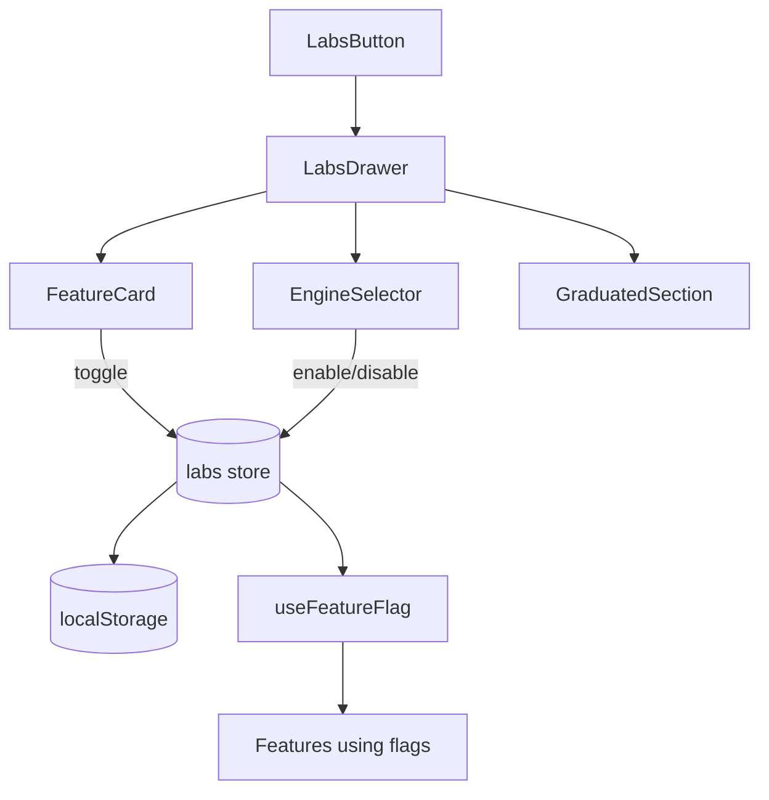

# Labs

Experimental feature flags for opt-in preview features.



## Infrastructure Location

- **Definitions**: `@/core/labs/features.ts`
- **Store**: `@/core/store/labs`
- **Hook**: `@/hooks/useFeatureFlag`

## Components

- **LabsButton** - Opens labs drawer
- **LabsDrawer** - Main drawer UI with feature list
- **FeatureCard** - Individual feature toggle card
- **FeatureStatusBadge** - Status indicator (early access/beta/shipped)
- **GraduatedSection** - Collapsible "Now for everyone" section for shipped features
- **EngineSelector** - Segmented control over the mutually-exclusive 3D-engine kernel flags (`brepkit_kernel`, `occt_wasm_kernel`); writes both flags to enforce exclusivity, replaces `FeatureCard` UI for those two

## Current Flags

Internal status enum values → UI badge labels: `experimental` → "Early access", `preview` → "Beta", `graduated` → "Shipped".

| Flag                    | Status (`enum`) | Purpose                                                                   |
| ----------------------- | --------------- | ------------------------------------------------------------------------- |
| `bin_designer`          | `graduated`     | Custom bin designer                                                       |
| `baseplate_generator`   | `graduated`     | Custom baseplate generator                                                |
| `handle_holes`          | `graduated`     | Finger-grip cutouts on bin walls                                          |
| `collaborative_editing` | `experimental`  | Real-time Liveblocks collab                                               |
| `brepkit_kernel`        | `experimental`  | Alternative 3D geometry engine (BrepKit) — driven by `EngineSelector`     |
| `occt_wasm_kernel`      | `experimental`  | Updated OCCT 3D engine — driven by `EngineSelector`                       |
| `multi_color_export`    | `graduated`     | Multi-color 3MF export (now gated per-design via `featureColors.enabled`) |
| `cloud_sync`            | `experimental`  | Sign-in sync of layouts/designs across devices                            |

The two kernel flags are mutually exclusive: priority order in `BridgeManager`/`WorkerPoolManager` is `brepkit > occt-wasm > default`. `EngineSelector` enforces this in the UI; downstream consumers also assume it via the priority chain.

## Usage

```typescript
const isEnabled = useFeatureFlag('collaborative_editing');
```

## Gotchas

1. **Flags persisted in localStorage** - survives refresh
2. **Some flags require page reload** - noted in UI
3. **Feature definitions in core/labs** - not in this feature module
