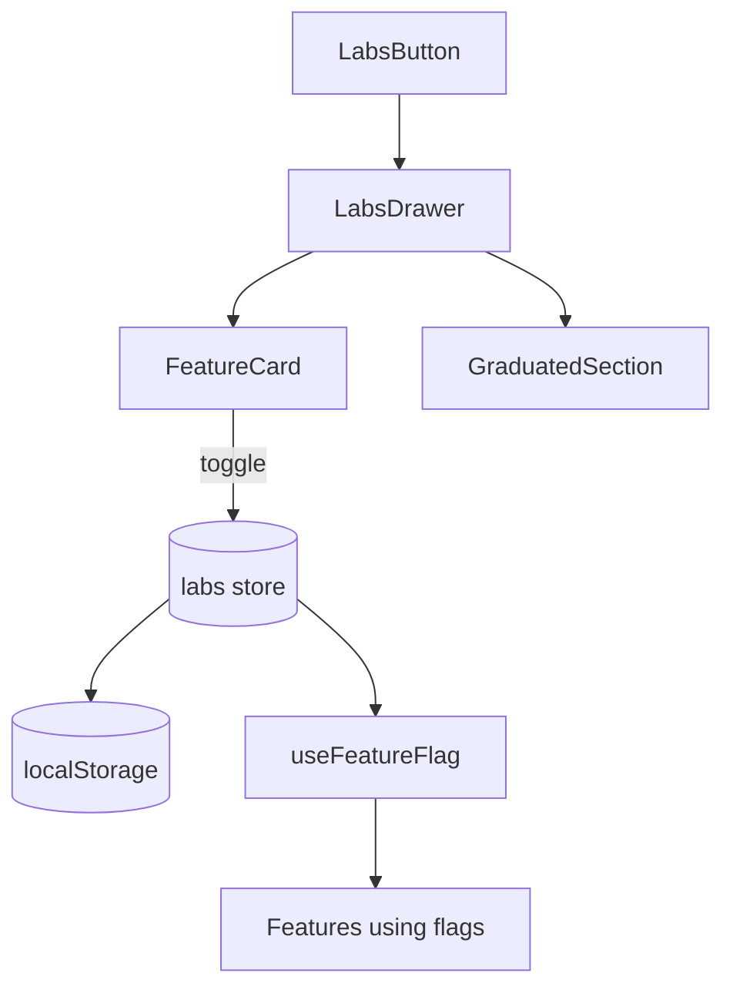

# Labs

Experimental feature flags for opt-in preview features.



## Infrastructure Location

- **Definitions**: `@/core/labs/features.ts`
- **Store**: `@/core/store/labs`
- **Hook**: `@/hooks/useFeatureFlag`

## Components

- **LabsButton** - Opens labs drawer
- **LabsDrawer** - Main drawer UI with feature list
- **FeatureCard** - Individual feature toggle card
- **FeatureStatusBadge** - Status indicator (experimental/preview/graduated)
- **GraduatedSection** - Collapsible "What's New" section for graduated features

## Current Flags

| Flag                    | Status       | Purpose                     |
| ----------------------- | ------------ | --------------------------- |
| `bin_designer`          | Graduated    | Parametric bin generator    |
| `collaborative_editing` | Experimental | Real-time Liveblocks collab |
| `layout_to_print`       | Experimental | STL export from layout      |

## Usage

```typescript
const isEnabled = useFeatureFlag('collaborative_editing');
```

## Gotchas

1. **Flags persisted in localStorage** - survives refresh
2. **Some flags require page reload** - noted in UI
3. **Feature definitions in core/labs** - not in this feature module
