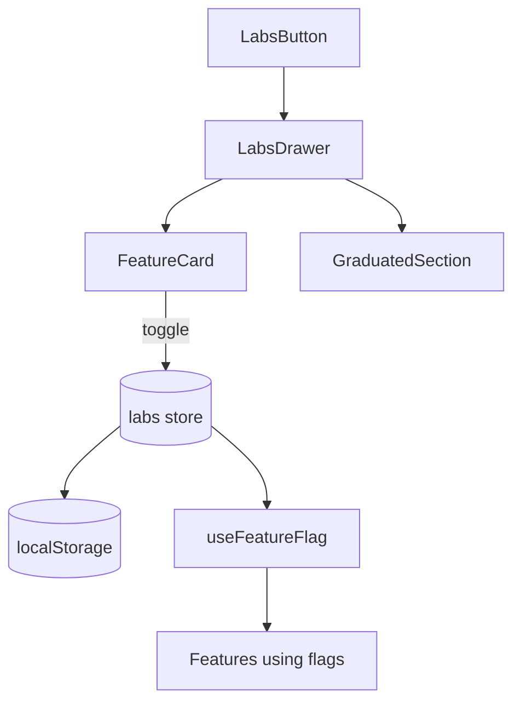

# Labs

Experimental feature flags for opt-in preview features.



## Infrastructure Location

- **Definitions**: `@/core/labs/features.ts`
- **Store**: `@/core/store/labs`
- **Hook**: `@/hooks/useFeatureFlag`

## Components

- **LabsButton** - Opens labs drawer
- **LabsDrawer** - Main drawer UI with feature list
- **FeatureCard** - Individual feature toggle card
- **FeatureStatusBadge** - Status indicator (early access/beta/shipped)
- **GraduatedSection** - Collapsible "Now for everyone" section for shipped features

## Current Flags

Internal status enum values → UI badge labels: `experimental` → "Early access", `preview` → "Beta", `graduated` → "Shipped".

| Flag                    | Status (`enum`) | Purpose                        |
| ----------------------- | --------------- | ------------------------------ |
| `bin_designer`          | `graduated`     | Custom bin designer            |
| `baseplate_generator`   | `graduated`     | Custom baseplate generator     |
| `collaborative_editing` | `experimental`  | Real-time Liveblocks collab    |
| `brepkit_kernel`        | `experimental`  | Alternative 3D geometry engine |

## Usage

```typescript
const isEnabled = useFeatureFlag('collaborative_editing');
```

## Gotchas

1. **Flags persisted in localStorage** - survives refresh
2. **Some flags require page reload** - noted in UI
3. **Feature definitions in core/labs** - not in this feature module
