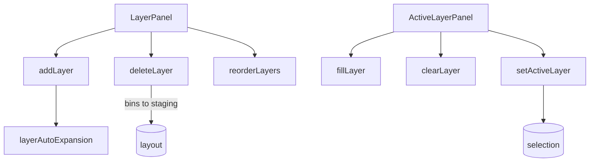

# Layers

Vertical stacking system for multi-height drawer organization.



## Key Files

- `components/LayerPanel.tsx` — layer list with add/delete/reorder, drag-and-drop reordering
- `components/ActiveLayerPanel.tsx` — active layer controls (fill, clear, paint mode)
- `utils/layerAutoExpansion.ts` — auto-expand layer height for tall bins

## Z-Axis Model (CRITICAL)

```
layers[0] is BOTTOM - array order = physical stack order
UI displays reversed via getDisplayLayers() from @/shared/utils/collision

Layer 0: z = 0 to h0
Layer 1: z = h0 to (h0 + h1)
Layer 2: z = (h0 + h1) to ...
```

Z-axis calculations (getLayerZStart, getLayerZEnd) are in `@/shared/utils/collision`.

## Gotchas

1. **Bottom-left coordinate system** - Y=0 is bottom, layers[0] is bottom
2. **Blocked zones** - bins from lower layers protrude into higher layers
3. **Reorder validation** - checks for vertical collisions before allowing
4. **Can't delete last layer** - minimum 1 required
5. **Layer deletion** - bins move to staging

## Help Modal Integration

`helpEntries` is exported from the barrel and aggregated by the global Help modal. Add new entries to `helpEntries.ts` when authoring user-facing affordances that should be discoverable via natural-language search. Each entry's `target` references a `data-help-target` marker in the rendered DOM.
