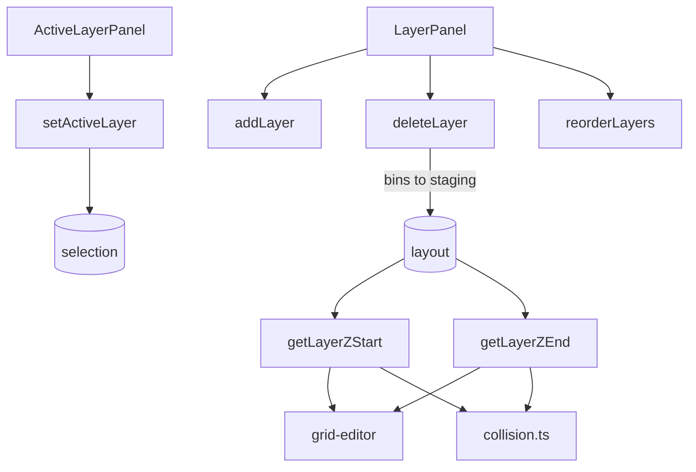

# Layers

Vertical stacking system for multi-height drawer organization.



## Z-Axis Model (CRITICAL)

```
layers[0] is BOTTOM - array order = physical stack order
UI displays reversed via getDisplayLayers()

Layer 0: z = 0 to h0
Layer 1: z = h0 to (h0 + h1)
Layer 2: z = (h0 + h1) to ...
```

## Z Calculations

```typescript
getLayerZStart(layerId): sum of heights of layers below
getLayerZEnd(layerId): zStart + layer.height
```

## Gotchas

1. **Bottom-left coordinate system** - Y=0 is bottom, layers[0] is bottom
2. **Blocked zones** - bins from lower layers protrude into higher layers
3. **Reorder validation** - checks for vertical collisions before allowing
4. **Can't delete last layer** - minimum 1 required
5. **Layer deletion** - bins move to staging
