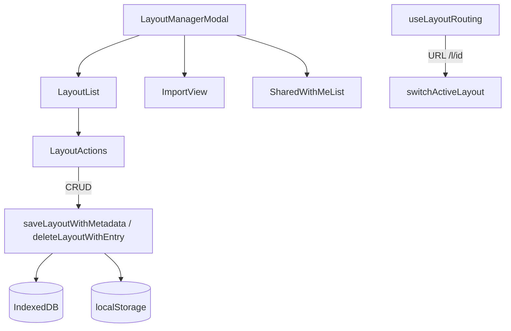

# Layout Library

Multi-layout management with thumbnails and metadata.



## Key Files

- `components/LayoutManagerModal/index.tsx` — main library modal
- `components/LayoutManagerModal/LayoutList.tsx` — layout grid/list view
- `components/LayoutManagerModal/ImportView.tsx` — JSON import UI
- `hooks/useLayoutRouting.ts` — URL-based layout switching (`/l/id`)

## Storage Keys

- **Library index**: `gridfinity-library-v1` (localStorage)
- **Individual layouts**: `gridfinity-layout-{uuid}` (IndexedDB)

## Core Operations

```
createNewLayout() → UUID + empty layout + entry
switchLayout(id) → save current, load target
duplicateLayout(id) → copy data, new UUID, "(copy)" suffix
deleteLayout(id) → remove from IndexedDB + library
```

## Gotchas

1. **Can't delete last layout** - minimum 1 required
2. **Max 100 layouts** - warning at 80
3. **Switching saves current first** - prevents data loss
4. **useLayoutSwitcher** lives at `@/hooks/useLayoutSwitcher`
