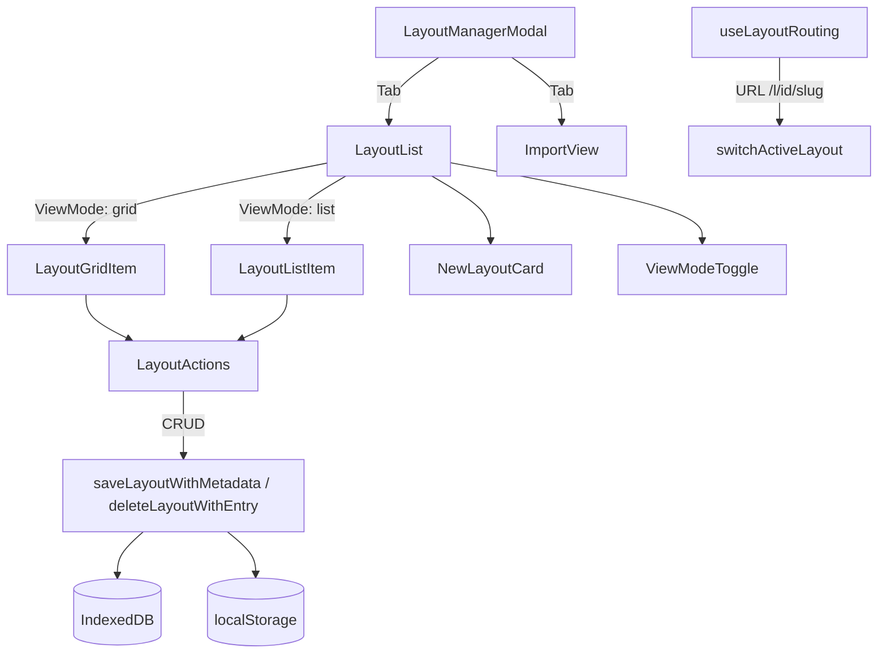

# Layout Library

Multi-layout management with thumbnails, metadata, and URL routing.



## Key Files

### Components

- `components/LayoutManagerModal/LayoutManagerModal.tsx` — main modal with tabs (layouts/import)
- `components/LayoutManagerModal/LayoutList.tsx` — layout grid/list view with search & sort
- `components/LayoutManagerModal/LayoutGridItem.tsx` — grid view card
- `components/LayoutManagerModal/LayoutListItem.tsx` — list view row
- `components/LayoutManagerModal/LayoutActions.tsx` — action menu (download/copy link/rename/duplicate/suggest name/delete)
- `components/LayoutManagerModal/ImportView.tsx` — JSON import UI
- `components/LayoutManagerModal/NewLayoutCard.tsx` — "Create New" card
- `components/LayoutManagerModal/ViewModeToggle.tsx` — grid/list toggle
- `components/LayoutManagerModal/SharedWithMeList.tsx` — shared layouts (not yet integrated)
- `components/LayoutManagerModal/SharedWithMeItem.tsx` — shared layout item
- `components/LayoutManagerModal/useInlineEdit.ts` — inline rename hook

### Hooks

- `hooks/useLayoutRouting.ts` — URL sync for bookmarkable layouts (`/l/{id}/{slug}`)

## Storage Keys

- **Library index**: `gridfinity-library-v1` (localStorage)
- **Individual layouts**: `gridfinity-layout-{uuid}` (IndexedDB)

## Core Operations

```
createNewLayout() → UUID + empty layout + entry
switchLayout(id) → save current, load target
duplicateLayout(id) → copy data, new UUID, "(copy)" suffix
deleteLayout(id) → remove from IndexedDB + library
```

## Gotchas

1. **Can't delete last layout** - minimum 1 required
2. **Max 100 layouts** - warning at 80
3. **Switching saves current first** - prevents data loss
4. **useLayoutSwitcher** lives at `@/hooks/useLayoutSwitcher`
