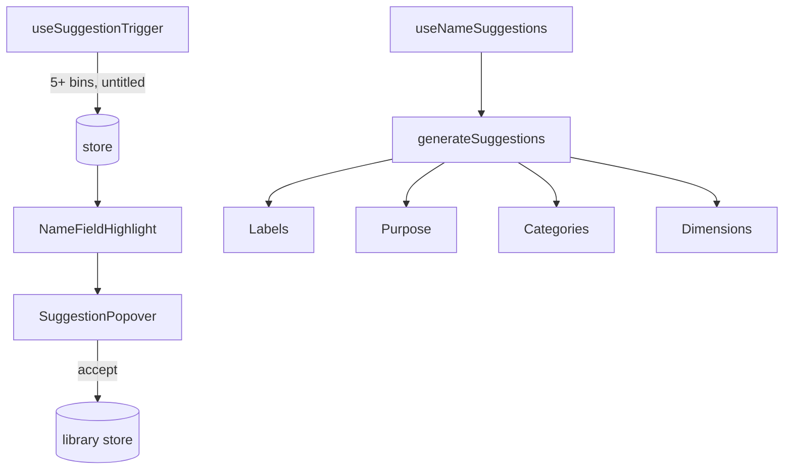

# Name Suggestions

Intelligent layout name suggestions based on bin contents.



## Key Files

- `components/SuggestionPopover.tsx` — suggestion dropdown UI
- `components/NameFieldHighlight.tsx` — pulsing highlight wrapper
- `hooks/useNameSuggestions.ts` — suggestion generation logic
- `hooks/useSuggestionTrigger.ts` — auto-trigger conditions
- `utils/generateSuggestions.ts` — name generation from bin data

## Trigger Conditions

- 5+ bins have labels
- Layout name is "Untitled layout"
- Not dismissed in current session

## Suggestion Sources

1. **Labels** - Analyzes bin labels via `labelVocabulary.ts`
2. **Purpose** - `purposeInference.ts` detects drawer purpose
3. **Categories** - Custom category names if significant
4. **Dimensions** - Fallback using drawer size

## Entry Points

- **Auto-trigger** - Pulsing highlight on Header name field
- **Command Palette** - "Suggest Layout Name"
- **Layout Manager** - "Suggest Name" menu item

## Usage

```tsx
<NameFieldHighlight>
  <button>{layoutName}</button>
</NameFieldHighlight>
```
