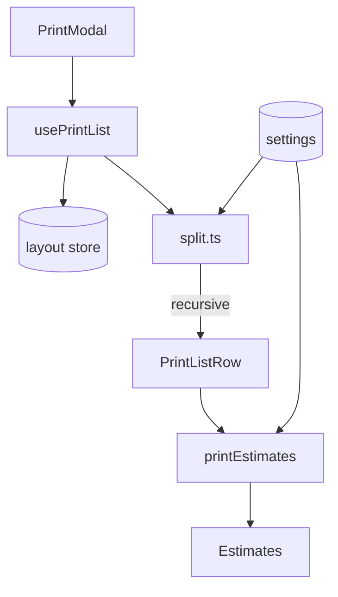

# Print Export

Print list generation with bin splitting and filament estimates.



## Key Files

- `components/PrintModal.tsx` — main print list dialog
- `hooks/usePrintList.ts` — aggregates bins into print rows
- `utils/split.ts` — recursive bin splitting for print bed
- `utils/printEstimates.ts` — filament/time/cost calculations
- `utils/printListOperations.ts` — sort and group operations

## Split Algorithm

```
splitBinSize(w, d, maxUnits):
  if (w <= max && d <= max) return pieces
  split larger dimension in half
  recurse
```

## Print Estimates

| Metric       | Formula                          |
| ------------ | -------------------------------- |
| Filament (g) | shell volume × 1.24 g/cm³ + base |
| Time (min)   | proportional to filament weight  |
| Cost         | filament × $/gram setting        |
| Spool %      | total / spool size               |

## Settings Dependencies

- `printBedSize` - max bin size in mm
- `filamentCostPerGram`
- `spoolSize`

## Gotchas

1. **Dividers not counted** - estimate may undercount filament
2. **Staging bins excluded** - only placed bins in print list
3. **Category grouping optional** - toggle in UI
