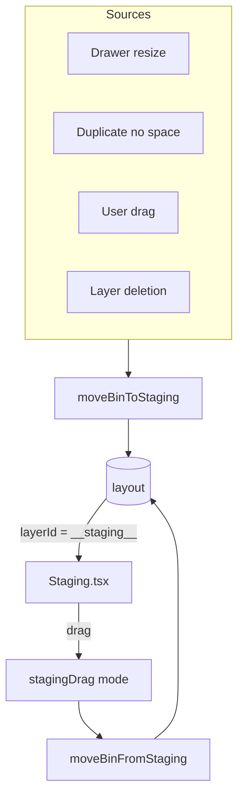

# Staging

Off-grid bin stash for displaced bins.

## Key Files

- `components/Staging.tsx` — staging area UI with drag-out support

## Key Concept

Bins with `layerId === '__staging__'` are stored here, not on any layer.

## Gotchas

1. **STAGING_ID is magic string** - `'__staging__'`, not a real layer
2. **Bins don't count in print list** until placed
3. **Cloud-share excludes staging** - filtered from sync fingerprint
