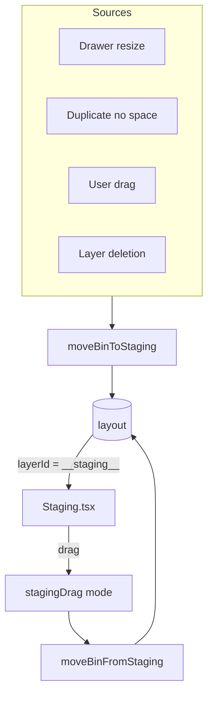

# Staging

Off-grid bin stash for displaced bins.

## Key Files

- `components/Staging/Staging.tsx` — orchestrator: layout, state, drop target tracking
- `components/Staging/StagingBin.tsx` — single bin rendering with adaptive label system
- `hooks/useStagingResize.ts` — draggable height adjustment for the stash panel
- `hooks/useStagingLongPress.ts` — long-press detection for touch context menu
- `utils/packing.ts` — bin clustering and grid packing algorithm (pure functions)

## Key Concept

Bins with `layerId === '__staging__'` are stored here, not on any layer.

## Gotchas

1. **STAGING_ID is magic string** - `'__staging__'`, not a real layer
2. **Bins don't count in print list** until placed
3. **Cloud-share excludes staging** - filtered from sync fingerprint
4. **Fractional-depth bins need ceiled `gridHeight` + `alignSelf: 'end'`** — `repeat(N, ...)` silently drops a non-integer N (collapsing the explicit grid), so `gridHeight` ceils `maxY`. The ceiled row span is taller than the bin's pixel height, so any fractional-depth bin must align to the end (bottom) of its grid area or it drifts above grid Y=0.
