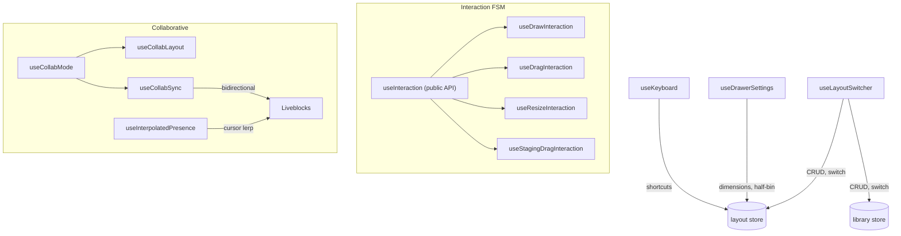

# Hooks

App-level hooks for keyboard shortcuts, layout switching, drawer settings, collaborative editing, and grid interactions.

## Key Files

| File                    | Purpose                                                                  |
| ----------------------- | ------------------------------------------------------------------------ |
| `useKeyboard.ts`        | 40+ global shortcuts (delete, undo, nudge, rotate, zoom, layer nav)      |
| `useDrawerSettings.ts`  | Drawer dimensions, half-bin toggle/remediation, physical units, defaults |
| `useLayoutSwitcher.ts`  | Atomic layout CRUD: switch, create, delete, duplicate, import            |
| `useBinGeometry.ts`     | Three.js geometry generation for 3D bin preview                          |
| `useContextMenu.ts`     | Right-click menu lifecycle (position, outside-click, escape)             |
| `useDesignerRouting.ts` | Bin Designer URL navigation with history integration                     |

## Collaborative Hooks

| Hook                         | Purpose                                                    |
| ---------------------------- | ---------------------------------------------------------- |
| `useCollabMode.ts`           | Detect if collab needed (feature flag + `edit` permission) |
| `useCollabLayout.ts`         | Layout data source abstraction (Liveblocks or Zustand)     |
| `useCollabSync.ts`           | Bidirectional sync FSM: pending → initializing → ready     |
| `useCollabPresence.ts`       | Cursor & interaction broadcasting (no-ops outside collab)  |
| `usePresence.ts`             | Aggregate participant list with join/leave toasts          |
| `useInterpolatedPresence.ts` | Smooth remote cursor animation (lerp 0.25, 300ms fade)     |

## Infrastructure Hooks

| Hook                      | Purpose                                                          |
| ------------------------- | ---------------------------------------------------------------- |
| `useAnalytics.ts`         | Vercel heartbeat (3 min) + PostHog session tracking              |
| `useFeatureFlag.ts`       | Reactive flag check + non-reactive `isFeatureEnabled()`          |
| `useStorageMigration.ts`  | One-time localStorage → IndexedDB migration (idle, non-blocking) |
| `useTabletPanels.ts`      | Tablet overlay panel open/close with auto-collapse on mode entry |
| `use3DPreviewKeyboard.ts` | `V` toggle, Space expand, Escape close                           |

## Interaction Subsystem (`interactions/`)

See [`interactions/README.md`](./interactions/README.md) for the FSM architecture.

## Gotchas

1. **Interaction public API** — only `useInteraction` is the public entry point; mode hooks (`useDraw`, `useDrag`, etc.) are internal
2. **RAF throttling in parent** — the parent `useInteraction` throttles via RAF; mode hooks do NOT throttle (draw/paint need instant feedback)
3. **Stale closure prevention** — callbacks in `useLayoutSwitcher` use `getState()` for fresh state, not closure captures
4. **Collab sync loop prevention** — `lastEditSource === 'local'` skips re-sync of own edits
5. **View-only shares stay local** — `permission === 'view'` never connects to Liveblocks
6. **Keyboard skips inputs** — `useKeyboard` ignores events when focus is in `<input>` or `<textarea>`
7. **Half-bin remediation** — `handleRemediate()` moves fractional bins to staging before disabling mode
8. **Layout switch side effects** — clears undo history, resets selection, updates URL slug, resets ML session
