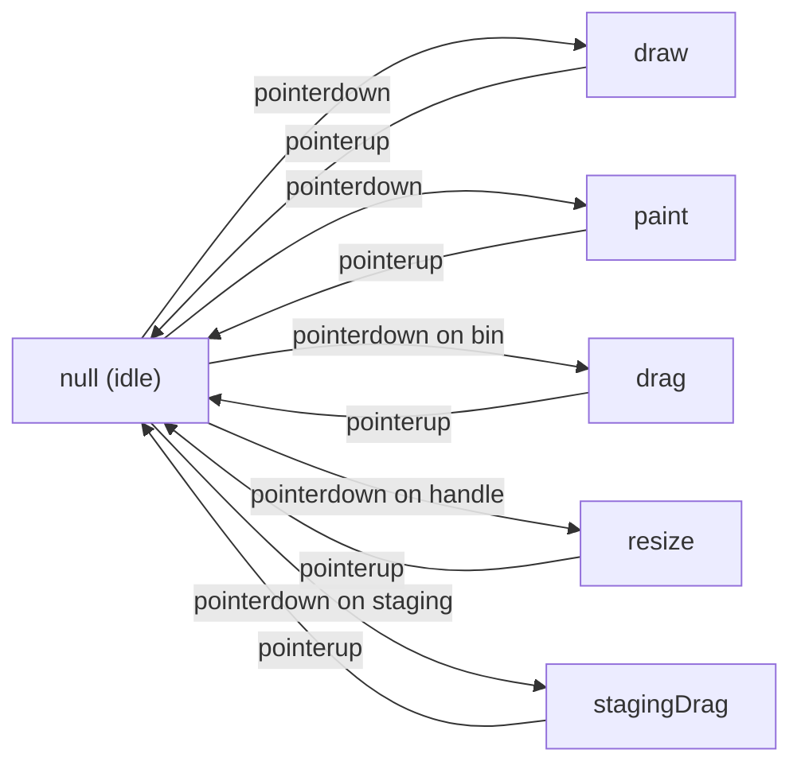

# Interactions

Finite state machine for grid pointer interactions: draw, drag, resize, staging drag, and paint modes.



## Architecture

Each mode implements `ModeHandlers<TStart>`:

```typescript
interface ModeHandlers<TStart> {
  start(...args: TStart): void; // pointerdown → set interaction state
  handleMove(e: PointerEvent): void; // pointermove → update preview/position
  handleUp(e: PointerEvent): void; // pointerup → commit mutation
}
```

The parent `useInteraction` hook:

1. Builds a stable `InteractionContext` (memoized dependency object, NOT React Context)
2. Delegates to the active mode's handlers
3. Applies RAF throttling to `handleMove` (except draw/paint which need instant feedback)
4. Manages pointer capture via `capturePointer()` at document.body level

## Key Files

| File                           | Purpose                                                               |
| ------------------------------ | --------------------------------------------------------------------- |
| `types.ts`                     | `InteractionContext`, `ModeHandlers<T>`, start arg types              |
| `interaction.ts`               | `capturePointer()`, `calculateResizeRect()`, `mapInteractionToHint()` |
| `selection.ts`                 | `getSelectionBounds()`, `constrainGroupDelta()`, `applyGroupDelta()`  |
| `useDrawInteraction.ts`        | Draw (single bin) + paint (fill area with uniform bins)               |
| `useDragInteraction.ts`        | Move, duplicate (Alt), swap (Shift), drop targets (trash/staging)     |
| `useResizeInteraction.ts`      | 8-direction handle resize, multi-bin proportional                     |
| `useStagingDragInteraction.ts` | Drag from stash to grid with ghost preview                            |

## Mode Details

| Mode            | Trigger                    | Multi-bin            | Throttled | Key Behavior                                    |
| --------------- | -------------------------- | -------------------- | --------- | ----------------------------------------------- |
| **draw**        | Drag on empty grid         | No                   | No        | `width = end - start + minSize`                 |
| **paint**       | Click/drag in paint mode   | Yes (bulk select)    | No        | Centers on click, fills area on drag            |
| **drag**        | Pointerdown on bin         | Yes (selected group) | Yes (RAF) | Group constraints, swap countdown, drop targets |
| **resize**      | Pointerdown on handle      | Yes (proportional)   | Yes (RAF) | 8 directions, half-bin aware min size           |
| **stagingDrag** | Pointerdown on staging bin | No                   | Yes (RAF) | Ghost preview, bounds clamping                  |

## Gotchas

1. **Pointer capture on document.body** — `capturePointer()` must be called in `start()` to ensure reliable tracking across viewport edges
2. **`currentCoord` in drag stores DELTA** — not absolute position; applied via `constrainGroupDelta()`
3. **`startRects` map in resize** — preserved from interaction start for multi-bin proportional math
4. **Swap mode single-bin only** — Shift+drag with multi-select falls back to normal drag
5. **Swap countdown preserved** — prevents flickering when hovering between targets
6. **Draw/paint never throttle** — instant visual feedback is critical for responsiveness
7. **ML telemetry fires BEFORE mutations** — needs bin data before deletion/move changes it
8. **Paint single-click centers** — bin is centered on cursor, clamped to drawer bounds
