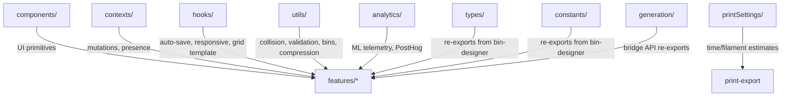

# Shared

Cross-cutting utilities, components, hooks, and contexts reused across features.

## Subdirectories

| Directory        | Purpose                                                                      |
| ---------------- | ---------------------------------------------------------------------------- |
| `components/`    | Domain-agnostic UI primitives (no feature coupling)                          |
| `contexts/`      | React contexts for mutations and collaborative presence                      |
| `hooks/`         | Custom hooks for auto-save, responsiveness, grid math, PWA                   |
| `utils/`         | Pure functions — collision detection, validation, bin filtering, compression |
| `analytics/`     | ML telemetry pipeline and PostHog product metrics                            |
| `printSettings/` | Print time/filament estimation constants and scaling                         |
| `types/`         | Re-exports `BinParams` types from `bin-designer` to avoid circular deps      |
| `constants/`     | Re-exports `DEFAULT_BIN_PARAMS`, `GRIDFINITY` from `bin-designer`            |
| `generation/`    | Re-exports `GenerationBridge` for cross-feature 3D mesh access               |

## Key Components (`components/`)

| Component                  | Purpose                                                                  |
| -------------------------- | ------------------------------------------------------------------------ |
| `DeferredNumberInput`      | Number input that commits on blur/Enter (prevents mid-type validation)   |
| `ItemListShell`            | Generic searchable, sortable, filterable list container (grid/list view) |
| `ConfirmDialog`            | Modal with focus trap, Escape handling, portal rendering                 |
| `Toast` / `ToastContainer` | Auto-dismiss notifications with pause-on-hover                           |
| `Checkbox`                 | Custom styled, desktop/mobile variants, display-only mode                |
| `ContextMenu*`             | Framework for consistent right-click menus                               |
| `CollapsibleSection`       | Expandable container with arrow indicator                                |

## Key Hooks (`hooks/`)

| Hook                  | Purpose                                                               |
| --------------------- | --------------------------------------------------------------------- |
| `useAutoSave()`       | Debounced save (1s) with idle scheduling, retry, status tracking      |
| `useResponsive()`     | Breakpoint detection: mobile (<768), tablet (768-899), desktop (≥900) |
| `useGridTemplate()`   | CSS Grid template computation with half-bin fractional support        |
| `useCrossTabSync()`   | Sync layout/library across browser tabs via StorageEvent              |
| `usePWAUpdate()`      | Detect and prompt for service worker updates                          |
| `useInlineEdit()`     | Inline editing state management (active, commit, cancel)              |
| `usePrefetchChunks()` | Idle-time code chunk preloading                                       |
| `useSharedWithMe()`   | Fetch and track layouts shared via Liveblocks                         |

## Key Utilities (`utils/`)

| File                      | Purpose                                                                                       |
| ------------------------- | --------------------------------------------------------------------------------------------- |
| `collision.ts`            | 3D spatial collision: `binsCollideResult()`, `getBlockedZones()`, `getDisplayLayers()`        |
| `validation.ts`           | Type guards (`isValidBin`), `canPlaceBin()`, `validateImport()`                               |
| `bins.ts`                 | Bin filtering: `getGridBins()`, `getStagingBins()`, `getLayerBins()`, `splitBinsByLocation()` |
| `fill.ts`                 | Auto-fill algorithms: `fillAllWithSize()`, `fillGaps()`                                       |
| `compression.ts`          | LZ-string compression for layout storage                                                      |
| `color.ts`                | `getContrastColor()`, `getBinTextColors()` for bin rendering                                  |
| `uuid.ts`                 | Layout ID generation and validation                                                           |
| `throttle.ts` / `idle.ts` | RAF throttle, idle scheduling utilities                                                       |

## Contexts (`contexts/`)

- **MutationsContext** — unified interface for layout mutations; `useMutations()` works in both local and collab mode
- **PresenceContext** — collaborative presence (cursor, interaction, selection); no-ops outside collab

## Gotchas

1. **No domain coupling** — shared components must not import from `features/`; use `types/` and `constants/` re-exports for bin-designer types
2. **PostHog import path** — import directly from `@/shared/analytics/posthog`, not from the barrel `index.ts` (naming collisions)
3. **Collision returns Result** — `binsCollideResult()` and friends return `Result<T, E>`, not booleans
4. **getDisplayLayers reverses** — UI display order is the reverse of array order; always use this for rendering
5. **useAutoSave debounce** — 1000ms debounce + 2000ms idle callback; saves skip if no changes detected
6. **MutationsContext fallback** — `useMutations()` returns store mutations directly when no provider is present (safe default)
