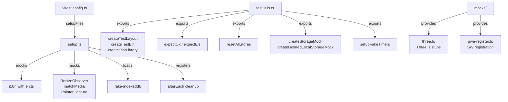

# Test Infrastructure

Centralized test setup, factory functions, and mocks shared across all unit tests. Colocated test files (`*.test.ts`) live next to their source; this directory provides the shared foundation.



## Key Files

| File                    | Purpose                                                              |
| ----------------------- | -------------------------------------------------------------------- |
| `setup.ts`              | Global mocks (i18n, DOM APIs, pointer capture), React cleanup        |
| `testUtils.ts`          | Factory functions, store reset, Result helpers, storage/timer mocks  |
| `mocks/three.ts`        | Three.js object mocks (Vector3, Color, BufferGeometry) for R3F tests |
| `mocks/pwa-register.ts` | `useRegisterSW()` mock for PWA update tests                          |

## Core Utilities

| Export                             | Purpose                                                         |
| ---------------------------------- | --------------------------------------------------------------- |
| `resetAllStores()`                 | Reset all 10+ Zustand stores to initial state                   |
| `createTestLayout(overrides?)`     | Deterministic layout with `cat1`, `layer1` IDs                  |
| `createTestBin(overrides?)`        | Bin with defaults: `layerId('layer1')`, `width: 1`, `height: 3` |
| `createTestLibrary(id?)`           | Valid `LayoutLibrary` with one entry                            |
| `expectOk(result)`                 | Assert Result is Ok and unwrap value in one call                |
| `expectErr(result)`                | Assert Result is Err and unwrap error in one call               |
| `getBinId(result)`                 | Extract BinId from `addBin()` Result                            |
| `createStorageMock()`              | Mock all storage functions (legacy + atomic)                    |
| `createIsolatedLocalStorageMock()` | Per-test localStorage with cleanup                              |
| `setupFakeTimers()`                | Coordinate fake timers with `Date.now()`                        |

## Typical Test Pattern

```typescript
import { resetAllStores, expectOk, createTestLayout } from '@/test/testUtils';

describe('my feature', () => {
  beforeEach(() => {
    resetAllStores(); // NOT automatic — must call explicitly
  });

  it('adds a bin', () => {
    const layout = createTestLayout();
    const { addBin } = useLayoutStore.getState();
    const result = addBin({ layerId: layout.layers[0].id, ... });
    expect(expectOk(result)).toBeDefined();
  });
});
```

## Gotchas

1. **`resetAllStores()` is NOT automatic** — `setup.ts` handles React cleanup but NOT Zustand store reset; call in every `beforeEach()`
2. **Deterministic IDs** — `createTestLayout()` uses `cat1`, `layer1` (not random UUIDs) for predictable assertions
3. **localStorage isolation** — use `createIsolatedLocalStorageMock()` per-test; shared module-level mocks pollute subsequent tests
4. **Result helpers preferred** — use `expectOk()` / `expectErr()` instead of manual `isOk()` + unwrap chains
5. **Fake timer coordination** — `setupFakeTimers()` syncs `vi.useFakeTimers()` with `Date.now()`; call `cleanup()` in `afterEach`
6. **Coverage thresholds enforced** — ~78% lines, ~66% branches; `npm run test:coverage` blocks commit if below
7. **Colocated convention** — test files must be siblings to source (`foo.ts` + `foo.test.ts`); pre-commit hook enforces this
8. **Zustand state persists** — stores survive unmounts; without `resetAllStores()`, prior test state leaks through
